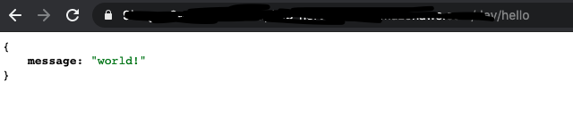

## serverless framework

serverless는 서버리스 애플리케이션을 위한 인프라를 매우 빠르고 편리하게 구축할 수 있게 도와주는 프레임워크입니다.

Lambda, IAM, API Gateway, VPC 등 아주 많은 AWS 서비스들을 지원합니다. 원하는 서비스를 골라 설정파일에 내용을 적어주면, 모든 것이 자동으로 생성되고, 애플리케이션이 배포됩니다.

또한 serverless는 오픈소스이고, 아주 많은 플러그인들이 존재하기 대문에 개발을 정말 편하게 할 수 있습니다. 거기다가 serverless는 문서화까지 정말 잘 되있다고 생각합니다.

소개는 여기까지 하고, 바로 시작해봅시다.

## 기본 의존성 설치하기

우선 serverless를 설치해 주어야 합니다.

```
npm install -D serverless
```

그리고 typescript 관련 의존성들도 설치해줍시다.

```
npm install -D typescript serverless-plugin-typescript
```

serverless-plugin-typescript는 typescript로 작성된 코드를 알아서 트랜스파일링 하고 배포해줍니다.

AWS Lambda의 type definition을 설치해줍시다.

```
npm install -D @types/aws-lambda
```

## 람다 함수 핸들러 작성

우선 전체 프로젝트 구조는 아래와 같습니다.

```
/node_modules
/src
  index.ts
.gitignore
package.json
package-lock.json
README.md
serverless.yml
```

src 디렉토리 내에 index.ts를 생성해주고, 간단히 람다 함수 핸들러를 작성해봅시다.

```typescript
import { APIGatewayProxyHandler, APIGatewayProxyEvent } from "aws-lambda";

export const handler: APIGatewayProxyHandler = async (event: APIGatewayProxyEvent) => {
  const { path } = event;

  if (path === "/hello") {
    return {
      statusCode: 200,
      body: JSON.stringify({
        message: "world!",
      }),
    };
  } else {
    return {
      statusCode: 404,
      body: "not found",
    };
  }
};
```

람다 함수를 HTTP 요청에 의해 실행시키기 위해선 API Gateway라는 서비스를 사용해야 합니다.

람다 함수는 말그대로 함수이고, 특정 URL로 들어온 요청을 람다 함수와 연결하고 실행시켜줄 서비스가 필요하기 때문입니다.

즉, API Gateway는 람다 함수의 '호출자' 중에 하나인 것이고, 람다 함수가 받는 인자 중에 event 객체는 '호출자'가 무엇이냐에 따라 내용이 달라집니다.

API Gateway가 넘겨주는 객체에는 path 프로퍼티에 요청 URL 정보가 들어있습니다.

따라서 path === "/hello" 조건을 만족하면, JSON을 응답하고, 아니라면 404 에러를 응답하는 간단한 예시입니다.

API Gateway의 event 객체에 대한 예시는 [여기](https://github.com/awsdocs/aws-lambda-developer-guide/blob/master/sample-apps/nodejs-apig/event.json)서 확인하실 수 있습니다.

## serverless framework 설정하기

serverless 프레임워크를 통해 애플리케이션을 배포하기 위해선, serverless.yml 이라는 설정 파일을 작성해야 합니다.

```yml
service: blog-post

provider:
  name: aws
  runtime: nodejs12.x
  region: ap-northeast-2
  profile: hsjang
  apiName: blog-post

plugins:
  - serverless-plugin-typescript

functions:
  api:
    handler: src/index.handler
    events:
      - http:
          path: /{proxy+}
          method: any
```

각각의 옵션들을 설명드리면,

- service: 배포할 애플리케이션의 이름이라고 생각하시면 됩니다.

- provider: 어떤 클라우드 서비스에 배포할지, 그리고 그 서비스에 대한 설정이라고 생각하시면 됩니다.

  - name: 클라우드 서비스의 이름입니다.

  - runtime: 람다 함수가 실행될 런타임입니다.

  - region: 애플리케이션을 배포할 AWS의 리전입니다.

  - profile: aws-cli를 사용할 때 붙는 --profile 옵션과 동일합니다. 저는 회사 맥북을 사용하고 있어서 따로 profile을 만들어 주었는데, 본인 컴퓨터라면 default로 사용하시고 이 옵션을 생략하셔도 됩니다.

  - apiName: API Gateway의 이름입니다.

- plugins: serverless 프레임워크의 플러그인들을 설정하는 곳입니다.

- functions: 람다 함수에 대해 설정하는 곳입니다.

  - 함수 이름 (위에서는 api): 함수 이름을 설정합니다.

    - handler: 프로젝트 내에서 람다 함수 핸들러가 위치한 경로입니다.
    - events: 해당 람다 함수를 실행시키는 이벤트를 설정합니다.

      - http: API Gateway의 REST API 유형의 이벤트를 설정합니다.

        - path: 경로를 설정합니다. 위의 경우 {proxy+}라는 와일드카드를 사용하고 있는데, 모든 경로가 다 매치된다고 생각하시면 됩니다.

        - method: 해당 path에 대한 HTTP Method를 설정합니다. any로 설정할 경우 모든 메소드를 사용할 수 있습니다.

## 애플리케이션 배포하기

serverless framework는 deploy 명령어를 통해서 애플리케이션을 배포할 수 있습니다.

package.json의 scripts 부분을 아래와 같이 수정해줍시다.

```
"scripts": {
  "deploy": "serverless deploy"
},
```

그리고 명령어를 입력해서 배포해줍시다.

```
npm run deploy
```

## 확인하기

배포된 애플리케이션에 요청을 보내봅시다.



/hello로 요청을 보내주니 잘 응답하는걸 볼 수 있네요.

## 애플리케이션 삭제하기

배포를 하고 테스트도 했으니 이제 질려서 모든 것을 삭제하고 싶어졌습니다.(????)

이럴 때 아래의 명령어를 사용하면 serverless가 삭제까지 알아서 다 해줍니다.

```
serverless remove
```
