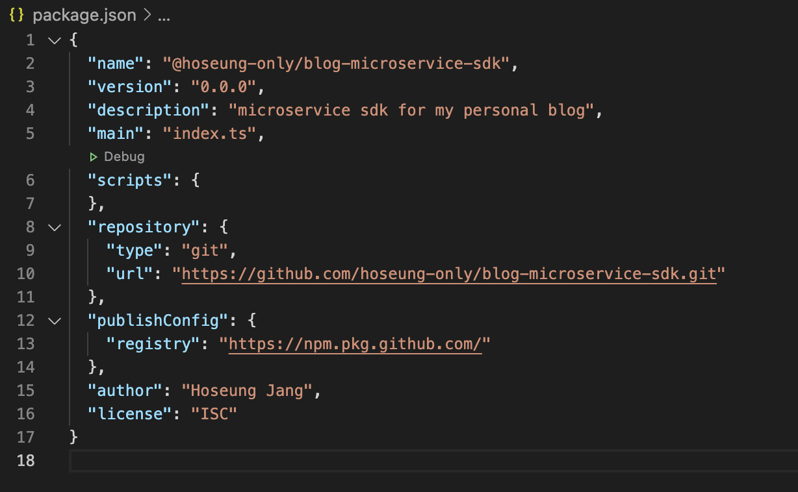
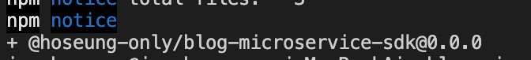

## Github Packages?

Github Packages는 깃허브에서 제공하는 패키지 호스팅 서비스입니다.

오직 제 개인 블로그 서비스에서만 쓰일 패키지를 배포해야 하는데, npm에서는 private package를 배포하려면 돈을 내야하는 것으로 알고 있어서 Github Packages를 선택하게 되었습니다.

패키지의 코드가 저장된 repository가 public이라면 다른 사람들도 다운로드할 수 있도록 공개적으로 배포됩니다.

반대로 private이라면 비공개로 혼자서 쓰거나, 같은 organization 내에 있는 팀원끼리만 다운로드할 수 있습니다.

## 준비물

- 깃허브 토큰 생성 (developer settings에서 생성할 수 있습니다)
- npm 설치
- repository 하나 만들고 아무 코드나 push해두기

## package.json 작성

필수적으로 작성해줘야 하는 것들은 아래와 같습니다.

- name: @[유저이름 or Organization 이름]/[패키지 이름] 형식으로 작성해줘야 합니다. @ 뒤에오는걸 scope라고 부릅니다.

- version: 패키지 버전을 명시해줘야 합니다.

- description: 패키지에 대한 설명을 작성해줍시다.

- repository: repository 정보를 적어줘야 합니다.

- publishConfig: npm publish 명령어를 사용할 때 필요한 설정을 적어줘야 합니다. registry 속성의 값을 https://npm.pkg.github.com/ 으로 해주시면 됩니다.

- author: author가 누군지 작성해줍시다.

- license: 어떤 license를 따르는지 작성해줍시다.

저는 아래와 같이 작성해주었습니다.



repository의 owner와 name의 scope가 일치해야 publish할 때 오류가 안납니다.

## npm으로 Github Packages 인증하기

Github Packages에 배포하기 위해서 발급해둔 깃허브 토큰을 사용한 인증이 필요합니다.

[이 가이드](https://docs.github.com/en/packages/guides/configuring-npm-for-use-with-github-packages#authenticating-to-github-packages)를 보시면 .npmrc 파일에 적어주거나, npm login 명령어를 사용해서 인증이 가능합니다.

아무래도 모든 사용처에 .npmrc 파일을 만들어주는건 번거로운 일이니 npm 명령어를 사용해서 한 번만 인증해 주었습니다.

```
$ npm login --scope=@OWNER --registry=https://npm.pkg.github.com

> Username: USERNAME
> Password: TOKEN
> Email: PUBLIC-EMAIL-ADDRESS
```

scope옵션에는 아까 package.json에서 name에 적어준 scope 이름을 넣어주시고, registry는 그대로 해줍시다.

그리고 CLI에서 Username, Password, Email을 입력하는 부분이 나올겁니다. Username은 본인의 깃허브 유저네임, Password는 깃허브 토큰, 이메일은 본인의 이메일로 입력하시면 완료됩니다.

## 배포하기

npm publish 명령어를 통해서 배포할 수 있습니다.



## 패키지 다운로드 받기

이제 다른 곳에서 패키지를 다운로드받아서 dependency로 사용할 수 있습니다.

현재 패키지가 업로드된 곳이 Github Packages Registry이기 때문에, npm install 명령을 실행할 때 아래처럼 registry를 변경해주어야 합니다.

```
npm install --registry https://npm.pkg.github.com @[scope name]/[package name]
```

매번 registry 옵션을 달아주는게 불편할 수 있으니, .npmrc 파일 안에 아래와 같은 내용을 넣어줄 수도 있습니다.

```
@[scope name]:registry=https://npm.pkg.github.com/
```

설정한 scope의 패키지들은 모두 Github Pacakges Registry에서 찾는다는 내용입니다.
