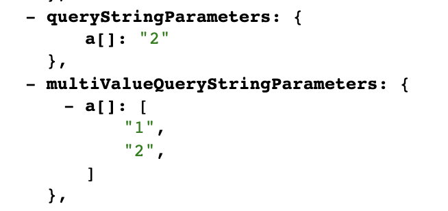
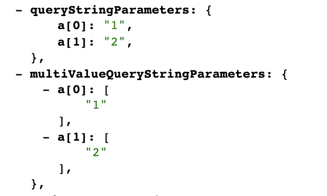
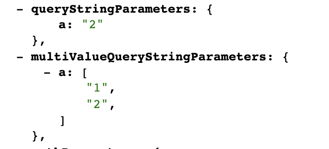
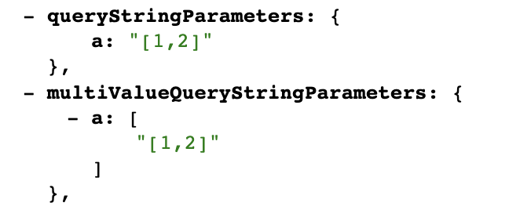

> 이 글에서는 API Gateway, AWS Lambda를 다룹니다.

## 개요

회사에서 개발하던 중, axios를 사용해서 query string에 array를 담아 백엔드에 요청했을 때 제대로 전달이 안되는 문제에 마주했습니다.

회사의 백엔드는 AWS Lambda에 기반한 서버리스로 동작하는 MSA 아키텍처로 설계되어 있고, 원인을 파악해보니 API Gateway가 HTTP 요청을 파싱할 때 생긴 문제였습니다.

따라서 이 글에서는 AWS Lambda가 API Gateway 등의 외부 서비스와 어떻게 연결되는지, query string에 array를 담아 전달했을 때 API Gateway가 어떻게 파싱하는지를 알아보겠습니다.

## AWS Lambda와 외부 서비스의 연결

AWS Lambda(이하 람다)는 함수이고, AWS의 다른 서비스와 연결되어 호출됩니다.

이 때, 람다 함수는 event라는 parameter를 받는데, 이 event parameter는 람다 함수를 실행시킨 AWS 서비스가 무엇이냐에 따라 달라집니다.

API Gateway의 경우 HTTP Request에 대한 정보(path, method, body 등등)를 json 형태로 파싱해서 람다 함수의 event parameter로 넘겨줍니다. 따라서 람다 함수 내에서 어떤 요청인지를 파악해서 응답할 수 있는 것입니다.

## 특정 요청에 대한 event.json

근데 이렇게 API Gateway와 람다를 연결해서 사용하면서 불편했던 점이, 내가 지금 보내고있는 요청에 대한 event.json이 어떻게 생겼는지를 알기가 힘들다는 것이었습니다.

AWS에서 공개해놓은 [예시](https://github.com/awsdocs/aws-lambda-developer-guide/blob/main/sample-apps/nodejs-apig/event.json)나, [가이드](https://aws.amazon.com/blogs/compute/support-for-multi-value-parameters-in-amazon-api-gateway/)같은걸 제외하고는, 요청 정보를 적으면 그에 맞는 event.json를 바로 보여주는 서비스 같은걸 찾아볼 수가 없었습니다.

그래서 직접 간단한 Lambda 함수를 배포해서 테스트해보기로 했습니다.

```typescript
import { APIGatewayProxyHandler } from "aws-lambda";

export const handler: APIGatewayProxyHandler = async (event) => {
  return {
    statusCode: 200,
    body: JSON.stringify(event),
  };
};
```

요청이 들어오면, 해당 요청에 대한 event.json을 그대로 응답하는 코드입니다.

그리고 serverless framework를 사용해서 배포해 주었습니다. serverless.yml은 아래와 같이 작성했습니다.

```yml
service: api-gateway-test

provider:
  name: aws
  runtime: nodejs12.x
  apiGateway:
    shouldStartNameWithService: true
  lambdaHashingVersion: 20201221

plugins:
  - serverless-plugin-typescript

functions:
  api:
    handler: src/index.handler
    events:
      - http:
          path: /{proxy+}
          method: any
```

path를 /{proxy+}로, method를 any로 설정해서 모든 url, 모든 method의 요청을 람다 함수에 넘겨주도록 설정했습니다.

이제 query string으로 array를 넘기는 방법들을 알아보고, API Gateway가 각각의 query string을 어떻게 파싱하는지 확인해봅시다.

## query string으로 array를 넘기는 방법들

query string을 통해 array를 넘기는 방법은 아래와 같습니다.

```
1. ?a[]=1&a[]=2

2. ?a[0]=1&a[1]=2

3. ?a=1&a=2

4. ?a=[1,2]
```

(1번 방법이 axios가 기본적으로 사용하는 방법입니다.)

그리고 위에서 배포했던 람다 함수로 요청을 보내서, API Gateway가 각각의 query string을 어떻게 파싱해서 람다로 전달하는지 확인해 보았습니다.

### 1번 방법 결과



### 2번 방법 결과



### 3번 방법 결과



### 4번 방법 결과



실험을 통해 알아낸 것들은 아래와 같습니다.

1. API Gateway는 query string을 파싱해서 queryStringParameters, multiValueQueryStringParameters 필드를 통해 전달한다.

2. 똑같은 key가 여러개 있으면, queryStringParameters에는 맨 마지막 key-value 쌍만 들어간다.

그리고 각각의 queryStringParameters, multiValueQueryStringParameters를 [qs](https://www.npmjs.com/package/qs)라는 라이브러리로 파싱해보겠습니다.

간단하게 Javascript로 바로 작성했습니다.

```javascript
const qs = require("qs");

// ?a[]=1&a[]=2
const result1 = {
  queryStringParameters: qs.parse(
    qs.stringify({
      "a[]": "2",
    })
  ),
  multiValueQueryStringParameters: qs.parse(
    qs.stringify({
      "a[]": ["1", "2"],
    })
  ),
};
console.log("1. ?a[]=1&a[]=2");
console.log(result1);

// ?a[0]=1&a[1]=2
const result2 = {
  queryStringParameters: qs.parse(
    qs.stringify({
      "a[0]": "1",
      "a[1]": "2",
    })
  ),
  multiValueQueryStringParameters: qs.parse(
    qs.stringify({
      "a[0]": ["1"],
      "a[1]": ["2"],
    })
  ),
};
console.log("2. ?a[0]=1&a[1]=2");
console.log(result2);

// ?a=1&a=2
const result3 = {
  queryStringParameters: qs.parse(
    qs.stringify({
      a: "2",
    })
  ),
  multiValueQueryStringParameters: qs.parse(
    qs.stringify({
      a: ["1", "2"],
    })
  ),
};
console.log("3. ?a=1&a=2");
console.log(result3);

// ?a=[1,2]
const result4 = {
  queryStringParameters: qs.parse(
    qs.stringify({
      a: "[1,2]",
    })
  ),
  multiValueQueryStringParameters: qs.parse(
    qs.stringify({
      a: ["[1,2]"],
    })
  ),
};
console.log("4. ?a=[1,2]");
console.log(result4);
```

출력 결과는 아래와 같습니다.

```
1. ?a[]=1&a[]=2
{
  queryStringParameters: { a: [ '2' ] },
  multiValueQueryStringParameters: { a: [ '1', '2' ] }
}
2. ?a[0]=1&a[1]=2
{
  queryStringParameters: { a: [ '1', '2' ] },
  multiValueQueryStringParameters: { a: [ [Array], [Array] ] }
}
3. ?a=1&a=2
{
  queryStringParameters: { a: '2' },
  multiValueQueryStringParameters: { a: [ '1', '2' ] }
}
4. ?a=[1,2]
{
  queryStringParameters: { a: '[1,2]' },
  multiValueQueryStringParameters: { a: [ '[1,2]' ] }
}
```

출력 결과를 보니 쉽게 해결하려면 팀 내에서 룰을 정하는게 좋을 것 같습니다.

1. 1번, 3번 방법 중 하나로 하고, multiValueQueryStringParameters를 사용한다.

2. 2번 방법으로 하고, queryStringParameters를 사용한다.

3. 4번 방법으로 하고, queryStringParameters에 JSON.parse를 한번 해준다.

등등 여러가지 룰이 나올 수 있겠네요.

아니면 경우에 따라서 모든 케이스에 대해 처리를 해줄 수도 있겠죠?

## 문제 해결

저는 위에서 말한대로 모든 케이스에 대한 처리를 먼저 해주었습니다. 저희 회사는 AWS Lambda 전용 웹 프레임워크를 직접 만들어서 사용하고 있는데, request parameter validation 과정에서

```typescript
function parse(value: any) {
  try {
    return JSON.parse(value);
  } catch (e) {
    return value;
  }
}

const value =
  schema.type === "array"
    ? (() => {
        const parsed = parse(queryStringParameters[key]);
        if (casted instanceof Array) {
          return parsed;
        }
        return multiValueQueryStringParameters[key];
      })()
    : queryStringParameters[key];
```

이런식으로(실제 코드와 완전히 똑같진 않습니다.) 처리해주었습니다.

JSON.parse로 확인하는 이유는, 위에서 qs를 거친 출력 결과를 보시면 짐작이 가실 겁니다./

- 1번 방법
  - JSON.parse 실패(이미 Array)
  - multiValueQueryStringParameters에서 읽음
  - 모든 값 제대로 전달됨
- 2번 방법
  - JSON.parse 성공
  - instanceof Array 조건 통과
  - JSON.parse 결과값 리턴
  - 모든 값 제대로 전달됨
- 3번 방법
  - JSON.parse 성공
  - instanceof Array 조건 실패
  - multiValueQueryStringParameters에서 읽음
  - 모든 값 제대로 전달됨
- 4번 방법
  - JSON.parse 성공
  - instanceof Array 조건 통과
  - JSON.parse 결과값 리턴
  - 모든 값 제대로 전달됨

JSON.parse를 활용하면 위처럼 query string으로 array를 전달하는 모든 케이스에 대해 정상적으로 처리할 수 있게됩니다.

그리고 프레임워크를 수정해서 모든 케이스를 핸들링 하게 만드는 것과는 예외로, 저희 팀 내에서는 query string을 array로 전달할 때 4번 방법으로 강제하기로 했습니다.

axios 요청이 아래와 같이 작성되었다면,

```javascript
await axios.request({
  url: "/asdf",
  method: "GET",
  params: {
    a: [1, 2, 3],
    b: 123,
  },
});
```

최종적으로 요청이 아래와 같이 보내집니다.

```
GET /asdf?a[]=1&a[]=2&a[]=3&b=123
```

하지만 axios의 paramsSerializer 옵션을 사용하면 query string을 마음대로 조작할 수 있습니다. axios가 개발자가 설정한 params 옵션 값을 paramsSerializer의 첫 번째 인자로 그대로 넘겨주는데, 그걸 qs같은 라이브러리로 조작하면 됩니다.

```javascript
await axios.request({
  url: "/asdf",
  method: "GET",
  params: {
    a: [1, 2, 3],
    b: 123,
  },
  paramsSerializer: (params) => {
    const mappedParams = _.mapValues(params, (value) => {
      if (typeof value === "string") {
        return value;
      } else {
        return JSON.stringify(value);
      }
    });
    return qs.stringify(mappedParams);
  },
});
```

이제 query string은 아래와 같이 변환되어 보내집니다.

```
GET /asdf?a=[1,2,3]&b=123
```
