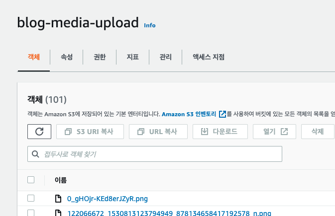
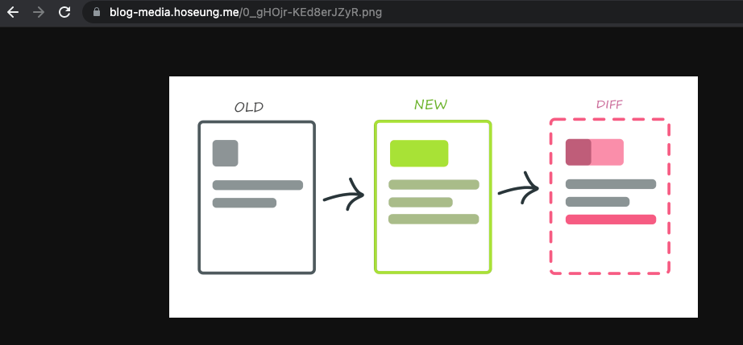
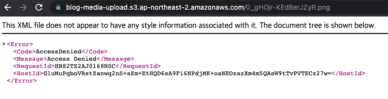

이미지 같은 미디어 컨텐츠는 일반적으로 CDN을 통해 제공됩니다.

AWS에서도 S3과 CloudFront를 연결해서 컨텐츠를 제공할 수 있습니다.

[이전 글](/2021-08-06-cloudfront-s3-private)에서 media service를 배포하고, presigned post를 통해 이미지를 업로드 했었습니다. 이 글에서는 업로드한 이미지를 사용자에게 제공하는 방식을 알아보겠습니다.

## Public vs Private

일반적으로 S3과 CloudFront로 컨텐츠를 제공하는 방식은 두 가지로 나뉩니다.

1. S3 버킷의 public access를 허용해서 사용자가 컨텐츠를 볼 수 있게 한다.
2. S3 버킷은 private 상태로 보호하고, CloudFront에 권한을 줘서 사용자가 컨텐츠를 볼 수 있게 한다.

1번 방식은 가장 쉬운 방법이긴 하지만, 저장소의 public access를 허용하는 것은 보안상 상당히 불안한 일이라고 생각합니다. 사용자는 S3 객체의 URL나 CloudFront를 통해 컨텐츠에 엑세스할 수 있습니다.

반면 2번 방식은 S3 버킷은 외부로부터 보호되고, 사용자는 CloudFront를 거쳐서만 S3 버킷에 접근할 수 있기 때문에 1번 방식에 비해 안전한 액세스를 확보할 수 있습니다.

Origin Access Identity를 통해 2번 방식으로 컨텐츠를 제공할 수 있습니다.

## Origin Access Identity

Origin Access Identity(이하 OAI)는 private 컨텐츠를 CloudFront를 통해 제공하기 위한 특수한 사용자입니다.

OAI를 생성하고 CloudFront와 연결하면, S3의 private 컨텐츠를 제공할 수 있습니다.

## serverless.yml resources 작성

serverless.yml의 resources는 AWS CloudFormation 문법과 똑같이 작성해주면 됩니다. CloudFormation은 AWS의 리소스들을 자동으로 생성해주는 서비스입니다.

[여기](https://docs.aws.amazon.com/AWSCloudFormation/latest/UserGuide/aws-template-resource-type-ref.html)서 원하는 AWS 리소스의 CloudFormation 템플릿 형식을 확인하고, 그거에 맞춰서 serverless.yml을 작성해주면 됩니다.

[CloudFront Distribution](https://docs.aws.amazon.com/AWSCloudFormation/latest/UserGuide/aws-resource-cloudfront-distribution.html), [OAI](https://docs.aws.amazon.com/AWSCloudFormation/latest/UserGuide/aws-resource-cloudfront-cloudfrontoriginaccessidentity.html) 둘 다 CloudFormation을 통해 생성할 수 있으므로, 각각 문서를 참고해서 serverless.yml을 작성해주겠습니다.

media service의 serverless.yml에서 resources 부분만 보여드리면 아래와 같습니다.

```yml
resources:
  Resources:
    Bucket:
      Type: AWS::S3::Bucket
      Properties:
        BucketName: blog-media-upload
        CorsConfiguration:
          CorsRules:
            - AllowedHeaders:
                - "*"
              AllowedMethods:
                - GET
              AllowedOrigins:
                - "*"
            - AllowedHeaders:
                - "*"
              AllowedMethods:
                - POST
              AllowedOrigins:
                - "*"
    AccessIdentity:
      Type: AWS::CloudFront::CloudFrontOriginAccessIdentity
      Properties:
        CloudFrontOriginAccessIdentityConfig:
          Comment: access identity to provide s3 content via cloudfront
    CloudFront:
      Type: AWS::CloudFront::Distribution
      Properties:
        DistributionConfig:
          Origins:
            - Id: blog-media-origin
              DomainName: blog-media-upload.s3.ap-northeast-2.amazonaws.com
              S3OriginConfig:
                OriginAccessIdentity:
                  Fn::Join:
                    - ""
                    - - "origin-access-identity/cloudfront/"
                      - Ref: AccessIdentity
          DefaultCacheBehavior:
            TargetOriginId: blog-media-origin
            ViewerProtocolPolicy: https-only
            CachePolicyId: 658327ea-f89d-4fab-a63d-7e88639e58f6
          Aliases:
            - blog-media.hoseung.me
          ViewerCertificate:
            AcmCertificateArn: arn:aws:acm:us-east-1:103085914365:certificate/a7b3ee39-01ec-41b0-8234-b1501e6e2d3f
            MinimumProtocolVersion: TLSv1.2_2021
            SslSupportMethod: sni-only
          Enabled: true
```

Bucket은 이전 글에서 만들었던 그대로이고, OAI랑 CloudFront 설정을 설명드리면,

- OAI

  - Comment: OAI에 대한 설명입니다. 대충 private S3 컨텐츠를 제공하기 위한 것이라고 써놨습니다.

- CloudFront
  - Origins: CloudFront Origins를 설정합니다.
    - Id: Origin의 ID입니다.
    - DomainName: [문서](https://docs.aws.amazon.com/AmazonCloudFront/latest/DeveloperGuide/distribution-web-values-specify.html#DownloadDistValuesDomainName)에서 S3 도메인 형식을 참고해서 작성하면 됩니다.
    - S3OriginConfig: 여기서 OAI를 연결해주면 됩니다. [문서](https://docs.aws.amazon.com/AWSCloudFormation/latest/UserGuide/aws-properties-cloudfront-distribution-s3originconfig.html#cfn-cloudfront-distribution-s3originconfig-originaccessidentity)를 보면 OAI ID를 입력할 때 맞춰야할 포맷이 나옵니다. 포맷에 맞추기 위해 Join을 사용해서 두 값을 연결해줬습니다.
  - DefaultCacheBehavior: CloudFront의 캐싱 정책을 설정합니다.
    - TargetOriginId: 캐싱 정책을 적용할 Origin의 ID입니다. blog-media-origin으로 설정했습니다.
    - ViewerProtocolPolicy: http, https 허용 정책을 설정합니다. https로만 접근할 수 있도록 설정했습니다.
    - CachePolicyId: CloudFront 캐싱 정책의 ID입니다. [managed cache policies](https://docs.aws.amazon.com/AmazonCloudFront/latest/DeveloperGuide/using-managed-cache-policies.html) 중에서 CachingOptimized 정책의 ID를 넣어줬습니다.
  - Aliases: Domain Aliases를 설정합니다. blog-media.hoseung.me로 설정했습니다.
  - ViewerCertificate: Domain Aliases를 사용했으므로, TLS 설정을 해줬습니다.

## 테스트

CloudFront를 통해 S3 객체를 가져와봅시다.

맨 위에 있는 0_gHOjr-KEd8erJZyR.png를 요청해 보겠습니다.



CloudFront를 통해 요청을 보내면 이미지를 확인할 수 있습니다.



그러나 S3 URL로 직접 접근하면, 버킷에 대한 public access를 허용하지 않았기 때문에 403을 응답합니다.



의도한대로 S3 객체에 CloudFront로만 엑세스할 수 있으니 성공입니다.
