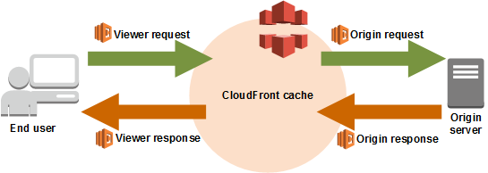
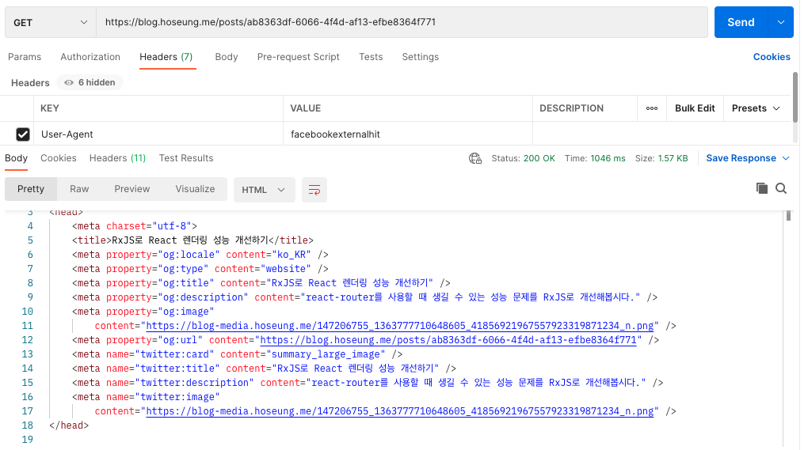
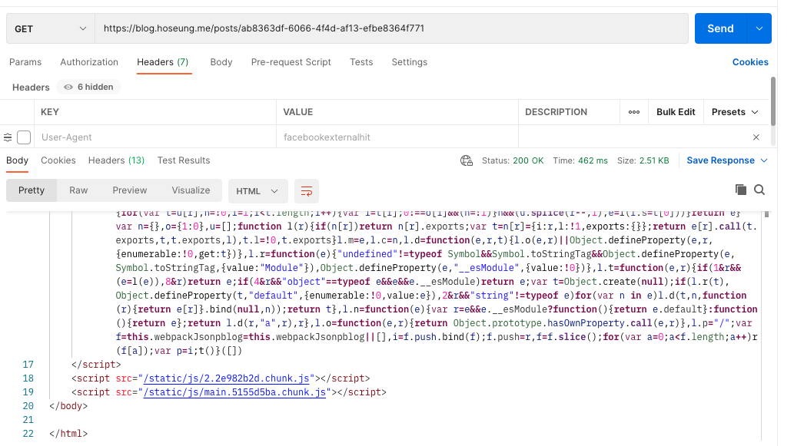
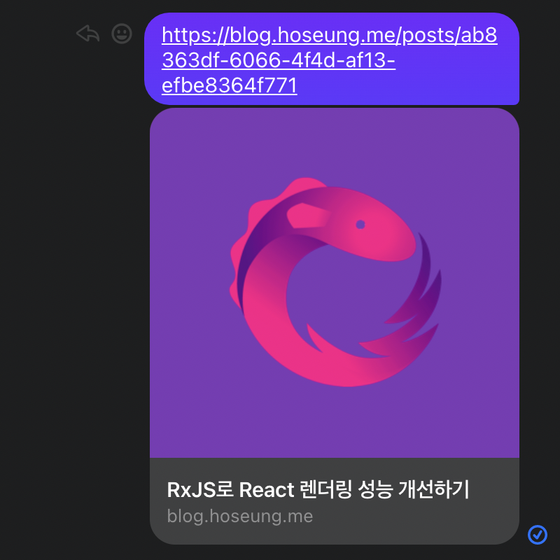

리액트를 사용하시는 프론트엔드 개발자 분들이라면, 서버에서 HTML을 렌더링해서 보내주는게 아닌 브라우저에서 Javascript가 실행되어 렌더링되는 CSR 방식이 굉장히 익숙하실겁니다.

하지만 CSR 환경은 기본적으로 SEO에 불리한데, 크롤링 봇이 Javascript 실행까지 지원하지 않는 경우가 있기 때문입니다.

검색 엔진의 경우 Javascript까지 실행한 결과를 파싱하는 것들이 있어서, [react-helmet](https://github.com/nfl/react-helmet) 등으로 meta 태그를 추가해 SEO를 핸들링할 수 있지만, Javascript 실행을 지원하지 않는 검색 엔진이나, SNS에 링크를 공유하는 등의 상황에서는 처리가 힘듭니다.

빌드 시점에 특정 페이지의 HTML을 미리 생성하는 pre-rendering 방식도 있지만, 포스트 조회 페이지처럼 path parameter가 달라지는 페이지의 경우, 포스트 ID 마다 다르게 렌더링하는 등의 섬세한 처리는 힘듭니다.

이 때 AWS CloudFront를 통해 웹 사이트를 제공하는 경우, Lambda@Edge를 사용해서 간편하고 SEO를 핸들링할 수 있습니다.

이 글에서는 SEO 처리를 다 하는건 아니지만, Lambda@Edge를 활용해 Open Grapth meta 태그들을 렌더링 해보겠습니다.

## 배경지식

우선 이 글을 읽기 위해 필요한 기본적인 내용들부터 짚고 넘어가봅시다.

## CloudFront와 Lambda@Edge의 동작 방식

Lambda@Edge(이하 람다엣지)는 기본적으로 일반 Lambda function(이하 람다함수)과 동일합니다.

일반 람다함수와 다른 점은, 람다엣지는 CloudFront(이하 클라우드프론트)와 연결되는 특수한 함수로, Cloudfront에 요청이 들어왔을 때 실행됩니다.



클라우드프론트를 사용할 때의 전체적인 구성 요소는 사진에 나오듯이 유저(End user), CDN(CloudFront cache), 오리진(Origin Server)이라고 할 수 있습니다.

이 때 클라우드프론트에서 람다엣지를 실행시키는 이벤트는 4가지가 존재합니다. 이를 실행 순서대로 정리하면,

1. viewer-request: 유저가 CDN에 보내는 요청입니다. 해당 요청에 대해 이미 캐싱된 응답이 있는 경우, 오리진에 요청을 보내지 않고 바로 4번 단계로 넘어갑니다.
2. origin-request: 클라우드프론트가 오리진으로 보내는 요청입니다.
3. origin-response: 오리진에서 CDN으로 보내는 응답입니다. CDN은 캐싱 정책에 따라 해당 응답을 캐싱합니다.
4. viewer-response: CDN이 유저에게 보내는 응답입니다.

각각의 이벤트 마다 람다엣지를 등록할 수 있고, 요청/응답의 내용을 조작하거나, 요청 단계에서 바로 응답을 해버리는 등 상황에 따라 다양한 처리를 할 수 있습니다.

단, 람다엣지는 일반 람다 함수와 다른 제약이 있고 (예를 들자면 환경변수 사용 금지, 최대 실행시간 5초 등등..), 이벤트 별로 제약이 달라지는 경우가 있으니 주의해야 합니다.

만약 제약에 어긋나는 경우, Lambda@Edge 배포에 실패합니다.

### CloudFront의 헤더 기반 캐싱

클라우드프론트는 기본적으로 URL로 캐싱하지만, 캐시 적중률을 늘리기 위한 추가적인 기능들을 제공합니다. 그 중에는 HTTP 헤더 값을 기준으로 캐싱할 수 있는 기능이 있습니다.

캐싱의 기준이 될 헤더를 자유롭게 선택할 수 있는데, 따라서 CloudFront-Is-Desktop-Viewer나 CloudFront-Viewer-Country 등을 이용해 디바이스 유형, 위치 등에 따라서 캐싱할 수도 있고, 직접 보낼 커스텀 헤더의 값을 기준으로 캐싱할 수도 있습니다.

## 설계

제가 람다엣지를 등록해야하는 이벤트는 viewer-request, origin-request 두 가지입니다.

### viewer-request

viewer-request를 조작하는 목적은 요청을 한게 크롤링 봇인지 판단하기 위함입니다.

User-Agent 헤더를 검사해서 크롤링 봇인지 확인하고, 그 결과를 X-Viewer-Type이라는 커스텀 헤더에 담아 클라우드프론트로 보내줄겁니다.

이 때, 클라우드프론트가 X-Viewer-Type 헤더의 값을 기준으로 캐싱하도록 설정해서, 크롤링 봇에게는 Open Graph 컨텐츠가 따로 캐싱되어 응답되도록 설정할겁니다.

### origin-request

origin-request를 조작하는 목적은 Open Graph 컨텐츠를 렌더링해서 응답하기 위함입니다.

viewer-request 단계에서 추가한 X-Viewer-Type 헤더를 검사했을 때 요청을 보낸게 크롤링 봇일 경우, 바로 Open Graph 컨텐츠가 담긴 HTML을 렌더링한 후 HTTP Response를 return하면 됩니다.

즉, SEO 처리와 동시에 오리진에 가해지는 트래픽 부담까지 줄일 수 있습니다.

origin-request의 URL을 보고 어떤 페이지에 대한 요청인지 확인한 후, 그에 맞는 HTML을 렌더링해서 응답해줄겁니다.

## Lambda@Edge 함수 작성

이제 Lambda@Edge 함수를 작성해줄겁니다.

### viewer-request

우선 User-Agent 헤더를 검사해서 크롤링 봇인지 판단할겁니다.

```typescript
const request = event.Records[0].cf.request;
const headers = new Headers(request.headers);

const type = !!headers.get("user-agent")?.match(/facebookexternalhit|twitterbot|slackbot/g) ? "bot" : "user";
```

페이스북/트위터/슬랙 봇 등이 사용하는 User-Agent인지 검사하고, "bot" 또는 "user" 문자열을 type 변수에 담았습니다.

```typescript
const headerName = "X-Viewer-Type";
request.headers[headerName.toLowerCase()] = [{ key: headerName, value: type }];
return request;
```

그리고 viewer-request의 헤더 목록에 X-Viewer-Type을 추가해서 return 해줬습니다.

### origin-request

viewer-request를 조작해서 보낸 X-Viewer-Type 헤더를 먼저 검사해줍시다.

```typescript
const request = event.Records[0].cf.request;
const headers = new Headers(request.headers);

const viewerType = headers.get("x-viewer-type");
if (!viewerType || viewerType !== "bot") {
  return request;
}
```

X-Viewer-Type의 값이 bot이 아닌 경우, origin-request를 그대로 return 합니다.

만약 X-Viewer-Type의 값이 bot인 경우, Open Graph 컨텐츠들을 렌더링 해야합니다.

우선 간단한 HTTP Response 팩토리를 만들어줬습니다.

```typescript
import { CloudFrontResultResponse } from "aws-lambda";

export class Response {
  public static render(meta: {
    title: string;
    description: string;
    image: string;
    url: string;
  }): CloudFrontResultResponse {
    const body = `
    <html>
      <head>
        <meta charset="utf-8">
        <title>${meta.title}</title>
        <meta property="og:locale" content="ko_KR" />
        <meta property="og:type" content="website" />
        <meta property="og:title" content="${meta.title}" />
        <meta property="og:description" content="${meta.description}" />
        <meta property="og:image" content="${meta.image}" />
        <meta property="og:url" content="${meta.url}" />
        <meta name="twitter:card" content="summary_large_image" />
        <meta name="twitter:title" content="${meta.title}" />
        <meta name="twitter:description" content="${meta.description}" />
        <meta name="twitter:image" content="${meta.image}" />
      </head>
      <body></body>
    </html>
    `;

    return {
      status: "200",
      body,
      headers: {
        "Content-Type": [
          {
            key: "Content-Type",
            value: "text/html",
          },
        ],
      },
    };
  }
}
```

Response 클래스의 render 메소드는 input 값을 Open Graph 태그들이 담긴 HTML로 렌더링하고, HTTP Response object로 만들어 return 합니다.

나중에 제대로 SEO를 핸들링할 때, 이 메소드의 HTML만 수정해주면 됩니다.

그리고 이제 request URL을 검사해서, 페이지 별로 다른 Open Graph 컨텐츠를 응답해주겠습니다.

```typescript
const Regex = {
  UUID: /\b[0-9a-f]{8}\b-[0-9a-f]{4}-[0-9a-f]{4}-[0-9a-f]{4}-\b[0-9a-f]{12}\b/,
};

if (request.uri === "/categories") {
  return Response.render({
    title: "장호승 개발 블로그 - 카테고리",
    description: "전체 카테고리 목록",
    image: "https://blog-media.hoseung.me/blog-og-main-profile-image.png",
    url: requestURL,
  });
}

/* ... */

const postShowMatch = request.uri.match(new RegExp(`^\/posts\/(${Regex.UUID.source})\/?$`));
if (postShowMatch) {
  const postId = postShowMatch[1];
  const post = await client.getPost({ id: postId });

  return Response.render({
    title: post.title,
    description: post.summary,
    image: post.coverImageURL || defaultOgImage,
    url: requestURL,
  });
}

return Response.render({
  title: "장호승 개발 블로그",
  description: "",
  image: defaultOgImage,
  url: requestURL,
});
```

포스트 페이지의 경우 URL에서 ID를 파싱해서 포스트별로 다른 Open Graph 컨텐츠를 렌더링해줬습니다.

또한 별개로 처리한 페이지를 제외한 나머지 페이지는 기본값으로 응답해줬습니다.

> 전체 코드는 [https://github.com/hoseung-only/blog-seo](https://github.com/hoseung-only/blog-seo) 에서 확인하실 수 있습니다.

## 테스트

Postman과 페이스북 메신저를 통해 테스트 해보겠습니다.



Postman을 통해 User-Agent를 facebookexternalhit으로 설정하고 보내보니, Open Graph 컨텐츠가 응답된걸 볼 수 있었습니다.



그리고 User-Agent를 덮어쓰지 않고 그냥 보냈을 땐 리액트 빌드 결과물이 응답된걸 볼 수 있었습니다.



페이스북 메신저에서도 Open Graph 태그들을 잘 파싱해서 보여주는걸 볼 수 있었습니다.

성공적이네요.

## 마무리

Lambda@Edge와 CloudFront의 헤더 기반 캐싱을 활용한 SEO 처리, 정확히는 Open Graph 처리를 해보았습니다.

Serverless 기술과, 그 발전을 이끌어나가는 AWS의 Serverless 인프라들은 정말 매력적이라고 생각합니다.

우선 프론트엔드 개발자로써, 개발할 때의 선택지가 더 넓어졌다는 생각이 들었습니다.

예를 들어 이 글의 내용처럼 CSR 환경에서도 SEO를 처리할 수 있게 되었으니, 팀 상황이나 자신의 기준에 따라 CSR, SSR을 선택적으로 적용할 수 있게되었습니다.

또한 백엔드 개발자로써도 많은 변화가 있었습니다.

제가 AWS Lambda 기반의 백엔드 개발을 시작하기 전엔 EC2를 사용했었는데, EC2 인스턴스에 접속해 초기 세팅을 다 해주는 것부터 시작해 Docker와 NginX를 활용해 무중단 배포 자동화 프로세스를 설계하고, 구축하고, 운영하는 등 운영 관리 비용이 개발 비용에 비해 상당히 크다고 느꼈습니다.

하지만 Lambda와 함께 serverless 인프라를 활용하기 시작한 후로는 serverless framework를 통한 손쉬운 인프라 구축 자동화 및 무중단 배포, 오토 스케일링 등 운영관리 비용이 현저히 낮아진걸 크게 느꼈고, 코드 레벨에 더 집중할 수 있게 되었습니다.

앞으로 Serverless 기술이 얼마나 더 발전할지 기대되네요.
