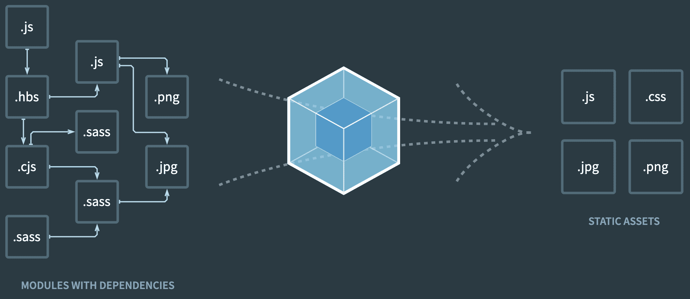
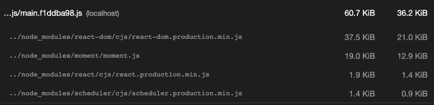
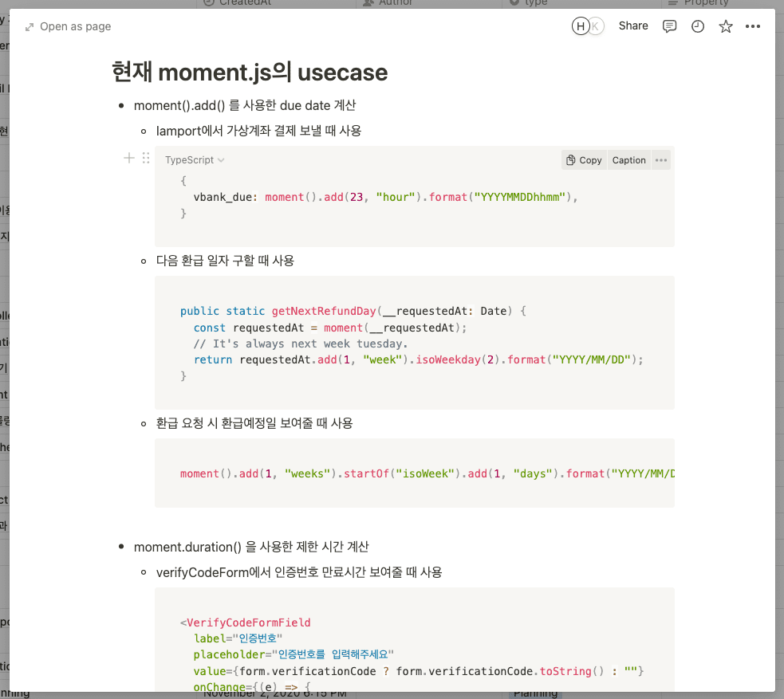
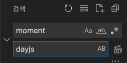
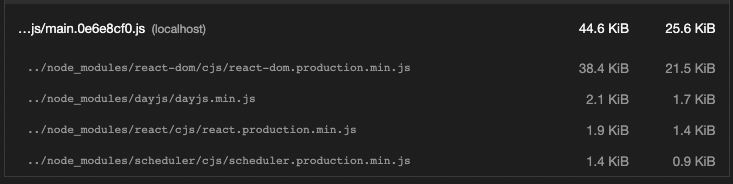

프론트엔드 개발을 하다보면 날짜와 관련된 여러가지 연산이 요구될 때가 많은데요.

예를 들어 캐시백 지급일을 상품 결제 완료일로부터 45일 뒤의 날짜로 보여준다거나, 생성된지 1분이 지나지 않은 글의 경우 작성일을 "방금" 이라고 보여주는 등의 니즈가 있을겁니다.

하지만 위와 같은 날짜 연산들을 Javascript의 Date 객체만을 사용해 처리하기엔 번거롭고, 이런 경우 이미 잘 만들어진 라이브러리를 가져다 사용하는게 훨씬 효율적입니다.

아주 대표적인 라이브러리로 [Moment.js](https://momentjs.com)가 있고, 제가 일하고 있는 팀에서도 한 때 사용하고 있었습니다.

그러나 Moment.js를 프론트엔드에서 사용할 때의 문제점 때문에 [Day.js](https://day.js.org)라는 라이브러리로 갈아타게 되었는데요. 이 글에서는 그 과정을 정리해보려고 합니다.

## 모던 프론트엔드의 빌드 시스템 - 웹팩의 등장 배경

Moment.js에 대해 이야기하기 전, 잠시 모던 프론트엔드의 빌드 시스템 이야기로 들어가봅시다.

프론트엔드의 빌드에는 다들 [웹팩](https://webpack.kr)을 사용하실텐데요. 웹팩이 왜 등장하게 되었을까요?

이전에는 서로 분리된 Javascript 파일들을 따로 요청해야 했습니다.

```html
<script src="a.js"></script>
<script src="b.js"></script>
<script src="c.js"></script>
```

하지만 브라우저는 동시에 보낼 수 있는 HTTP 요청 수를 제한하고 있고, 이는 요청할 Javascript파일이 많을 수록 로딩 시간이 늘어난다는 것을 의미합니다.

게다가 웹 페이지를 로딩할 때 불러와야하는 리소스는 Javascript만 있는게 아닙니다. 이미지, CSS 등 여러 리소스들이 함께 페이지를 이룹니다.

따라서 웹팩이 등장했습니다. 웹팩은 서로 분리된 Javascript 모듈 간의 의존 관계를 파악하고, 의존하는 것들끼리 합쳐 하나의 Javascript 파일로 만듭니다. 또한 Javascript에만 한정된 것이 아니라, CSS, 이미지 등 여러 리소스들에 대한 처리를 지원합니다.



그리고 웹팩이 하나로 합쳐준 Javascript 파일을 번들이라고 부르는데요. 번들 하나만 요청하면 되니까 HTTP 요청 수는 크게 줄어들었지만, 여러 Javascript 파일을 하나로 합치다 보니 이젠 번들의 크기가 너무 거대한 것이 문제가 되었습니다.

특히 [React.js](https://ko.reactjs.org)의 등장과 함께 SPA(Single Page Application)가 크게 주목받기 시작하고, CSS-in-JS 같은 방법론들이 생겨나면서 Javascript 코드는 이전보다 훨씬 커지게 되었습니다.

Javascript는 기본적으로 HTML 파서를 블로킹하는 리소스입니다. Javascript를 다운로드하고 실행하는 시간 만큼 유저가 결과적으로 페이지를 보게되는 시간이 늦어진다는 의미입니다.

따라서 거대한 번들의 크기를 줄이는 번들 경량화는 모던 프론트엔드의 성능 최적화에 있어서 아주 중요한 가치 중 하나가 되었습니다.

## Moment.js의 문제점

다시 Moment.js 이야기로 돌아와서, Moment.js는 사이즈가 매우 큰 라이브러리 입니다.

일반적인 use case의 범위를 초과하는 광범위한 Date 연산을 지원하기 때문인데요. 이는 번들에 포함된 Moment.js 코드 중 사용되지 않는 부분이 더 크다는 것을 의미합니다.

사용하지도 않는 기능들 때문에 네트워크 비용은 오르고, 다운로드 속도는 느려지고, 페이지 렌더링 시간은 늘어납니다.

그렇다면 Moment.js가 번들 경량화에 있어서 얼마나 비효율적인지 직접 확인해봅시다.

제가 일하고 있는 팀에서는 Lighthouse CI 지표를 프론트엔드 성능 최적화에 활용하고 있는데요. Moment.js의 문제점도 Lighthouse CI 경고 덕분에 알았습니다.

CRA를 사용해서 간단히 React 프로젝트를 생성하고, Moment.js로 현재 시간을 출력해보겠습니다. 그리고 로컬에서 Lighthouse CI를 한번 돌려보겠습니다.

```javascript
import moment from "moment";

export function App() {
  return <div>{moment().format("yyyy년 M월 D일 h시 m분 s초")}</div>;
}
```

moment를 import하고, format을 사용해 간단히 현재 시간을 보여주는 코드입니다. Moment.js의 전체 크기는 얼마이고, format만 사용했을 때 얼마나 큰 용량이 낭비되고 있을까요?



(잘 안보이시는 분들을 위해)전체 번들 크기가 60.7KB이고, Moment.js가 19KB를 차지합니다. 그리고 여기서 Moment.js에 의해 낭비되고 있는 크기는 12.9KB입니다.

즉, 번들의 약 30%를 Moment.js가 차지하고 있고, Moment.js의 약 70%가 낭비되고 있습니다.

이는 좀 극단적인 예시긴 하지만, 제가 일하는 팀에서 프로덕션에 측정해봤을 때도 심각한 용량 낭비는 크게 달라지는게 없었습니다.

그리고 사실 Moment.js의 문제점은 사이즈에만 있는 것은 아닙니다. 오래된 이야기지만, Moment.js는 **더이상의 신규 개발 없이 유지보수만 하는 상태**로 전환되었습니다. 따라서 앞으로도 이 문제에 대한 공식적인 솔루션은 기대하기 힘들 것으로 보입니다.

## Day.js를 선택한 이유

Moment.js의 공식 문서에 [Moment.js를 대체하기에 좋은 라이브러리들](https://momentjs.com/docs/#/-project-status/recommendations/)이 소개되어 있는데요. [You-Dont-Need-Momentjs](https://github.com/you-dont-need/You-Dont-Need-Momentjs)라는 깃허브 레포지토리에서 이들을 보기쉽게 비교해 두었습니다.

그 중에서 제가 Day.js를 선택한 이유는 아래와 같습니다.

- Moment.js와 똑같은 인터페이스
- 기본적인 기능만 포함하여 매우 작은 사이즈, 플러그인을 사용한 확장
- 프론트엔드 코드 내의 모든 Moment.js use case들을 커버 가능

### Moment.js와 똑같은 인터페이스

새로운 기술을 도입함에 있어서 매우 중요한 고려사항 중 하나는 바로 러닝커브라고 생각합니다. Moment.js와 다른 라이브러리의 차이가 클수록 팀 전체가 적응하는 비용도 커질텐데요.

그러나 Day.js는 공식 문서에서 대놓고 아래와 같이 소개하고 있습니다.

> Day.js is a minimalist JavaScript library that parses, validates, manipulates, and displays dates and times for modern browsers **with a largely Moment.js-compatible API.**

즉, 러닝 커브와 마이그레이션 비용을 기본적으로 낮게 가져갈 수 있기 때문에 Day.js를 우선적으로 검토하기 시작했습니다.

### 기본적인 기능만 포함하여 매우 작은 사이즈, 플러그인을 사용한 확장

Day.js가 Moment.js와 호환되는 인터페이스와 함께 강조하는 것은 매우 작은 사이즈입니다.

일반적으로 개발자들이 필요로 할만한 아주 기본적인 기능들(add, sub, start of time, get millisecond 등)만 포함되어있고, 나머지는 plugin을 통해 필요에 따라 확장하여 사용하는 방식입니다.

```typescript
import dayjs from "dayjs";
import duration from "dayjs/plugin/duration";

dayjs.extend(duration);
```

라이브러리 사이즈에 민감한 프론트엔드 생태계에서 Day.js의 이런 특징은 정말 좋다고 생각했습니다.

### 프론트엔드 코드 내의 모든 Moment.js use case들을 커버 가능

사실 Moment.js를 대체할 라이브러리를 조사하기 전, 먼저 노션에 현재 Moment.js의 모든 use case들부터 정리했었는데요.



Day.js를 선택한 아주 결정적인 이유는, 노션에 정리한 모든 use case들을 커버할 수 있었기 때문입니다.

다른 라이브러리들의 경우, Moment.js와 인터페이스가 다르기 때문에 점진적인 마이그레이션이 필요했겠지만, Day.js는 Moment.js와 동일한 인터페이스를 가지고 있었기에 큰 비용없이 매우 빠르게 마이그레이션이 가능했습니다.

단순히 `moment`를 `dayjs`로 replace하고, type definition 수정 같은 작은 작업 몇 가지만 해주니 끝났습니다.



## Day.js + Lighthouse CI

위에서 CRA + Moment.js로 간단히 예제를 작성했었는데요.

그 코드에서 Moment.js를 Day.js로 교체한 후 다시 Lighthouse CI를 돌렸을 때 얼마나 달라지는지 확인해봅시다.

```javascript
import dayjs from "dayjs";

export function App() {
  return <div>{dayjs().format("yyyy년 M월 D일 h시 m분 s초")}</div>;
}
```

dayjs를 import하고, format을 사용해 현재 시간을 보여주는 코드입니다. Moment.js와 사용법이 똑같은게 보이시나요?



전체 번들 사이즈가 44.6KB로 Moment.js를 사용할 때보다 약 30%나 줄었습니다. 게다가 Day.js의 사이즈는 2.1KB로, 번들의 약 4%만 차지하는걸 볼 수 있습니다.

이 또한 극단적인 예시라고 볼 수 있지만, Moment.js를 사용할 때보다 대략 8 ~ 10KB 정도는 절약할 수 있다는 점은 확실하네요.

## 마무리

전체적으로 보면 단순히 라이브러리를 교체하는 작업이었지만,

- 번들 경량화가 중요 가치로 떠오르게된 배경은 무엇인가
- 새로운 기술의 도입에 있어서 고려해야할 점은 무엇인가

에 대해 생각해볼 수 있었던 의미있는 작업이었네요.

혹시나 Moment.js를 프론트엔드에서 사용하신다면 도움이 되셨으면 좋겠습니다.
