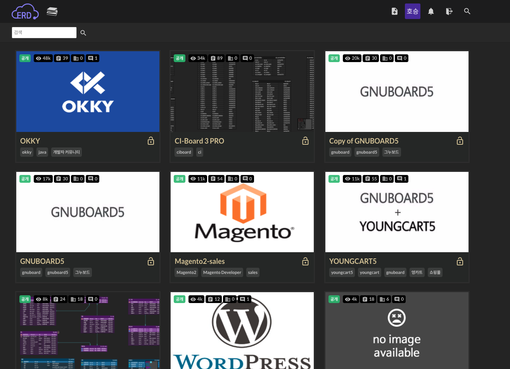

## ERD란

ERD는 Entity Relationship Diagram의 약자로, 데이터들의 관계를 그림으로 표현한 것입니다.

ERD를 통해서 RDB의 데이터들을 모델링할 수 있습니다. 고유 표기법을 통해서 1:1, 1:n, n:n 관계를 깔끔하게 표현할 수 있습니다.

그리고 두 테이블 사이에 점선, 실선을 사용할 수 있는데, 점선은 비식별 관계, 실선은 식별 관계를 나타냅니다.

테이블 사이의 식별/비식별 관계에 대해서는 [이 글](https://deveric.tistory.com/108)에 매우 쉽게 설명되어 있습니다.

## ERD 모델링 도구

저번에 시스템 아키텍처를 설계하며 소개드렸던 [miro](https://miro.com)처럼, ERD를 그릴 수 있는 도구도 존재합니다.

그것은 바로 [erdcloud](https://www.erdcloud.com/) 입니다.

ERD만 그릴 수 있는 것이 아니라, 아주 큰 국내 개발자 커뮤니티인 [OKKY](https://okky.kr/)를 비롯해 아주 많은 예시들을 보고 학습할 수 있습니다.

## 포스트, 카테고리 모델링 하기

제 블로그의 포스트들이 가지는 조건은:

1. 모든 포스트는 제목을 가진다.
2. 모든 포스트는 내용을 가진다.
3. 모든 포스트는 생성일을 가진다.
4. 모든 포스트는 1개의 카테고리를 가진다.

제 블로그의 카테고리들이 가지는 조건은:

1. 모든 카테고리는 0개 이상의 포스트를 가진다.
2. 모든 카테고리는 부모 카테고리를 가질 수 있다.
3. 모든 카테고리는 이름을 가진다.

위 조건들에 따라서 테이블을 모델링한 결과는 아래와 같습니다.

post와 category 테이블에 필요한 필드를 정의해주고, 둘 사이에 1:n 관계를 정의해주었습니다. category 테이블은 스스로를 외래키로 참조하도록 정의했습니다.

따라서,

- post 테이블의 category_id를 사용하여
  1. 특정 카테고리의 포스트를 조회
  2. 특정 카테고리의 포스트를 삭제
  3. 특정 포스트의 카테고리를 변경
     ...
- category 테이블의 parent_id를 사용하여
  1. 특정 카테고리의 자식 카테고리를 조회
  2. 특정 카테고리의 자식 카테고리를 삭제
  3. 특정 카테고리의 부모 카테고리를 변경
     ...

등의 작업 처리가 가능해집니다.
