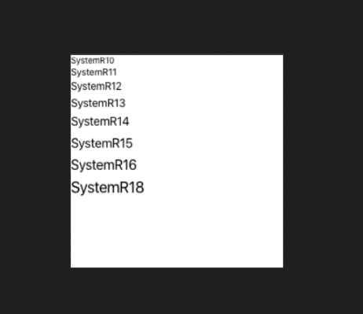
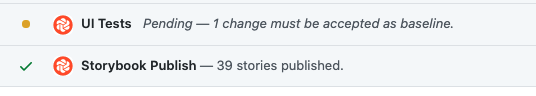

## Visual Regression Test?

visual regression test는 변경사항을 반영하고도 똑같은 UI가 유지되는지를 검사하는 테스트입니다.

예를 들어, 버튼의 height를 바꾼다거나, 실수로 margin을 지웠다거나.. 아니면 리팩토링을 하다가 UI 요소중에 무언갈 빠뜨렸거나 하는 등의 상황에서 유용할 수 있습니다.

팀에서 이것을 페이지 단위로 크게 도입해보자는 이야기가 나와서 시작하게 되었습니다.

## 목적

- PR의 변경사항에서 전후 비교를 한눈에 하기 위함
- 의도치 않은 UI 변동을 방지하기 위함

## 첫 번째 도전기 - Cypress


[Cypress](https://www.cypress.io/)라는 E2E테스트 라이브러리가 있습니다.

버튼 클릭, 페이지 이동 등 E2E테스트를 위한 인터랙션 기능을 라이브러리에서 지원하고, 테스트코드를 실행하면 가상 브라우저에서 작성한 테스트들이 실행되는 방식입니다.

Cypress로 페이지를 이동하면서 스크린샷을 찍으면 될거라고 생각했지만, 문제는 브라우저상에서 실제 배포되어있는 사이트에 접속해서 스크린샷을 찍으니까 동적으로 변하는 데이터 때문에 매번 테스트에 실패했습니다.

또한 Cypress는 (제가 모르는 것일 수도 있지만) 하나의 디렉토리 내에 관련된 모든 것을 담아야 했습니다. (프로젝트 내에 테스트코드를 분산시켜서 따로따로 만들어놓고, `src/**/*.test.ts` 이런식으로 매핑하는게 안된다는 뜻) 거기다가 tsconfig 설정도 따로 해줘야하고, 상당히 번거로웠습니다.

결론적으로 Cypress는 패스....

## 두 번째 도전기 - Jest


Cypress를 사용하면서 깨달은 문제점을 바탕으로, 아예 원하는 데이터로 컴포넌트를 완전히 mocking해서 그것만 따로 사진을 찍자고 생각했습니다.

[Jest](https://jestjs.io/)와 [react-screenshot-test](https://www.npmjs.com/package/react-screenshot-test)라는 라이브러리를 사용해서 대충 찍으면 될거라고 생각했습니다.

그런데.. 정말 머리가 터질뻔 했네요.

#### 개발자 경험에 관련된 문제

사실 테스트를 작성하는 것이 개발자에게 있어서 너무 어렵고 복잡해서는 안된다고 생각합니다.

따라서 test helper들을 잘 만들어서 편하고 좋은 인터페이스를 팀에게 제공해야 하는데, 페이지 단위의 복잡한 mocking을 해줘야 하니까 그게 쉬운 일이 아니었습니다.

테스트를 작성하기 위해서 해당 페이지 컴포넌트에서 어떤 API를 가져다 쓰느냐를 모두 확인해서 하나하나 mocking하는.. 그런 작업이 개발자 경험에 좋다고 생각되진 않았고,

저희가 컴포넌트에 API Response를 inject해주는게 아니라 react-query라는 라이브러리의 useQuery hook으로 컴포넌트 내에서 dynamic하게 fetch하고 있었기 때문에 컴포넌트 mocking에 대한 것들도 상당히 까다로운게 많았습니다.

엎친데 덮친 격으로 react-screenshot-test에서 사용하는 ReactDevServer?(이름은 제대로 기억이 안나네요)가 Suspense 컴포넌트도 지원하질 않아서 페이지 단위 테스트가 불가능에 가까워져 갔습니다.

그래서 방향을 바꿔서 버튼, 텍스트폼 등의 작은 단위의 컴포넌트들을 대상으로 삼기로 했습니다.

#### scss 모듈을 인식하지 못하는 문제

react-screenshot-test에서 css, css 모듈, scss까지는 지원을 했지만, scss 모듈은 지원하지 않았습니다.

scss 모듈과 그냥 scss의 차이는 아래와 같습니다.

```typescript
// scss
import "./index.scss";

// scss 모듈
import styles from "./index.module.scss";
```

CRA로 만들어진 리액트 앱에서 scss를 저렇게 모듈 형태로 임포트하면, className이 매핑된 객체가 import됩니다.

따라서 아래와 같은 방식으로 scss스타일을 적용할 수 있습니다.

```jsx
<Button className={styles[styleName]} />
```

다만, 저것은 (제가 알기론)웹팩에서 빌드할 때 index.html에 style태그를 추가해주고, 그것이 적용될 수 있도록 알맞은 className을 매핑해주는 겁니다.

따라서 Jest에서는 transform 설정을 통해서 직접 바꿔줘야 합니다.

#### Jest의 transform

Jest의 transform은 특정 확장자의 파일이 어떻게 export되는지를 결정합니다.

```json
{
  "transform": {
    "^.+\\.css$": "<rootDir>/a.js"
  }
}
```

```javascript
// a.js

module.exports = {
  process() {
    return `module.exports = "asdf";`;
  },
};
```

위처럼 설정하면 .css확장자인 파일을 import했을 때 그 값은 모두 "asdf"가 됩니다.

따라서 스타일이 적용될 수 있도록 scss module transformer를 만들어주었습니다.

```javascript
const sass = require("node-sass");

module.exports = {
  getCacheKey() {
    return Math.random().toString();
  },
  process(src, filename, config, options) {
    const { css: buffer } = sass.renderSync({
      file: filename,
    });

    const css = buffer.toString("utf-8");
    const styles = {};

    css
      .match(/\.(?<classname>[\S]+)/g)
      .map((e) => e.replace(".", ""))
      .forEach((e) => {
        styles[e] = e;
      });

    return `
      const { recordCss } = require("react-screenshot-test");
      recordCss(${JSON.stringify(css)});
      module.exports = ${JSON.stringify(styles)};
    `;
  },
};
```

react-screenshot-test는 가상 브라우저를 실행하기 전에 HTML style태그에 recordCss 함수를 통해 저장된 모든 css를 넣어줍니다. 따라서 scss를 파싱해서 recordCss 함수에 넘겨주었습니다.

결과적으로, 기존에 적용되지 않았던 scss 스타일들(텍스트 크기, 폰트 등)이 아래와 같이 적용되었습니다.



#### 그러나.. 로컬과 CI환경의 플랫폼 차이, CRA의 제한

하지만, 로컬은 Mac OS이고 Github Actions workflow는 우분투에서 돌아가고 있었기 때문에 환경 차이로 인해서 CI에서 테스트가 실패하는 문제가 있었습니다.

따라서 환경 통일을 위해 screenshot mode를 docker로 설정하고 찍어야 했는데, 그렇게 찍으니 완전 구식 브라우저(?)마냥 찍혀나와서.. 없느니만 못한 상태가 되었습니다.

거기다가 CRA코드를 뜯어보니 css, scss 모듈의 transform을 transformIgnorePatterns옵션을 사용해 금지하고 있었기 때문에 Jest 테스트 환경도 따로 만들어줘야 했습니다.

결론적으로 도커라이징을 통해 스크린샷을 찍었을 때의 결과물이 좋은 것도 아니고, 굳이 스크린샷 테스트 할때만 분리된 환경을 만들어준다는 접근법도 별로 좋지 않은 것 같아서 Jest도 결국엔 패스하게 되었습니다.

## 세 번째 도전기 - Chromatic


사실 회사에서는 이미 [Storybook](https://storybook.js.org/)이라는걸 사용해서 작은 UI component(버튼, 텍스트폼, 드롭다운 등등)들을 렌더링해서 확인해보고 있었습니다.

하지만, Storybook은 대상 컴포넌트들을 빌드해서 보여주기만 할 뿐이지 변경사항을 체크해서 비교해주고 CI를 실패시키고.. 그런 역할은 못합니다.

그렇다면 Storybook의 빌드 결과와 연결되어 전후비교를 해주는 도구가 있을 것 같았고, [Chromatic](https://www.chromatic.com/) 이라는 도구를 발견했습니다.

Chromatic은 매우 편리하게 Storybook과 통합할 수 있었습니다.

Chromatic에서 지원하는 CLI를 사용하면 Chromatic이 알아서 Storybook을 빌드한 후 스스로 publish 합니다. 혹은 미리 Storybook을 빌드해놓고, 그 경로를 Chromatic에게 알려줄 수도 있습니다.

그리고 Chromatic은 매우 편하게 자동화가 가능한데, Github Action을 지원하기 때문에 기존에 사용하던 Github Actions workflow에 정말 편리하게 통합할 수 있었습니다.

아래와 같이 Storybook을 빌드하는 workflow에서 [빌드 결과를 Cache](https://github.com/actions/cache)해주고,

```yml
- name: Cache storybook build result
  uses: actions/cache@v1
  with:
    path: build/storybook
    key: ${{ runner.OS }}-${{ github.sha }}-storybook-build-result
```

Chromatic에 Publish하는 workflow에서 빌드 결과를 가져다가 넘겨주면 끝입니다.

```yml
- name: Cache storybook build result
  uses: actions/cache@v1
  with:
    path: build/storybook
    key: ${{ runner.OS }}-${{ github.sha }}-storybook-build-result

- name: Publish to Chromatic
  uses: chromaui/action@v1
  with:
    token: ${{ secrets.GH_TOKEN }}
    projectToken: ${{ secrets.CHROMATIC_TOKEN }}
    storybookBuildDir: build/storybook
```

그리고 Chromatic에는 두 가지 기능이 있는데, UI Test와 UI Review입니다. 설정에서 원하지 않는 기능은 disable할 수 있습니다.

- UI Test: Storybook의 빌드 결과를 비교하여 결과를 보여주는 기능입니다.
- UI Review: 깃허브에서 코드리뷰를 하듯이 UI 변경사항에 대해 팀과 리뷰할 수 있는 기능입니다.

Storybook 빌드 결과가 Chromatic에 publish되면 UI Test가 실행됩니다.

이 때 Chromatic은 가장 마지막 빌드 결과와 현재 결과를 비교하고, 변경사항이 있는 경우 그것이 의도된 변경인지를 확인하도록 해줍니다. 팀원 혹은 본인이 Chromatic에 들어가서 Accept 혹은 Deny해주면 됩니다.

실제 화면은 회사 프로덕션이기 때문에 첨부하기가 애매해서, Chromatic Documentation에서 해당 화면을 가져왔습니다. 아래와 같이 Storybook 코드상에서의 변경 사항과, (아래 사진에선 안나오지만) 실제 픽셀단위로 어디가 어떻게 변경되었는지 한눈에 보여줍니다.


그리고 이 기능들의 status는 아래와같이 PR에서 한눈에 체크할 수 있습니다.



그리고 그냥 적용하면 알람같은걸 받아볼 수 없는데, Slack이나 Custom Webhook을 통합하면 Chromatic의 Notification 서비스를 이용할 수 있습니다.

결국 Storybook과 Chromatic을 통합하므로써 Visual Regression Test를 성공적으로 도입할 수 있었습니다.

## 정리

정말 먼 길을 돌아서 Chromatic의 적용을 통한 성공적인 도입까지 왔네요.

겨우 테스트 하나 도입한거지만, 참 많은 것들을 생각해보고 배울 수 있었던 계기였던 것 같습니다.

- Dependency Injection같은 의존성 관리 패턴
- 좋은 개발자 경험과 인터페이스에 대한 고민
- 크로스 플랫폼 이슈와 도커를 통한 일관된 환경 구축의 중요성
- ...

회사에 입사한 이후 처음으로 해본 꽤 의미있는 리서치였는데, 처음과 방향은 조금 달라졌지만 실패로 끝나지 않아서 기쁘네요.
