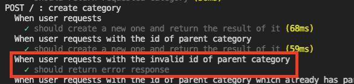

백엔드 애플리케이션을 개발하다보면 항상 깔끔한 에러 처리에 대해 고민하는 것 같습니다.

이 글에서는 어떻게 보면 어렵지만, 어떻게 보면 답이 매우 뻔했던.. 그런 고민 과정들을 풀어보려 합니다.

## 기존의 에러 처리의 문제

저는 Express를 백엔드 개발에 사용하고 있고, 기존의 에러 핸들러는 간단하게 아래와 같이 구성했습니다.

```typescript
router.use((req, res, next) => {
  const err = new Error("Not Found");
  return next(err);
});

router.use((err, req, res, next) => {
  if (err.message === "Not Found") {
    return res.status(404).json({
      message: err.message,
    });
  } else {
    return res.status(500).json({
      message: "Internal Server Error",
    });
  }
});
```

저렇게 그 어떤 라우터와도 path가 매치되지 않았을 때를 위한 404와, 에러가 났을 때를 대비한 500 라우터만 따로 만들어 뒀었고,

비즈니스 로직상(맞는 말인진 모르겠습니다)의 에러(Post가 존재하지 않거나, request parameters가 잘못됬거나... 등등)는 아래처럼 해당 라우터에서 따로 처리하는 방식으로 하고 있었습니다.

```typescript
router.get("/post/:id", async (req, res, next) => {
  try {
    const id = Number(req.params.id);

    const post = await Post.findById(id);

    if (!post) {
      return res.status(404).json({ message: "post does not exist" });
    }

    return res.status(200).json({ result: post });
  } catch (error) {
    return next(error);
  }
});
```

저런 경우에는 보시다시피 코드 퀄리티 상으로는 문제가 될 수 있겠지만, 딱히 에러를 응답하는 로직 자체에는 문제가 될일은 없다고 생각했습니다.

하지만 create 요청의 핸들러를 만들면서 문제를 깨달았습니다.

```typescript
router.post("/post", async (req, res, next) => {
  try {
    const post = await Post.create(req.body);

    return res.status(201).json({ result: post });
  } catch (error) {
    return next(error);
  }
});
```

```typescript
class Post {
  /* ... */
  public static async create(data: { title: string; content: string; categoryId: number }) {
    return await this.repository.create(data);
  }
}
```

위와 같은 경우에서, create 메소드 내부에서 특정 예외 상황이 있는 경우,(뭐 제목은 5자 이상이라던가... 물론 이런 종류의 validation은 create 메소드 내부에서 해야할 작업은 아니라고 생각합니다.. "굳이 예시를 들자면" 이죠..) create operation을 실행하지 않고 싶어졌다고 가정해봅시다.

create 요청인데 create가 진행되지 않았으니, 문제가 있다고 클라이언트에게 4XX Error Response를 통해 알려야할 것입니다.

근데 지금 클라이언트에 응답하는 메소드를 가지고 있는건 router의 res 객체이고, 그 router에서 호출한 create 메소드 내부에서는 res 객체에 직접적으로 접근할 수 있는 방법이 없습니다.

위에서 본 Read 요청의 경우 그냥 findById의 결과값을 검사해서 undefined냐 아니냐를 router에서 따진 후 응답하면 그만이지만, create의 경우 그런식으로 에러를 처리하는게 좋은 방법은 아닐 것 같다는 생각이 들었습니다.

예를 들어, 저런 경우에 그냥 null을 리턴해버린 후, router 내부에서 create 메소드의 결과가 null인지 아닌지를 판별하는 방법이나, try catch를 중첩해서 create 메소드에 감싸고, 내부에서 throw new Error();를 쓰는 방법 등등등...이 있을 겁니다.

하지만 결국 그런 방법은 create operation의 성공/실패 여부만 확인할 수 있을 뿐이지

```
"~~한 문제로 인해서 create operation을 진행할 수 없다" + status code
```

위와 같은 정보를 얻을 수는 없다는 아쉬움이 있습니다.

## 내가 생각하는 에러 처리의 조건

그래서 저런 고민들을 바탕으로 새롭게 도입할 에러 처리 플로우가 충족해야 하는 조건을 리스팅해봤습니다.

#### 1. 에러는 한 곳에서 처리되어야 한다.

이 조건을 넣은 이유는, 사실 이런 문제들이 근본적으로 애플리케이션 곳곳에서 에러를 분산해서 처리한다는 점 때문에 생겼다고 볼 수도 있다고 생각했기 때문입니다. (그렇게 생각한 이유는 다음 조건의 설명과 함께..)

#### 2. 에러는 애플리케이션 어느 곳에서든지 throw할 수 있어야 한다.

이 조건이 제가 1번 조건의 설명처럼 생각했던 이유입니다.

"애플리케이션 곳곳에서 에러를 처리한다는 점"은 문제가 안될 수도 있지만, "에러를 정의하여 응답할 수 있는 곳은 무조건 router 내부"로 한정되어 있으니, 당연하게도 이런 문제들이 생겼던 것입니다.

반면, 애초에 "에러는 애플리케이션 어느 곳에서든지 throw할 수 있다."를 염두에 두고 애플리케이션을 설계했었다면, 1번 조건은 충족하지 못하더라도 최소한 위에서 겪었던 문제들이 생길 일은 없었을거라고 생각했습니다.

## 문제 해결

그럼 위에서 리스팅한 조건들을 바탕으로 문제를 해결해 봅시다.

### 알아야할 개념들

**1. Express의 에러 핸들러**
우선, Express는 위에서도 보셨듯이 에러 핸들러를 지원합니다.

에러 핸들러는 일반 request 핸들러와 다르게 err, req, res, next, 총 4개의 값을 받습니다.

그리고 next function에 값을 넣는 경우, 모든 미들웨어를 뛰어넘고 에러 핸들러로 넘어갑니다. 그리고 그 값은 에러 핸들러의 첫 번째 매개변수에 담기게 됩니다.

**2. try catch 문과 throw**
try문 내부에서 throw한 값은 catch문의 변수에 그대로 담깁니다.

```typescript
try {
  throw 1;
} catch (error) {
  console.log(error); // 1
}
```

### 기존의 에러 핸들러 수정

Express의 에러 핸들러에서 모든 에러를 처리하는 것으로 가정하고, 기존에 만들어뒀던 에러 핸들러를 수정해봅시다.

우선, 에러 처리에 자주 사용하는게 자바스크립트의 Error 객체일텐데, 그건 500 이외의 에러를 처리하는 것에는 적합하지 않다고 생각했습니다. message 프로퍼티 외에도 status code를 담을 프로퍼티도 필요했기 때문입니다.

물론 자바스크립트라면 그냥

```javascript
const err = new Error("Not Found");
err.statusCode = 404;
```

이런식으로 했겠지만, 저는 타입스크립트를 사용하고 있고, 굳이 정해진 타입을 깨뜨릴 필요가 있나 싶었습니다.

따라서 커스텀 에러 객체를 따로 만들어주기로 결정했습니다.

```typescript
class ErrorResponse {
  constructor(public readonly statusCode: number, public readonly message: string) {}
}
```

그리고 아래와 같이 사용하면 됩니다.

```typescript
router.get("/post/:id", async (req, res, next) => {
  try {
    const id = Number(req.params.id);
    const post = await Post.findById(id);

    return res.status(200).json({ result: post });
  } catch (error) {
    return next(error);
  }
});
```

```typescript
class Post {
  /* ... */

  public static async findById(id: number) {
    const post = await this.repository.findOne(id);

    if (!post) {
      throw new ErrorResponse(400, "Post does not exist");
    }

    return post;
  }
}
```

findById 메소드에서 throw된 ErrorResponse 인스턴스는 router 내부의 catch 문으로 넘겨지고, next function을 통해 에러 핸들러로 넘어가게 됩니다.

그리고 최종적으로 에러 핸들러 내부에서 넘어온 값이 ErrorResponse 클래스의 인스턴스인지 판별만 해주면 됩니다.

그러면 그것이 제가 직접 정의해서 throw한 에러인지, 아니면 제가 정의하지 않은 internal server error(라이브러리에서 throw한 에러 등등..)인지 구분이 가능합니다.

```typescript
router.use((err, req, res, next) => {
  if (err instanceof ErrorResponse) {
    return res.status(err.statusCode).json({
      message: err.message,
    });
  } else {
    return res.status(500).json({
      message: "Internal Server Error",
    });
  }
});
```

instanceof 키워드를 사용해서 ErrorResponse의 인스턴스인지 확인해 주었습니다.

나름 깔끔하게 문제를 해결한 것 같네요.

## 테스트 코드 작성

간단한 테스트를 작성해서 새롭게 도입한 에러 처리 플로우가 잘 동작하는지 확인해봅시다.

우선 실제로 코드상에서 ErrorResponse 객체를 사용해주고,


그에 맞게 테스트를 작성했습니다.


나중에 따로 포스팅 하겠지만, 저는 BDD라는 개념에 기반한 테스트 코드를 Mocha, Chai, Supertest라는 라이브러리들을 사용해서 작성하고 있습니다.



통과한걸 보니 성공인가보네요!
