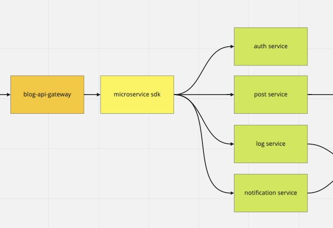
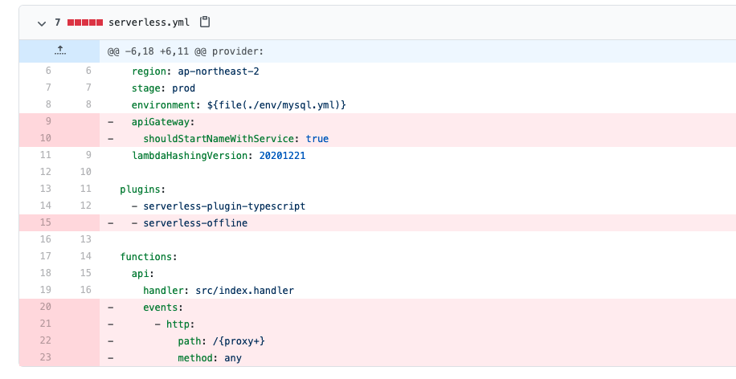

이 글에서는 Github Packages Registry를 사용하고 있습니다. 관련 내용은 [여기](/2021-02-13-github-packages)를 참고해주세요.

## 마이크로 서비스 간 통신 방법

잠시 제 개인 블로그의 백엔드 아키텍처를 복습해보자면,



blog-api-gateway에서 Microservice SDK를 통해 서비스들을 호출하고 있습니다.

또한, blog-api-gateway 말고 각각의 서비스들도 Microservice sdk를 통해 서로 호출할 수 있도록 설계했었습니다.

오늘 만들 것이 바로 저 Microservice SDK입니다.

그런데, 여기서 각각의 서비스들을 어떻게 호출할지에 따라 Microservice SDK가 어떻게 만들어질지가 달라질 것입니다.

1. HTTP위에서 통신할 수도 있을 것이고,

2. gRPC같은걸 사용할 수도 있을 것입니다.

3. 또는 제 아키텍처는 AWS Lambda에 기반하고 있기 때문에 그냥 AWS SDK를 사용해 Lambda 함수를 직접 호출할 수도 있겠죠.

저는 이 중에서 3번 방법으로 개발하기로 했습니다.

왜냐하면, 제 아키텍처 컨셉 상 각각의 서비스들을 호출하기 위해선 blog-api-gateway를 무조건 거쳐야 하기 때문입니다.

즉, blog-api-gateway 외에 다른 서비스들은 타인이 HTTP로 접근할 수 없도록 외부에 공개하지 않고, 제 AWS 계정을 통해서 직접 Lambda 함수를 invoke하는 것이 더 안전할 것 같다고 생각했습니다. (물론 이렇게 안하더라도 VPC 같은걸 설정해서 숨기면 되긴 하지만... 아예 HTTP 콜 자체를 막는게 좋은 것 같습니다.)

## AWS SDK V3 설치

제 기억상 원래 Javascript AWS SDK는 패키지 하나에 AWS 서비스들이 다 들어가 있었지만, V3부터는 @aws-sdk 스코프 내에서 원하는 서비스의 SDK만 설치하면 되도록 수정된 것 같습니다.

그래서 client-lambda를 설치해줬습니다. ([공식 Documentation](https://docs.aws.amazon.com/AWSJavaScriptSDK/v3/latest/clients/client-lambda/index.html))

```
npm install @aws-sdk/client-lambda
```

그리고 BaseLambdaClient라는 class를 만들어 주고, 아래와 같이 Lambda 클라이언트를 생성해 주었습니다.

```typescript
// Lambda 클라이언트 가져오기
import { Lambda } from "@aws-sdk/client-lambda";
```

```typescript
// BaseLambdaClient 생성자 내부
this.client = new Lambda({
  credentials: {
    accessKeyId: "액세스 키 아이디",
    secretAccessKey: "시크릿 액세스 키",
  },
});
```

그리고 실제로 Lambda 함수를 실행시키기 위한 인터페이스와 메소드를 만들어 주었습니다.

```typescript
export interface RequestOptions {
  method: string;
  path: string;
  headers?: { [key in string]: any };
  query?: { [key in string]: any };
  body?: { [key in string]: any };
}

export interface RequestResult<Body> {
  statusCode: number;
  headers: { [key in string]: string };
  body: Body;
}
```

```typescript
protected async request<Body>(
  options: RequestOptions
): Promise<RequestResult<Body>> {
  const response = await this.requestViaLambda(options);

  if (response.statusCode >= 400) {
    throw new ResponseError(response.statusCode, response.body.message);
  }

  return response;
}

private async requestViaLambda(options: RequestOptions) {
  const result = await this.client.invoke({
    FunctionName: this.metadata.name,
    InvocationType: "RequestResponse",
    Payload: new TextEncoder().encode(
      JSON.stringify({
        httpMethod: options.method,
        path: options.path,
        headers: options.headers ? this.serializeJSON(options.headers) : {},
        queryStringParameters: options.query
          ? this.serializeJSON(options.query)
          : {},
        body: JSON.stringify(options.body ?? {}),
      })
    ),
  });

  const response = JSON.parse(new TextDecoder().decode(result.Payload!));

  return {
    statusCode: response.statusCode,
    headers: response.headers,
    body: JSON.parse(response.body),
  };
}
```

#### 메소드 제한자

나중에 BaseLambdaClient를 상속해서 사용할 것이고, request 메소드를 통해서만 requestViaLambda 메소드를 호출할 것입니다.

따라서 request 메소드는 상속은 하되 외부에서 접근은 못하도록 protected, requestViaLambda는 상속되지 않도록 private로 설정해 주었습니다.

#### Payload 프로퍼티

그리고 requestViaLambda 메소드에서 this.client.invoke를 실행할 때 넘기는 속성 중 Payload가 굉장히 중요합니다.

저 부분이 [Lamdba 함수의 event 객체](https://docs.aws.amazon.com/ko_kr/lambda/latest/dg/nodejs-handler.html)가 될 부분입니다. 따라서 [AWS API Gateway Proxy Event의 포맷](https://github.com/awsdocs/aws-lambda-developer-guide/blob/main/sample-apps/nodejs-apig/event.json)에 잘 맞춰서 넣어주었습니다.

#### TextEncoder / TextDecoder

AWS Lambda SDK에서 Payload의 타입이 UInt8Array인데, 찾아보니 바이너리 데이터를 처리하는 타입인 것 같습니다.

Javascript Object를 JSON.stringify를 사용해서 JSON 문자열로 변환해주고, TextEncoder를 사용해서 UInt8Array로 인코딩할 수 있습니다.

반대로 TextDecoder를 사용하면 UInt8Array를 기존의 텍스트로 디코딩할 수 있습니다.

#### 에러 처리

그리고 request 메소드에서 requestViaLambda의 실행 결과가 2XX가 아닐 시, 에러를 throw하는 것을 보실 수 있습니다.

여기서 throw할 때 기본 Error 객체가 아니라 ResponseError라는 클래스를 따로 만들어 사용했는데, 그 이유는 [이 글](/2021-02-20-error-handling)에서 보실 수 있습니다.

짧게 요약하자면, 아래와 같이 에러가 Microservice SDK에서 발생한 것인지, 아니면 제가 핸들링하지 않은 다른 곳에서 발생한 것인지 식별하기 위함입니다.

```typescript
import { ResponseError } from "@hoseung-only/blog-microservice-sdk";
```

```typescript
if (err instanceof ResponseError) {
  return res.status(err.statusCode).json({ message: err.message });
} else {
  return res.status(500).json({ message: "Internal Server Error" });
}
```

## Post Service Client 작성해보기

Base Client를 만들었으니, 그것을 상속받아서 실제 마이크로서비스를 위한 Client도 작성해줘야 합니다.

우선 Post 서비스를 위한 클라이언트를 간단히 작성해줬습니다.

```typescript
export class PostService extends BaseLambdaClent {
  constructor() {
    super({
      name: "람다 함수 이름",
      arn: "람다 함수 ARN",
      region: "람다 함수 리전",
    });
  }

  public async getPostList({ cursor }: { cursor?: number }) {
    return await this.request<Models.PostListShow>({
      method: "GET",
      path: "/post/list",
      query: {
        cursor,
      },
    });
  }
}
```

그리고 패키지 최상위에서 아래와 같이 export 해줬습니다.

```typescript
// src/index.ts
import { PostService } from "./post/client";

export const client = {
  post: new PostService(),
};
```

## 기존의 마이크로서비스에서 API Gateway Proxy 없애기

blog-api-gateway를 제외한 나머지 서비스들은 HTTP 콜 자체를 하지 않을 것이기 때문에, serverless 프레임워크 설정 파일에서 AWS API Gateway 관련 설정을 없애주고 재배포 해야합니다.

[이 글](/2020-12-29-serverless-framework)에서 소개했었던 serverless-offline을 사용한 로컬 테스트와 http event 설정을 blog-api-gateway를 제외한 모든 서비스에서 지워줬습니다.



## 배포하기 전 테스트 하기

패키지를 배포하기 전에 간단히 테스트를 작성해봅시다. 테스트 코드 작성 기법이 궁금하시다면 [이 글](/2021-02-27-mocha-chai-bdd)을 참고해주세요.

```typescript
import { expect } from "chai";

import { client } from "..";

describe("Microservice SDK", () => {
  describe("Post service", () => {
    context("When user requests post list", () => {
      it("should return posts and nextCursor", async () => {
        const response = await client.post.getPostList({});

        expect(response.statusCode).to.be.eq(200);
        expect(response.body).has.property("posts");
        expect(response.body).has.property("nextCursor");
      });
    });
  });
});
```

위에서 만들어준 Post Service Client를 테스트하는 코드입니다. getPostList를 실행해서 실제로 Post Service가 올라가있는 Lambda 함수를 실행하고, 응답이 제대로 오는지 확인하고 있습니다.

Mocking이 아니라 실제 호출이기 때문에, 정확한 값을 확인하지 않고 올바른 포맷으로 응답이 왔는지만 확인해 주었습니다.

실제로 실행해보면 성공하는 것을 확인할 수 있네요.


## 패키지 배포하고 설치해보기

우선 패키지 배포를 위해 필수적으로 알아야할 tsconfig와 package.json 옵션들이 있습니다.

- tsconfig

  - declaration: .d.ts 파일(타입이 정의된 파일입니다)을 생성할지에 대한 여부입니다. 당연히 true로 설정해주었습니다. 패키지를 사용하는 곳에서 타입을 알아야 하기 때문입니다.

- package.json

  - files: 패키지를 배포할 때 포함할 파일들을 정하는 옵션입니다.

  - main: 패키지의 메인 export 지점을 어디로 둘지를 정하는 옵션입니다. [여기](https://docs.npmjs.com/cli/v7/configuring-npm/package-json#main)를 보시면 빠르게 이해가 가실겁니다.


tsconfig.json과 package.json를 각각 위와 같이 작성해주고, 배포해줬습니다.

```
npm publish
```

이제 실제로 다른 서비스에서 install하고 사용할 수 있습니다.

```
npm install @hoseung-only/blog-microservice-sdk
```


