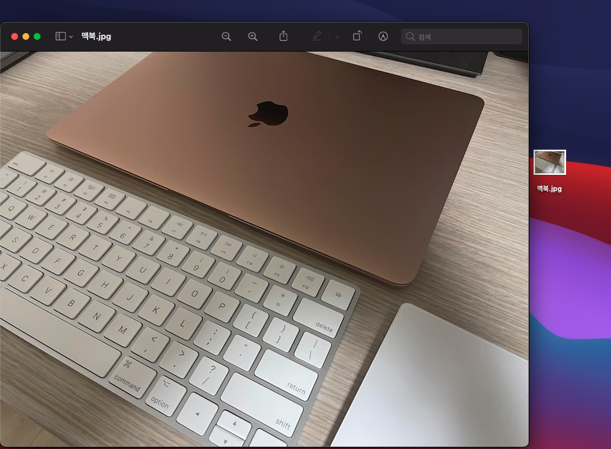
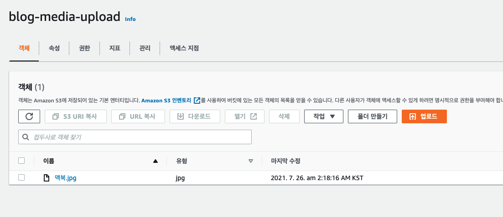

> 이 글에서는 [Javascript AWS SDK V3](https://docs.aws.amazon.com/AWSJavaScriptSDK/v3/latest/index.html)을 사용합니다.

AWS S3(이하 s3)은 클라우드 스토리지의 한 종류로, 매우 높은 데이터 내구성과 가용성을 보장합니다.

s3에 파일을 업로드할 경우 최소 3개의 AZ로 복제되어 데이터가 안전하게 보관됩니다. 또한 주기적으로 데이터 손실을 검사하고, 복제된 데이터를 활용해서 빠르게 복구합니다.

따라서 정적 웹 사이트 배포, 이미지 업로드 등에 매우 보편적으로 사용되는 서비스 중 하나입니다.

> s3의 내구성에 대한 자세한 내용은 [공식 FaQ 문서](https://aws.amazon.com/ko/s3/faqs/)의 '내구성 및 데이터 보호' 파트를 참고해주세요.

이 글에서는 s3에 이미지를 업로드할 수 있는 방법 3가지를 비교해보고, 실제로 업로드 해보겠습니다.

## 업로드 방법 비교

우선 s3 업로드는 기본적으로 두 가지 방법으로 나뉩니다.

1. 클라이언트와 s3사이에 이미지 업로드 용도의 프록시 API를 하나 둔다.
2. 클라이언트 직접 s3로 업로드한다.

우선 첫 번째 방법부터 살펴봅시다.

### 프록시 API

클라이언트 스토리지 사이에 업로드 / 수정 / 삭제 등을 위한 프록시 API를 두는 것은 매우 전통적인 방식일 겁니다.


이 방식은 외부로부터 스토리지에 대한 직접적인 접근을 막을 수 있어 안전하지만, 응답까지의 시간이나 서버 부하는 증가시킬 수 있다는 단점이 있을 것 같습니다.

따라서 이런 경우 클라이언트에서 직접 업로드하는 방식을 사용할 수 있고, s3는 그것에 적합한 안전한 솔루션을 제공합니다.

### 클라이언트에서 직접 업로드

s3에서는 presigned url, presigned post 두 가지 솔루션을 제공하고 있습니다. 각각의 솔루션은 기본적으로 서로 같은 개념이지만, 조금 다른 기능을 제공합니다.

우선 '서로 같은 개념'이라는게 무슨 의미인지 설명하자면, s3에서 presigned란 말그대로 미리 인증되었다는 뜻을 가집니다. s3 버킷에 대한 액세스 및 작업 권한이 부여된 url이 제공되는 것입니다.

즉, s3 버킷의 퍼블릭 액세스 허용 여부와는 관련 없이, presigned된 url을 가지고 있는 누구나 버킷에 대한 액세스가 가능해집니다.


위와 같이 서버에서 presigned된 url을 클라이언트에 제공하고, s3로 바로 접근하는 방식입니다. 따라서 사용에 각별한 주의가 요구되며, 먼저 presigned url부터 살펴보겠습니다.

### presigned url

presigned url은 s3 버킷에 액세스할 수 있고, 인증을 위한 signature가 담긴 query string parameters를 포함한 URL입니다.

HTTP GET을 통해 객체를 불러오고, PUT을 통해 버킷에 객체를 업로드할 수 있습니다. 또한 만료 시간을 설정하여 일정 시간 이후에는 접근이 불가능 하도록 제한할 수 있습니다.

단, 기본적으로 query string parameters에 붙어있는 signature를 제외한 커스텀 validation은 추가할 수 없습니다.

하지만 presigned post는 fields, conditions를 통해 커스텀 validation을 추가할 수 있도록 허용합니다.

### presigned post

presigned post는 HTTP POST를 통해 s3 버킷에 객체를 업로드하는 방식입니다. 데이터 전송에 multipart/form-data를 활용합니다.

presigned post는 POST 요청을 보낼 url과, form data에 무조건 포함시켜야 하는 key-value 쌍들이 포함된 fields를 제공합니다. 따라서 클라이언트는 fields의 내용을 요청에 포함시켜야 합니다.

또한 conditions를 사용해 fields에 조건을 걸 수 있는데, conditions의 모든 조건을 만족하지 못하는 POST 요청의 경우, s3가 요청을 거부합니다.

conditions는 3가지 operator를 설정할 수 있습니다.

1. eq: 동일 여부를 검사합니다.
2. starts-with: 주어진 문자열로 시작하는지 검사합니다.
3. content-length-range: 업로드할 객체의 크기 범위를 설정합니다.

따라서 eq를 활용해 특정 유저의 요청만 허용할 수도 있고, starts-with를 활용해 Content-Type을 검사해서 업로드될 객체의 포맷을 특정할 수도 있고, content-length-range를 활용해 파일의 최대 사이즈를 제한할 수도 있습니다.

또한, presigned url과 마찬가지로 만료 시간을 설정할 수 있습니다.

따라서 업로드에 사용하기에는 presigned url에 비해 presigned post가 훨씬 더 안전하고, 편리합니다.

## media service 추가하기

> [AWS Lambda, serverless framework](/2020-12-29-serverless-framework)에 기반하여 개발하고 있습니다.

제 개인 블로그의 [백엔드 아키텍처 설계](https://miro.com/app/board/o9J_laTyd80=/)에 따라, 미디어 컨텐츠 처리는 media service에서 독립적으로 다루도록 만들겠습니다.

우선 serverless.yml 파일을 작성해보겠습니다.

### serverless.yml 작성

```yml
service: blog-media

provider:
  name: aws
  runtime: nodejs12.x
  region: ap-northeast-2
  stage: prod
  environment: ${file(./env/env.yml)}
  lambdaHashingVersion: 20201221
  iam:
    role:
      statements:
        - Effect: "Allow"
          Action:
            - "s3:*"
          Resource: "*"

plugins:
  - serverless-plugin-typescript

functions:
  api:
    handler: src/index.handler
    timeout: 10

resources:
  Resources:
    Bucket:
      Type: AWS::S3::Bucket
      Properties:
        BucketName: blog-media-upload
        CorsConfiguration:
          CorsRules:
            - AllowedHeaders:
                - "*"
              AllowedMethods:
                - GET
              AllowedOrigins:
                - "*"
            - AllowedHeaders:
                - "*"
              AllowedMethods:
                - POST
              AllowedOrigins:
                - "*"
```

중요한 부분들만 설명드리자면,

1. provider.iam.role.statements에서 Lambda function이 s3버킷에 접근 권한을 가지도록 해줬습니다. (~~귀찮아서 s3:\*로 설정해줬습니다~~)
2. resources에서 s3 버킷을 생성해줍니다. CORS도 허용해 주었습니다.

그리고 provider.environment를 보시면 env.yml이라는 파일을 매핑해주고 있는데, 해당 파일의 내용은 아래와 같습니다.

```yml
REGION: ${env:REGION, self:provider.region}
BUCKET: ${env:BUCKET, self:resources.Resources.Bucket.Properties.BucketName}
```

serverless framework에서는 [환경 변수 설정을 위한 여러 문법](https://www.serverless.com/framework/docs/providers/aws/guide/variables/)을 제공하는데, 위처럼 self를 통해 serverless.yml에 작성한 내용을 직접 참조할 수 있습니다.

그리고 environment에 들어간 내용은 process.env에 추가됩니다.

```typescript
console.log(process.env.REGION); // ap-northeast-2
console.log(process.env.BUCKET); // blog-media-upload
```

### API 작성

> aws-serverless-express를 통해 [AWS Lambda와 express.js를 함께 사용](/2021-01-01-aws-lambda-express)하고 있습니다.

우선 presigned post를 생성하는 class를 하나 만들었습니다.

```typescript
import { S3Client } from "@aws-sdk/client-s3";
import { createPresignedPost } from "@aws-sdk/s3-presigned-post";

export class PresignedPostGenerator {
  private client: S3Client;

  constructor(private fileName: string, private fileType: string) {
    this.client = new S3Client({ region: process.env.REGION! });
  }

  public async generate() {
    return await createPresignedPost(this.client, {
      Bucket: process.env.BUCKET!,
      Key: `${this.fileName}.${this.fileType}`,
      Expires: 120,
      Fields: {
        key: `${this.fileName}.${this.fileType}`,
        "Content-Type": `image/${this.fileType}`,
      },
      Conditions: [
        ["eq", "$key", `${this.fileName}.${this.fileType}`],
        ["starts-with", "$Content-Type", "image/"],
      ],
    });
  }
}
```

위에서 serverless.yml을 작성하며 설정해준 환경변수를 활용해서 S3 Client를 생성하고, Bucket name을 넘겨주고 있는걸 볼 수 있습니다.

2분이 지나면 만료되도록 설정했고, 객체의 key가 일치하지 않는 경우 또는 Content Type이 이미지가 아닌 경우 업로드를 거부하도록 설정했습니다.

그리고 간단한 express router를 작성했습니다.

```typescript
router.get(
  "/presigned_post",
  query("fileName").isString().exists(),
  query("fileType").isString().exists(),
  validateParameters,
  async (req, res, next) => {
    try {
      const fileName = req.query.fileName as string;
      const fileType = req.query.fileType as string;

      const presignedPost = await new PresignedPostGenerator(fileName, fileType).generate();

      return res.status(200).json(Presenters.presentPresignedPost(presignedPost));
    } catch (error) {
      return next(error);
    }
  }
);
```

이제 media service를 배포한 후, 클라이언트 코드를 작성해주도록 하겠습니다.

## 클라이언트 코드 작성

> [OpenAPI specification](/2021-03-27-open-api-specification)에 기반하여 [API client sdk를 자동 생성](/2021-05-01-api-client-sdk)해서 사용하고 있습니다.

간단한 upload function을 하나 작성해줍시다.

```typescript
const upload = useCallback(
  async (file: File) => {
    const index = file.name.lastIndexOf(".");
    const [fileName, fileType] = [file.name.slice(0, index), file.name.slice(index + 1)];

    const { url, fields } = await client.getPresignedPost({ fileName, fileType });

    const formData = new FormData();

    _.toPairs(fields).forEach(([key, value]) => {
      formData.append(key, value);
    });

    formData.append("file", file);

    await axios.post(url, formData);
  },
  [client]
);
```

upload 함수의 동작을 설명드리면,

1. file name과 file type을 구분합니다.
2. getPresignedPost(위에서 작성한 API)를 호출해서 데이터를 가져옵니다.
3. formData를 생성하고, fields를 모두 추가해줍니다.
4. 마지막으로 file을 추가하고, s3에 POST 요청을 보냅니다.

## 테스트

모든 준비가 끝났으니, 업로드가 잘 작동하는지 확인해봅시다. 맥북.jpg 파일을 업로드 해보겠습니다.



아래는 어드민 웹에서 정말 대충 만들어놓은(...) 포스트 에디터입니다. 자세히 보면 업로드를 위해서 맥북.jpg 파일을 선택한 것이 보이실 겁니다.


업로드 버튼을 누르고 network 탭을 확인해보면, 먼저 getPresignedPost를 통해 url과 fields를 얻어오고, 다음에 s3(blog-media-upload 버킷)로 요청을 보낸걸 볼 수 있습니다.

업로드에 성공하면 204를 응답하나 봅니다.


s3 대시보드로 들어가보면 실제로 업로드가 잘 된걸 볼 수 있습니다.



## 마무리

옛날엔 맹목적으로 다른 분들이 하는걸 따라하기만 했다면, 최근에는 가능한 여러 방법을 비교해보고, 가장 적합하다고 생각되는 선택지를 고르는 연습을 많이 하는 것 같습니다.

이번에 presigned post를 선택하는 과정도 꽤나 재밌었던 것 같네요. [Medium에서 읽은 글](https://zaccharles.medium.com/s3-uploads-proxies-vs-presigned-urls-vs-presigned-posts-9661e2b37932)에서 많은 도움을 받았습니다.

저도 언젠가는 생각의 깊이가 있는 개발자가 되고 싶네요.
