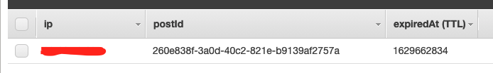

블로그에서 가장 보람찬 성과 지표는 조회수라고 생각합니다.

이번 글에서는 조회수 기능을 추가한 과정을 적어보려 합니다.

## 조회수 측정 방식

우선 조회수를 측정을 어떻게 할지 부터 정해야 했습니다.

조회수를 측정하는 방법을 크게 두 가지로 나눌 수 있었습니다.

1. 포스트를 볼 때마다 무조건 + 1
2. 특정 조건에 따라 + 1

1번 방식은 구현은 가장 간단하지만, 측정된 조회수를 신뢰할 수 없다는 문제가 있습니다. 같은 사람이 새로고침을 계속 한다던지... 의도적인 남용의 위험이 있습니다.

2번 방식은 조건을 어떻게 세우냐에 따라 조회수를 나름 신뢰할 수 있는 지표로 활용할 수 있습니다. 조건에 맞지 않으면 조회수를 증가시키지 않으면 되므로, 1번 방식에 비해 남용으로 부터 안전합니다. 따라서 2번 방식을 선택했습니다.

## 조회수 측정 조건

일단 조건은 한 사람 당 24시간 내 1회만 조회수를 증가시킬 수 있게 하자고 생각했습니다. 그런데 그 '한 사람'을 어떻게 백엔드에서 식별하냐가 문제였습니다.

개인 블로그라서 회원가입의 개념이 없기 때문에, 익명의 사용자들을 식별하기 위한 고유한 값이 필요했습니다.

첫 번째로 떠올린건 프론트엔드에서 임의의 string 값을 생성한 후, local storage에 저장해서 그걸 ID 값으로 활용하는 방식이었습니다.

하지만 이 방식은 사용자가 다른 기기 혹은 브라우저로 접속하거나 시크릿 탭으로 접속하면 각각을 모두 다른 사용자로 인식하기 때문에, 같은 사람을 다른 유저로 인식할 수 있는 변수가 너무 많았습니다.

그래서 두 번째로 떠올린 것이 IP주소를 활용하는 방식이었습니다. 같은 네트워크에 여러명이 연결되있는 경우, 그 사람들을 모두 같은 사람으로 인식한다는 문제가 있긴 하지만, 무분별한 조회수 증가를 막기엔 적합하다고 생각했습니다.

따라서 하나의 IP에 대해 특정 포스트의 조회수를 24시간 내 1회만 증가시킬 수 있게 하기로 결정했습니다.

## X-Forwarded-For

클라이언트의 IP 주소를 알아낼 때 [X-Forwarded-For](https://developer.mozilla.org/ko/docs/Web/HTTP/Headers/X-Forwarded-For)라는 HTTP 헤더를 활용할 수 있습니다.

X-Forwarded-For는 클라이언트의 IP와, 요청이 거쳐온 proxy들의 IP들이 담겨 있고, 맨 첫 번째 IP가 클라이언트의 IP입니다.

AWS CloudFront에서는 X-Forwarded-For 헤더를 [기본적으로 전달](https://docs.aws.amazon.com/ko_kr/AmazonCloudFront/latest/DeveloperGuide/RequestAndResponseBehaviorCustomOrigin.html#RequestCustomIPAddresses)합니다.

그리고 express는 "trust proxy"가 false가 아닌 경우, req.ips 배열에 X-Forwarded-For에 담긴 IP주소들을 차례대로 담아 전달합니다. ([공식 문서](https://expressjs.com/ko/api.html#req.ips) 참고)

```typescript
app.set("trust proxy", true);
```

## 동작 흐름

조회수 기능의 전체적인 동작 흐름은 아래와 같이 설계했습니다.

1. 사용자가 조회수 증가 요청
2. post_viewed_ip 테이블에서 데이터 조회 (post_viewed_ip 테이블의 데이터들은 생성 후 24시간이 지나면 삭제됨)
3. 데이터가 없는 경우에만 조회수 + 1

## 개발

위에서 설계한 동작 흐름에 맞춰 기능을 개발했습니다.

### view_count 컬럼 추가

그리고 post table에 아래와 같이 view_count 컬럼을 추가해줬습니다.

typeorm에서 synchronize 옵션을 true로 설정해주면 테이블 스키마가 변경되는 경우 자동으로 반영해주기 때문에, 별도의 migration이 필요하진 않았습니다.

```typescript
@Entity()
class Post {
  /* ... */

  @Column({ type: "integer", name: "view_count" })
  viewCount: number;

  /* ... */
}
```

### post_viewed_ip 테이블 생성

그리고 post_viewed_ip 테이블을 생성해줬는데, AWS DynamoDB를 활용했습니다.

DynamoDB에서는 테이블에 TTL을 적용할 수 있는데, 쉽게 말하자면 테이블 내의 각각의 데이터들에 만료 시간을 명시할 수 있는 기능입니다.

데이터를 생성할 때 현재 시간에 24시간을 더해서 TTL로 설정해주면, 24시간 후에 해당 데이터가 테이블에서 자동으로 삭제됩니다.

MySQL을 사용했다면 cron job 같은걸 별도로 돌려야 했겠지만, DynamoDB를 사용해 편하게 24시간 조건을 충족시킬 수 있었습니다.

아래와 같이 serverless.yml에 CloudFormation Template을 추가해서 테이블이 자동으로 생성되도록 만들었습니다.

```yml
Type: AWS::DynamoDB::Table
  Properties:
    TableName: post_viewed_ip
    KeySchema:
      - AttributeName: ip
        KeyType: HASH
      - AttributeName: postId
        KeyType: RANGE
    AttributeDefinitions:
      - AttributeName: ip
        AttributeType: S
      - AttributeName: postId
        AttributeType: S
    ProvisionedThroughput:
      ReadCapacityUnits: 5
      WriteCapacityUnits: 5
    TimeToLiveSpecification:
      AttributeName: expiredAt
      Enabled: true
```

ip를 파티션 키, postId를 정렬 키로 추가해주고, TTL을 사용하기 위해 TimeToLiveSpecification을 설정해줬습니다. 테이블의 expiredAt 컬럼을 TTL 값으로 사용하겠다는 의미입니다.

데이터를 생성할 때 expiredAt 컬럼 값으로 현재시간에 24시간을 더해서 넣어주면 됩니다.

이 때, DynamoDB TTL은 unix epoch timestamp를 사용하는 점에 유의해야 합니다.

### API 추가

post 테이블 수정과 post_viewed_ip 테이블 생성을 마친 후, API를 추가해줬습니다.

정확히 위에서 설계한 동작 흐름대로 비즈니스 로직을 작성해줬습니다.

```typescript
// PATCH /posts/:id/view_count
router.patch(
  "/:id/view_count",
  param("id").isString().withMessage("id must be string"),
  validateParameters,
  async (req, res, next) => {
    try {
      const postId = req.params.id as string;
      const ip = req.ips[0];

      if (!ip || (await postViewedIP.find({ ip, postId }))) {
        return res.status(200).json(Presenters.presentSuccess(false));
      }

      await Post.increaseViewCount(postId);
      await postViewedIP.create({ ip, postId, expiredAt: Math.floor(Date.now() / 1000) + 86400 });

      return res.status(200).json(Presenters.presentSuccess(true));
    } catch (error) {
      return next(error);
    }
  }
);
```

## 테스트

실제로 요청을 보내보면, 아래와 같이 DynamoDB에 데이터가 생성됩니다.



이 상태에서 같은 포스트에 요청을 반복해서 보내더라도, 조회수는 더이상 증가되지 않는걸 확인할 수 있습니다. 의도한대로 잘 동작하네요.


