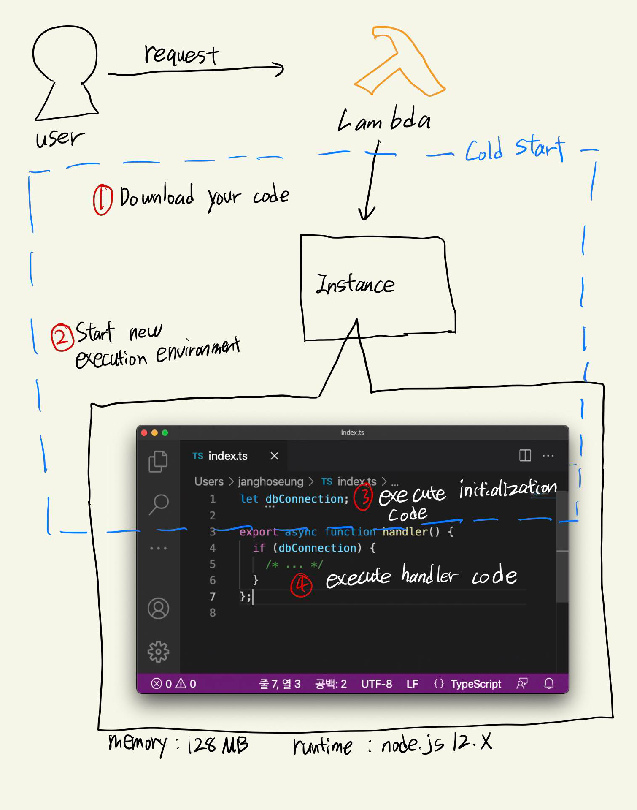
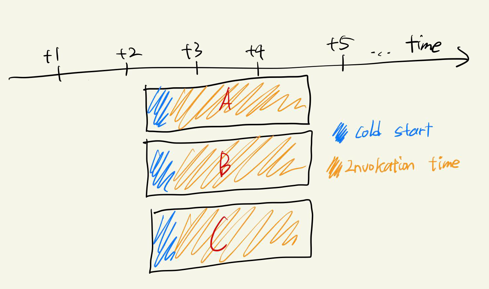
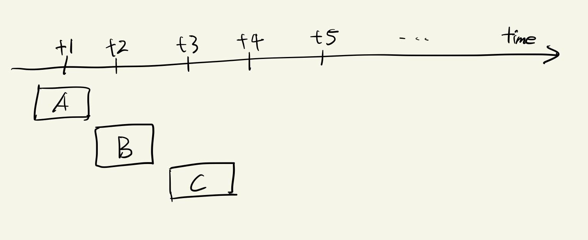
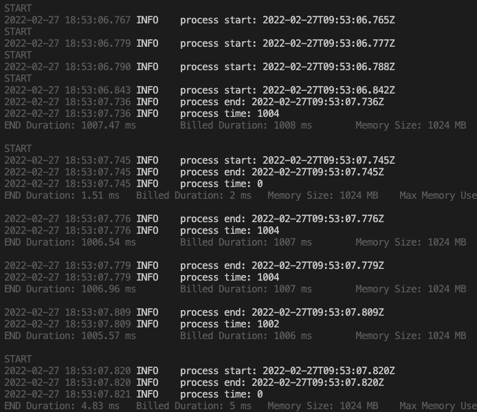

주변에 Lambda로 구성된 serverless 백엔드를 개발하고 있다고 하면, 종종 듣는 질문이 있는데요.

전역 변수가 유지되냐는, 즉 Lambda 런타임이 일회성이 아니냐는 질문입니다.

백엔드에서는 단일 요청에만 유효한 일회성 요소도 있지만, 데이터베이스 connection처럼 런타임 내에서 계속 유지되어야 하는 요소도 있습니다.

저도 예전엔 EC2 인스턴스에 실시간으로 서버를 켜놓고 관리하던 입장으로써, 위 내용이 Lambda를 처음 사용할 때 가장 궁금했던 부분이기도 한데요.

**결론부터 말씀드리면, Lambda의 동작 원리상 유지가 될 수도 있고, 안될 수도 있습니다.**

우선 전역 변수 유지에 대한 이야기를 하기 전, Lambda의 내부적인 동작 원리를 먼저 알아보겠습니다.

## Lambda 핸들러의 실행 순서

Lambda 핸들러는 아래의 그림처럼 크게 4단계를 거쳐서 실행됩니다.


1. Download your code

   - Lambda 핸들러가 실행될 AWS의 내부 인스턴스에서 개발자가 작성하고 업로드한 코드를 다운로드하는 단계입니다.

2. Start new execution environment

   - 새로운 execution environment를 생성하는 단계입니다.
   - execution environment란 Lambda 핸들러가 실행될 환경으로써, 메모리, 런타임 등을 구성합니다.

3. Execute initialization code

   - Lambda 핸들러 바깥의 전역 코드를 실행하는 단계입니다.

4. Execute handler code
   - Lambda 핸들러의 코드를 실행하는 단계입니다.

위 과정을 풀어서 다시 그려보면 아래와 같습니다.



위에서 파란색으로 표시한 1, 2, 3단계(Lambda 핸들러 코드가 실행될 수 있게 준비하는 과정)를 합쳐서 **cold start**라고 부릅니다. cold start를 거치면 Lambda 핸들러의 응답 시간을 짧게는 100ms 이하, 길게는 1초 이상까지 지연시키게 됩니다.

이 때, Lambda는 퍼포먼스 저하를 개선하기 위해 cold start를 거쳐 생성된 execution environment를 일정 시간동안 유지하고, 그 시간 내에 들어온 다음 요청에서 재활용하는데요. 그러면 다음 요청에서는 cold start 없이 4단계(Lambda 핸들러 코드를 실행하는 과정)를 바로 거칠 수 있게되고, 이를 **warm start**라고 부릅니다.

즉, 우리는 최대한 Lambda 핸들러가 cold start를 거치지 않도록 만들어야 합니다.

## cold start를 줄이는 방법?

위에서 Lambda 내부적으로 cold start 이후 execution environment를 일정 시간동안 유지해 다음 요청이 warm start를 거칠 수 있게 한다고 정리했는데요.

그렇다면 cold start를 줄이기 위한 아주 간단한 해결책으로, 주기적으로 Lambda 핸들러를 실행시켜서 execution environment를 유지하게 만드는걸 떠올리실 수 있습니다.

하지만 위와 같은 방법으로는 cold start를 줄일 수 있다는 보장이 힘든데, 이는 Lambda의 핸들러 실행 패턴 때문입니다.

간단한 타임라인을 통해 알아보겠습니다.




특정 시점인 t3에 3개의 요청이 동시에 들어왔고, 요청 A, B, C 모두 cold start를 거친 모습입니다.

그 이유는 Lambda 핸들러가 **특정 execution environment를 동시에 점유할 수 없기** 때문입니다. Lambda 핸들러와 execution environment는 1:1 관계입니다.

따라서 위 그림처럼 동시에 요청이 들어온 경우, 각각의 요청에 대해 별개의 execution environment을 생성하여 처리하게 됩니다.

그렇다면 아래 그림처럼 요청이 일정 간격을 두고 들어오면 어떻게 될까요?




요청 A, B, C가 순차적으로 들어왔고, A, B는 cold start를 거치고, C는 warm start를 거친 모습입니다.

위 그림을 설명하면:

1. A가 execution environment를 점유하고 있던 시점에 B가 들어왔다.
2. B는 cold start를 거쳐 새로운 execution environment에서 처리된다.
3. A의 처리가 끝난 시점에 C가 들어온다.
4. A의 처리가 끝난 후 유지되고 있던 execution environment 위에서 바로 C의 처리를 시작한다.

따라서 위에서 언급한 주기적으로 핸들러를 실행하는 방식은 warn start 유지 보장이 힘들다고 설명한 것입니다. 트래픽이 얼마나 자주, 또는 동시에 얼마나 많이 들어오는지에 따라 cold start를 거칠지, warm start를 거칠지가 변칙적입니다.

그럼 어떻게 cold start를 줄일 수 있을까요? 그 질문의 답은 Lambda의 동시성 처리 방식에 있습니다.

## Lambda의 동시성 처리 방식

Lambda의 동시성은 최대 동시 인스턴스 수, 즉 동시에 몇 개의 요청을 처리할 수 있는지에 대한 수치라고 보면 되는데요.

Lambda는 두 가지의 동시성 처리 방식을 지원합니다.

- 예약된 동시성(Reserved Concurrency)

  - 동시에 몇 개의 요청을 처리할 수 있게 할지 **예약**해두는 방식입니다.
  - 즉, 요청이 없을 땐 인스턴스를 사용하지 않다가, 요청이 들어오면 할당하는 on-demand 방식입니다.

- 프로비저닝된 동시성(Provisioned Concurrency)
  - 동시에 몇 개의 요청에 **cold start 없이 즉시 응답**할 수 있도록 할지 설정해두는 방식입니다.
  - 설정한 수 만큼 미리 인스턴스를 초기화 해두고 대기합니다.
  - 따라서 요청이 없더라도 요금이 발생합니다.

즉, 우리가 cold start를 최소화하기 위해서 사용할 수 있는 권장 솔루션은 **프로비저닝된 동시성**입니다.

여담으로, 동시성의 최대 할당량은 제한되어 있는데, 할당량의 기본값은 1000입니다. 예약된 동시성, 프로비저닝된 동시성 모두 그 한도 내에서 설정할 수 있습니다.

이 때, AWS가 Lambda 기반의 서비스가 중단 없이 동작할 수 있도록 사용량에 따라 동시성 할당량을 증가시키는데요.(또는 할당량 증가를 직접 요청할 수도 있습니다) 자세한 내용은 공식 문서의 [Lambda 함수 크기 조정](https://docs.aws.amazon.com/ko_kr/lambda/latest/dg/invocation-scaling.html)을 참고하시면 좋을 것 같습니다.

Lambda 핸들러의 실행 순서와 패턴, 동시성까지 전체적인 기반 지식을 다졌으니, 이제 정말 전역 변수 유지에 대한 이야기로 넘어갑시다.

## Static Initialization

Static Initialization은 맨 위에서 설명했던 Lambda의 실행 순서중 3번째 단계인, 핸들러 함수 바깥의 전역 코드(이를 initialization code라고 칭하더군요)를 실행하는 작업입니다.

```typescript
/* initialization code */

export async function handler() {
  /* handler code */
}
```

위에서 Lambda 핸들러의 실행 단계 중 3단계는 cold start에 포함된다고 설명했는데요. 이 말은 요청이 warm start를 거치는 경우, 전역 변수가 유지된다는 것을 의미합니다.

즉, Static Initialization은 execution environment 당 최초 1회만 발생하며, execution environment가 소멸할 때까지 전역 변수는 유지됩니다.

생각보다 정말 간단하죠?(...)

## Lambda 핸들러 작성

이젠 Javascript로 간단한 테스트 용도의 핸들러를 작성해보겠습니다.

```javascript
// index.js
let isWarmStart = false;

module.exports.handler = async () => {
  let message;

  if (isWarmStart) {
    message = "warm start";
  } else {
    message = "cold start";
    isWarmStart = true;
  }

  return {
    statusCode: 200,
    body: JSON.stringify({ message }),
  };
};
```

그리고 serverless framework를 사용해 API Gateway를 트리거로 연결하여 배포했습니다.

```yml
service: test

provider:
  name: aws
  runtime: nodejs12.x
  region: ap-northeast-2
  stage: prod

functions:
  test:
    handler: index.handler
    events:
      - http:
          path: /{proxy+}
          method: any
```

첫 요청에서는 "cold start"를 응답받았지만, 그 이후로는 "warm start"를 응답받았습니다.


동시에 여러번 요청을 보내는 경우도 테스트 해볼까요? warm start가 아닌 경우, 1초 동안 대기한 후 응답하도록 핸들러 코드를 수정했습니다.

```javascript
// index.js
let isWarmStart = false;

module.exports.handler = async () => {
  const start = new Date();
  console.log("process start:", start);

  if (!isWarmStart) {
    await new Promise((resolve) => {
      setTimeout(() => {
        isWarmStart = true;
        resolve();
      }, 1000);
    });
  }

  const end = new Date();
  console.log("process end:", end);
  console.log("process time:", end - start);

  return {
    statusCode: 200,
    body: JSON.stringify({}),
  };
};
```

그리고 [Apache Bench](https://httpd.apache.org/docs/2.4/ko/programs/ab.html)를 사용해 총 100개의 요청을 동시에 20개씩 보내봤습니다. MacOS에는 Apache Bench가 기본적으로 설치되어있습니다.

```
ab -n 100 -c 20 [endpoint]
```

요청을 보낸 후 로그를 찍어봤는데요. 동시에 들어간 일부 요청은 cold start 때문에 1초씩 딜레이가 걸렸고, 나머지 요청은 warm start를 거쳐 딜레이 없이 실행됬습니다..



## 결론

이로써 이 글에서는,

- execution environment는 동시 점유가 불가능하다.
- execution environment가 소멸할 때까지 전역 변수는 유지된다.

는 사실임을 확인했습니다.

또한,

- 데이터베이스 같은 외부 서비스와의 커넥션 수립 같은 비용이 큰 작업들은 Static Initialization 단계에서 미리 처리될 수 있도록 전역 변수를 활용해야 할 것이고,
- cold start의 큰 비중을 차지하는 Static Initialization의 시간이 너무 길어지지 않도록 함수를 분리하거나,
- Provisioned Concurrency 등을 사용해 미리 인스턴스를 초기화 해두는 등,

Lambda 기반 서비스의 최적화를 위한 지식들을 배웠습니다.

## 마무리

이번 글에서는 "전역 변수가 유지될까?" 라는 질문으로 시작해서 Lambda의 전체적인 동작 원리에 대해 정리해봤는데요.

질문은 단순하지만 답을 내리기 까지는 꽤나 긴 시간이 걸렸습니다.

최근엔 별로 공부하지 않아도 클릭 몇 번이면 쉽게 사용할 수 있는 완전관리형 서비스가 많아지다 보니까 동작 원리같은 기본적인 지식에 소홀해지는 것 같습니다.

개발자로 일하면서 느꼈던 점이, 기술적으로 문제가 발생했을 때 그냥은 도저히 해결법을 찾지 못하겠다면, 결국엔 그 해답은 동작 원리에 있을 가능성이 크다는 점입니다.

데이터베이스를 예시로 들어보면, 해당 데이터베이스가 내부적으로 strong consistency인지, 아니면 eventual consistency인지에 따라 문제의 해결점이 달라질 수 있겠죠?

물론 실제로 일할 때는 기술을 빨리 배워서 적용하는게 더 중요할 수도 있지만, 시간이 날 때 머릿속에 정리해두는 정도의 습관은 가지는게 좋을 것 같다는 생각이 드네요.
