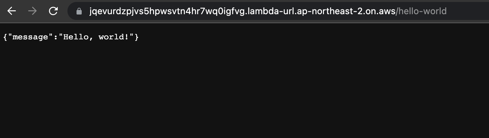
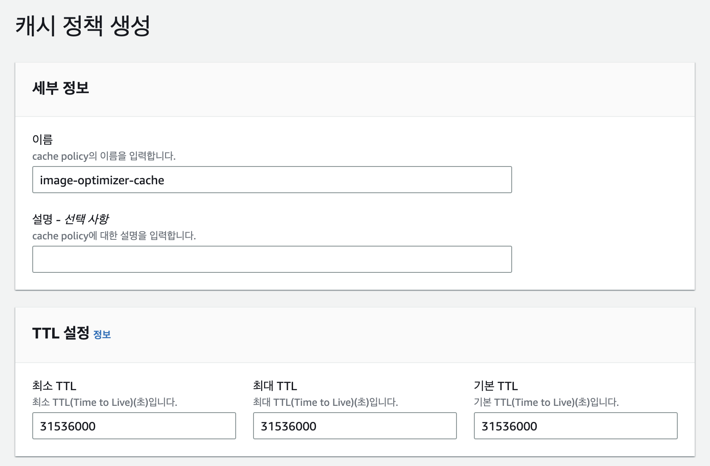

웹에 접근할 수 있는 디바이스는 정말 다양하고, 디바이스 각각의 화면 크기와 해상도도 천차만별입니다.

또한 우리가 웹을 통해 제공하는 컨텐츠의 종류도 정말 다양한데요. 그 중 가장 대표적인 것은 이미지라고 할 수 있습니다. 그럼 그 수많은 디바이스들에 대해 어떤 이미지를 제공해야 할까요?

큰 이미지를 화면이 작은 디바이스에 사용하기엔 유저 입장에서 불필요하게 큰 다운로드 비용이 생기는 것이고, 반대로 작은 이미지를 화면이 큰 디바이스에 사용하기엔 다운로드 비용은 적지만 화질이 떨어질 것입니다.

큰 이미지는 화면이 큰 디바이스에, 작은 이미지는 화면이 작은 디바이스에 제공하는 것, 즉 디바이스 화면 크기에 맞춰 이미지를 제공하는게 가장 좋을 것입니다.

그럼 이때 디바이스의 화면 크기 별로 제공할 이미지는 어떻게 준비해두면 좋을까요? 이미지 하나가 추가될 때마다 모든 경우의 수를 고려해 이미지를 뽑아 업로드해둬야 할까요? 그러기엔 우리의 업무 비용도 아깝고, 이미지를 업로드할 저장소 비용도 아깝습니다.

예를 들어, 유저가 업로드한 이미지를 데스크탑 용과 모바일 용으로 각각 리사이징하여 업로드 해뒀는데, 정작 그 이미지는 데스크탑 유저들만 조회했다면? 모바일 용으로 업로드한 이미지는 저장소 공간만 차지한 셈이 될 것입니다.

즉, 하나의 이미지를 준비해둔 후, 해당 디바이스의 화면 스펙에 따라서 실시간으로 리사이징하여 제공하는 것이 효율적입니다. 또한 한 번 리사이징한 이미지를 오랜 시간 캐싱해둔다면, 비용을 더 아낄 수 있을 것입니다.

따라서 이 글에서 다뤄볼 주제는 아래와 같습니다.

- 올바른 이미지 제공을 위한 배경지식
  - 디스플레이 해상도와 픽셀 밀도
  - CSS 상의 픽셀과 물리적 픽셀의 차이
- 디바이스 해상도에 맞는 이미지를 제공하는 방법
  - `img` element의 `srcset`, `sizes` attribute
- 필요한 시점에 이미지를 동적으로 리사이징하는 방법
  - AWS의 Lambda와 CloudFront를 사용해 이미지 리사이징 서버 구성하기

또한 이 과정을 통해 아래의 결과를 얻을 수 있습니다.

- 유저들의 이미지 다운로드 비용 절약
- 이미지 화질이 떨어지지 않는 경험 좋은 웹 제공
- 이미지 저장소 비용 절약

# 디스플레이 해상도와 픽셀 밀도

해상도는 대상이 몇 개의 픽셀로 이루어져 있는지 나타내는 값입니다. `가로 픽셀 수 * 세로 픽셀 수` 형태로 표현됩니다.

화면 해상도가 높은 디바이스 일수록 더 많은 것들을 화면에 그려낼 수 있을 것입니다. 그렇다면 양이 아닌 질로 간다면 어떨까요? 같은 것이라도 더 선명하고 정밀하게, 즉 좋은 화질로 그려내려면 무엇이 중요할까요?

예를 들어, 화면 해상도가 `400 * 400`인 디바이스 A, `800 * 800`인 디바이스 B가 있고, A와 B의 화면 크기는 같다고 가정해봅시다.

이때 `800 * 800`의 해상도를 가진 이미지를 화면 전체에 그렸을 때, 더 화질이 좋은 디바이스는 무엇일까요?

이미지의 해상도에 비해서, A의 화면 해상도는 낮기 때문에 이미지를 온전히 표현할 수 없습니다. 하지만 B의 화면 해상도는 이미지와 동일하기 때문에, 이미지를 온전히 표현할 수 있습니다.

이렇게 같은 면적에 얼마나 많은 픽셀이 밀집되어 있는지를 픽셀 밀도라고 하고, 픽셀 밀도는 PPI라는 단위로 표현합니다. PPI는 Pixels Per Inch, 즉 1 인치당 몇 픽셀을 표현할 수 있는지를 나타내는 단위입니다.

아래 사진이 좋은 예시입니다. 더 높은 PPI를 가진 화면 위에서 그려진 오른쪽 원이 더 정밀하게 그려지는 것을 확인할 수 있습니다.


# 디바이스의 픽셀과 CSS의 픽셀

제가 사용하고 있는 아이폰 12는 `1170 * 2532`의 해상도와 460PPI의 매우 높은 픽셀 밀도를 가지고 있습니다.

그런데 Chrome 브라우저에서 확인해 봤을 때, iPhone 12의 해상도는 `390 * 844`로, 실제 해상도 대비 매우 낮게 표현됩니다. 왜 그럴까요?

그 이유는, 모던 브라우저는 PPI가 높은 디바이스에 대해, CSS 1 픽셀을 그리기 위해 디바이스의 물리적 픽셀 여러개를 사용하기 때문입니다. 그리고 그 물리적 픽셀이 몇 개인지를 Device Pixel Ratio, 줄여서 DPR이라고 부릅니다.

아이폰 12의 DPR은 3으로, 아이폰 12에서 CSS 1 픽셀을 그리기 위해서는 물리적 픽셀 3개가 필요하다는 뜻입니다. CSS 상의 해상도인 `390 * 844`에 DPR을 곱하여 보면 실제 해상도인 `1170 * 2532`가 나옵니다.

따라서 웹에서 이미지를 렌더링할 때에는, 이미지의 실제 크기에 DPR을 반영해줘야 합니다. 아이폰 12를 예시로 들면, CSS 상에서 가로 100 픽셀로 이미지를 렌더링할 때, 실제로 사용되는 픽셀 수는 300이 되므로, 가로 300 픽셀의 해상도를 가진 이미지를 사용해야 화질이 저하되지 않습니다.

여담으로, JavaScript에서는 [window.devicePixelRatio](https://developer.mozilla.org/ko/docs/Web/API/Window/devicePixelRatio)를 통해 DPR 값을 가져올 수 있습니다.

Github의 [custom-device-emulation-chrome](https://github.com/amirshnll/custom-device-emulation-chrome) 레포지토리에는 디바이스 별로 해상도와 DPR 정리가 잘 되어있어, 개발자 도구에서 모바일 디바이스를 새로 추가할 때 편리합니다.

# 디바이스 해상도에 맞는 이미지 제공하기

배경지식을 둘러봤으니 본론으로 돌아와, 디바이스 해상도에 맞춰 올바른 크기의 이미지를 제공하는 방법을 알아봅시다.

`img` element에는 `sizes`와 `srcset`이라는 attribute가 있는데요. 이 두 attribute를 잘 명시하여 브라우저가 올바른 이미지를 선택해 렌더링하도록 만들 수 있습니다.

`sizes`는 `img` 엘리먼트가 렌더링 될 CSS 상의 크기를 명시하는 attribute입니다. 이때 크기를 여러개 명시하여 조건에 따라 다르게 선택되도록 만들 수 있습니다.

`srcset`는 렌더링될 이미지들을 명시하는 attribute입니다. 브라우저는 `sizes`나 DPR 값에 따라서 명시된 이미지들 중 하나를 선택하여 렌더링합니다.

위와 같은 단순 설명으로는 이해하기가 힘든 개념들이라, 예제를 통해서 알아봅시다.

## 이미지 크기에 맞춰 선택되게 하기 - srcset의 w descriptor와 sizes

`img` element가 렌더링될 크기에 따라 올바른 이미지가 선택되도록 만드는 방법은, `srcset`에 이미지들을 명시할 때 `w` descriptor를 사용하여, 명시한 이미지 각각의 크기를 브라우저에게 알려주는 것입니다.

`w` descriptor로 이미지의 물리적 가로 픽셀 수를 명시하고, 명시한 이미지 각각은 콤마로 구분합니다.

```html

```

이때 위처럼 `sizes`가 명시되지 않은 경우, 브라우저는 `100vw`를 기준으로 이미지를 선택합니다.

예를 들어, `100vw`가 300 픽셀이고, DPR이 2인 디바이스에서는 아래와 같이 `600w.png`가 렌더링됩니다.


디바이스의 `100vw`인 300 픽셀이 CSS 상의 픽셀이고, DPR이 2이므로, 렌더링에 가장 적합한 600w.png가 선택된 것입니다.

그럼 `sizes`를 명시한다면 어떻게 될까요?

```html

```

이 경우에는 `sizes`가 `350px`로 고정되어 있으므로, 디바이스의 viewport width가 아닌 DPR에 따라 이미지가 정해집니다.

똑같이 DPR이 2인 디바이스라고 가정했을 때 아래와 같이 `600w.png`가 선택됩니다.


이때, DPR이 2인 상황에서 CSS 350 픽셀을 화질 저하 없이 렌더링하기 위해서는 물리적 700 픽셀이 필요합니다.

그럼에도 물리적 100 픽셀이 부족한 `600w.png`가 선택된 것을 보면, 브라우저가 이미지 선택에 고려하는 것이 화질 말고도 훨씬 많다는 점을 알 수 있습니다. 이는 사용자의 설정, 디바이스의 네트워크 대역폭 등 브라우저 구현에 따라 천차만별일 것 같습니다.

위 예시의 경우엔 `900w.png`를 불러왔을 때 생기는 상황을 고려했을 때, `600w.png`를 사용했을 때 생기는 물리적 100 픽셀 만큼의 화질 손실은 감수할 만하다는 결정을 내린 것이겠죠.

이제 한 가지만 더 알고 가면 되는데, `sizes`를 명시할 때는 CSS의 Media Query를 활용하여 브라우저가 조건에 따라 크기를 선택하도록 할 수 있습니다. `srcset`에 이미지들을 나열할 때처럼 콤마로 구분하여 나열합니다.

```html

```

이번엔 예시를 조금 바꿔서, 디바이스의 DPR을 1이라고 가정해 보겠습니다.

만약 디바이스의 viewport width가 500px인 경우, `(max-width: 700px)`의 조건에 걸리기 때문에, 선택되는 사이즈는 `300px`입니다. 따라서 아래와 같이 `300w.png`가 렌더링됩니다.


그리고 디바이스의 viewport width가 800px, 1200px인 경우, 각각 `600px`, `900px`의 사이즈가 선택되어 아래와 같이 `600w.png`, `900w.png`가 렌더링되겠죠.


## 디바이스 DPR에 맞춰 선택되게 하기 - srcset의 x descriptor

복잡한 반응형 요구사항 없이, 단순히 고정된 크기에 대해 DPR만 처리하고 싶은 경우가 있을 것입니다. 그 경우가 바로 위에서 `sizes`를 `350px`로 고정했었던 예시와 같은데요.

이 경우에는 아래와 같이 `x` descriptor를 사용해 `srcset`에 이미지들을 나열하면 됩니다.

```html

```

위는 `img` element의 CSS 상의 가로 크기를 300 픽셀로 고정해두고, DPR에 따라 이미지가 선택되도록 하는 예제입니다.

디바이스의 DPR이 1인 경우 `300w.png`, 2인 경우 `600w.png`, 3인 경우 `900w.png`가 선택됩니다.

`w` descriptor와 `sizes`를 사용하는 것 보다 사용법이 훨씬 간단하니, 본인의 코드베이스에 따라 둘 중 적합한 것을 선택하여 사용하시면 될 것 같습니다.

## srcset의 브라우저 호환성 챙기기

`srcset`의 [브라우저 호환성에 대해 확인](https://caniuse.com/?search=srcset)해보면 지원 현황이 매우 좋습니다.

하지만 여전히 `srcset`이 지원되지 않는 브라우저를 위해 `src`는 꼭 추가해줍시다.

```html

```

# 실시간 이미지 리사이징 서버 만들기

> 백엔드 주제에 관심이 없으신 분들은 `여담 - Next.js` 파트로 가주시면 됩니다.

`srcset`에 나열할 이미지들을 모두 준비하여 저장소에 미리 업로드해두는 방식보단, 필요에 따라 동적으로 리사이징하여 제공하는 것이 팀의 업무 비용이나 이미지 저장소 비용상 훨씬 저렴할 것입니다.

AWS와 Node.js 환경을 기반으로 이미지 리사이징 서버를 만들어 보겠습니다.

## 인프라 설계

먼저 제가 필요로 하는 것들은 아래와 같습니다.

1. HTTP API를 구성할 수 있고, 요청한 건에 대해서만 요금을 부과하는 Serverless 서비스
2. 이미지 리사이징 결과를 반영구적으로 캐싱해둘 CDN

1번을 충족하는 서비스는 [Lambda](https://docs.aws.amazon.com/ko_kr/lambda/latest/dg/welcome.html)입니다. Lambda는 서버 구성 없이 간단하게 원격에 코드를 올려 실행할 수 있게 해주는 서비스입니다. 함수에 코드를 작성하는 개념이며, 그 함수는 HTTP 요청이나 다른 AWS 서비스에 의해 실행됩니다. 어떤 경로로 실행되었는지에 따라 함수에 넘어오는 인자 형태가 다릅니다.

이전까지는 [API Gateway](https://docs.aws.amazon.com/ko_kr/apigateway/latest/developerguide/welcome.html)라는 서비스를 사용해 HTTP API를 구성하여 Lambda 함수를 연결했지만, 이제는 Lambda 내부적으로 [Function URL](https://docs.aws.amazon.com/ko_kr/lambda/latest/dg/lambda-urls.html)이라는게 생겨서, API Gateway를 사용하지 않고 매우 간단히 Lambda 함수를 실행시키는 HTTP 엔드포인트를 만들 수 있습니다.

2번을 충족하는 서비스는 [CloudFront](https://docs.aws.amazon.com/ko_kr/AmazonCloudFront/latest/DeveloperGuide/Introduction.html)입니다. CloudFront에는 오리진이라는 개념이 있는데, 오리진은 실제로 요청을 받아 처리하여 응답하는 주체입니다. 여기서 CloudFront는 오리진에게 요청을 전달하고, 오리진이 응답한 결과를 캐싱해두는 역할을 합니다.

따라서 제가 해야할 일은, Lambda 함수를 만들어 이미지 리사이징 코드를 업로드하고, 해당 함수의 Function URL을 CloudFront의 오리진으로 연결하는 것입니다.

## Lambda 함수 생성

먼저 Lambda 함수 부터 만들어 볼텐데, 이는 [Serverless Framework](https://www.serverless.com/)를 사용해 정말 쉽게 할 수 있습니다.

아래의 간단한 설정 파일 하나면 함수 생성, Function URL 생성, 배포 모두 끝납니다.

```yml
service: image-optimize-lambda

provider:
  name: aws
  runtime: nodejs18.x
  region: ap-northeast-2

functions:
  image-optimize:
    handler: dst/index.handler
    url: true
```

Lambda 함수 코드 작성도 매우 간단합니다. 아래는 `GET /hello-world` 요청에 대해 `"Hello, world!"` 메시지를 응답하는 예제입니다.

```typescript
import { APIGatewayProxyEventV2, APIGatewayProxyResultV2 } from "aws-lambda";

export async function handler(event: APIGatewayProxyEventV2): Promise<APIGatewayProxyResultV2> {
  const { http } = event.requestContext;

  if (http.method === "GET" && http.path === "/hello-world") {
    return {
      statusCode: 200,
      body: JSON.stringify({
        message: "Hello, world!",
      }),
    };
  }

  return {
    statusCode: 404,
    body: JSON.stringify({
      message: "Not found",
    }),
  };
}
```

Lambda Function URL을 통해 함수가 실행되면 인자인 event 객체가 [이렇게](https://docs.aws.amazon.com/lambda/latest/dg/urls-invocation.html#urls-payloads) 넘어오므로, 타입을 `APIGatewayProxyEventV2`로 잡았습니다.

위 예제를 배포하고 생성된 Function URL로 요청을 보내보면, `GET /hello-world`에 대해 아래와 같이 잘 응답합니다.



## 이미지 리사이징 코드 작성

Lambda 함수와 Function URL까지 생성했으니, 이제 함수에 이미지를 리사이징하는 코드를 작성하여 배포해줄 차례입니다.

이미지 리사이징을 위해 필요한 라이브러리는 두 가지인데요.

1. 이미지를 다운로드하기 위한 HTTP client 라이브러리
2. 다운로드 받은 이미지를 리사이징하기 위한 이미지 처리 라이브러리

HTTP client 라이브러리로는 다들 익숙하신 [axios](https://axios-http.com/)를 사용하면 되고, 이미지 처리 라이브러리로는 [sharp](https://sharp.pixelplumbing.com)라는 유명한 라이브러리가 있습니다.

아래는 PNG 이미지를 `axios`로 다운로드하고, `sharp`를 사용해 200 \* 200 크기로 리사이징 하는 예제입니다.

```typescript
const imageURL = "https://example.com/image.png";
const { data } = await axios.get(imageURL, {
  responseType: "arraybuffer",
});
const image = sharp(data);
image.resize({ width: 200, height: 200 });
```

위 예제에서 동적으로 변하는 정보들인 이미지 URL, 이미지 가로/세로 크기만 쿼리 파라미터로 받아 동적으로 바꿀 수 있게 하면 완성입니다.

물론 실제로는 쿼리 파라미터 파싱, 화질 조정, base64 인코딩 및 Content-Type 헤더 추가 등 로직이 조금 더 필요합니다. 모두 반영된 함수 코드는 [여기](https://github.com/HoseungJang/blog.hoseung.me-example/blob/main/2023-03-25-provide-fit-image/image-optimizer-lambda/src/index.ts)서 확인하실 수 있습니다.

아래와 같이 요청하도록 만들었습니다.

```
/optimize-image?url={이미지URL}&w={가로크기}&h={세로크기}&q={화질}
```

## CloudFront와 Lambda Function URL 연결하기

이제 위에서 생성한 Lambda 함수에서 리사이징한 결과물을 캐싱하기 위해, 함수의 Function URL을 CloudFront와 연결해야 합니다.

CloudFront 콘솔에서 배포 생성 페이지로 넘어가면, 오리진의 도메인을 입력하는 필드가 있습니다.

거기에 Lambda Function URL의 도메인을 넣고 `뷰어 일치`를 선택해주면 오리진 연결은 끝납니다.


이제부터 핵심인데, CloudFront에 들어온 요청을 오리진에 어떤 방식으로 전달할지, 오리진에서 그 요청을 처리해 응답한 결과는 어떻게 캐싱할지에 대해 정책을 정해주어야 합니다.


`원본 요청 정책`은 `AllViewerExceptHostHeader`라고 되어있는데요. 오리진으로 요청을 넘길 때 Host를 제외한 다른 HTTP Request 헤더와 쿠키, 쿼리 파라미터를 모두 포함시킨다는 정책입니다. 우리는 Host 헤더는 필요 없고 쿼리 파라미터만 잘 넘어오면 되니까, 대충 기본값으로 써주겠습니다.

다만 `캐시 정책`이 `CachingDisabled`로 되어있는데요. 이는 오리진 응답을 캐싱하지 않는다는 정책인데, 우리는 리사이징 결과의 반영구적 캐싱을 원하기 때문에 정책을 새로 만들어 줄겁니다.

`정책 생성`을 눌러 새 정책의 이름을 설정한 후, TTL을 모두 31536000초로 설정하여 1년 동안 응답이 캐싱되도록 설정했습니다.

그리고 `TTL 설정` 아래의 `캐시 키 설정`에서 `쿼리 문자열`을 `모두`로 설정하여 쿼리 파라미터가 캐싱 기준에 포함되도록 설정했습니다.

만약 쿼리 파라미터가 캐싱 기준에 포함되지 않으면, 쿼리 파라미터가 변경되더라도 유저에게 캐싱된 응답이 전달됩니다.



이제 `배포 생성` 버튼을 누르고 조금 기다리면 이미지 리사이징 서버가 완성됩니다. 이제 Lambda Function URL 도메인이 아니라 CloudFront 배포와 연결된 도메인으로 요청을 보내면 됩니다.

테스트 차원에서 제 블로그 글 중 하나인 [AWS Lambda의 동작 원리 - 전역 변수가 유지될까?](https://blog.hoseung.me/2022-02-27-lambda-global-variables)의 썸네일을 리사이징 해보겠습니다.

현재 썸네일의 기본 크기가 현재 832 \* 512로 나오는데요. 아래는 이를 절반 줄여서 416 \* 256 크기로 리사이징한 결과입니다.

```
/optimize-image?url={썸네일URL}&w=416&h=256
```


응답이 CloudFront에 캐싱된 것인지 확인하고 싶으면, HTTP Response 헤더에서 `x-cache`의 값이 `Hit from cloudfront`인지 확인하면 됩니다.


이제 `srcset` 작성을 위해 이미지를 크기 별로 준비할 필요 없이 이미지 리사이징 서버를 거치면 됩니다. 아래는 900 \* 900 이미지 하나를 리사이징하여 디바이스 해상도에 대응하는 예제입니다.

```tsx
function createResizedImageURL(url: string, width: number, height: number) {
  return `https://api.example.com/optimize-image?url=${encodeURIComponent(url)}&w=${width}&h=${height}`;
}

const imageURL = "https://asset.example.com/900w.png";

function Image() {
  return (
     `${url} ${dpr}x`)
        .join(", ")}
      src={imageURL}
      alt=""
      width={300}
    />
  );
}
```

# 여담 - Next.js

Next.js를 사용하시는 경우, [next/image의 Image 컴포넌트](https://nextjs.org/docs/basic-features/image-optimization)를 사용하시면 원본 이미지를 내부적으로 리사이징하여 `srcset`으로 제공합니다.

이때 Next.js에 내장된 [Image Optimizer](https://github.com/vercel/next.js/blob/c8a5bd5ebaa7572f941dd6e8fb5ecd836b146e9f/packages/next/src/server/image-optimizer.ts#L398)를 사용하게 되는데, 이렇게 되면 커스텀도 불가능하고 CDN의 이점도 누릴 수 없습니다.

따라서 [loader prop](https://nextjs.org/docs/api-reference/next/image#loader)을 사용하여 커스텀 이미지 리사이징 서버를 직접 연결하는 것이 좋을 것 같습니다.

# 레퍼런스

- `srcset`, `sizes` attribute
  - [반응형 이미지 - MDN](https://developer.mozilla.org/ko/docs/Learn/HTML/Multimedia_and_embedding/Responsive_images)
- 실시간 이미지 리사이징 서버
  - [전체 코드](https://github.com/HoseungJang/blog.hoseung.me-example/blob/main/2023-03-25-provide-fit-image/image-optimizer-lambda/src/index.ts)
  - Serverless Framework
    - [공식 사이트](https://www.serverless.com/)
    - [Lambda Function 설정 파일 작성 가이드](https://www.serverless.com/framework/docs/providers/aws/guide/functions)
  - AWS Lambda
    - [Lambda 개념](https://docs.aws.amazon.com/ko_kr/lambda/latest/dg/gettingstarted-concepts.html)
    - [Lambda URL](https://docs.aws.amazon.com/ko_kr/lambda/latest/dg/lambda-urls.html)
  - AWS CloudFront
    - [CloudFront 배포에 다양한 원본 사용](https://docs.aws.amazon.com/ko_kr/AmazonCloudFront/latest/DeveloperGuide/DownloadDistS3AndCustomOrigins.html)
    - [쿼리 문자열 기반의 콘텐츠 캐싱](https://docs.aws.amazon.com/ko_kr/AmazonCloudFront/latest/DeveloperGuide/QueryStringParameters.html)
    - [캐시 정책 이해](https://docs.aws.amazon.com/ko_kr/AmazonCloudFront/latest/DeveloperGuide/controlling-the-cache-key.html#cache-key-understand-cache-policy)
