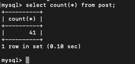
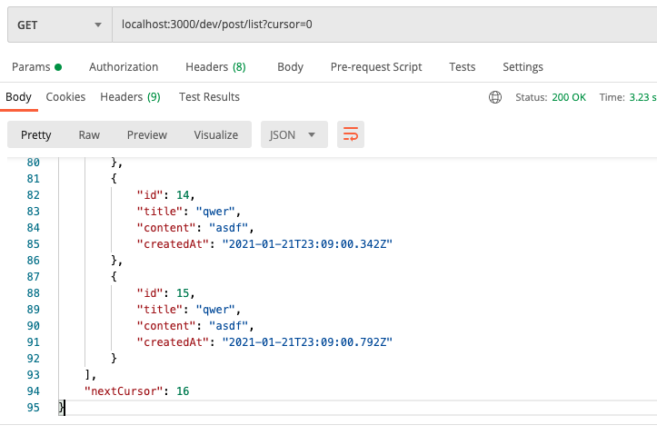
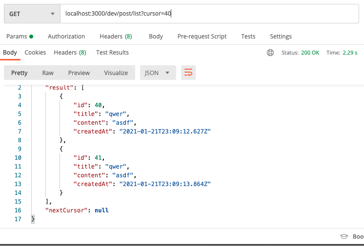

## 오프셋 기반 페이지네이션의 문제

저는 학교다닐 시절 친구들과 프로젝트를 할 때, 항상 SQL에서 페이지네이션에 offset을 사용했었습니다.

하지만, offset 값이 커질 수록 성능 저하가 심해진다는 문제점이 있다고 합니다.

공부 차원에서 진행한 매우 작은 프로젝트다 보니 저런 문제를 느껴볼 일이 없었던 것 같습니다.

성능 악화에 대해서는 [이 글](https://www.eversql.com/faster-pagination-in-mysql-why-order-by-with-limit-and-offset-is-slow/)에 매우 잘 설명되어 있습니다.

## 커서 기반 페이지네이션

오프셋 기반 페이지네이션이 데이터를 몇 개나 뛰어넘을지에 대해 집중한 개념이라면, 커서 기반 페이지네이션은 어떤 데이터부터 가져올지에 집중한 개념입니다.

아래와 같이 food 테이블에 데이터가 10개 있다고 가정해봅시다.

**food 테이블**

| id  | name     |
| --- | -------- |
| 1   | 김말이   |
| 2   | 떡볶이   |
| 3   | 김치     |
| 4   | 김밥     |
| 5   | 라면     |
| 6   | 미역국   |
| 7   | 라볶이   |
| 8   | 제육덮밥 |
| 9   | 고기볶음 |
| 10  | 김치찌개 |

데이터를 4번째 행부터 5개씩 불러오고 싶다고 할 때, 오프셋, 커서 기반의 SQL query는 각각 아래와 같습니다.

- 오프셋 기반 페이지네이션

```
SELECT * FROM food ORDER BY id ASC OFFSET 3 LIMIT 5;
```

- 커서 기반 페이지네이션

```
SELECT * FROM food WHERE ID >= 4 ORDER BY id ASC LIMIT 5;
```

지금은 쿼리가 매우 간단하지만, 나중에 게시글 정렬 옵션 같은것을 추가하게 된다면 조금 더 복잡해지겠네요.

## 구현

typeorm의 repository과 express를 이용해서 커서 기반 페이지네이션을 구현해보겠습니다.

우선 findByCursor 메소드를 만들어줍시다.

```typescript
public static async findByCursor(cursor: string) {
  return (await this.getRepository()).find({
    where: { id: MoreThanOrEqual(cursor) },
    order: { id: "ASC" },
    take: 15,
  });
}
```

위 코드는 결과적으로 아래의 쿼리를 생성합니다.

```
SELECT * FROM post WHERE id >= (cursor) ORDER BY id ASC LIMIT 15;
```

그리고 간단히 express request handler를 만들어줍시다.

```typescript
// GET /posts
async (req, res, next) => {
  try {
    const cursor = req.query.cursor as string;

    const result = await Post.findByCursor(cursor);
    const nextCursor = result.length === 15 ? result[result.length - 1].id + 1 : null;

    return res.status(200).json({
      result,
      nextCursor,
    });
  } catch (error) {
    return next(error);
  }
};
```

response json에서 다음 요청을 위한 cursor를 응답하고 있고, 클라이언트에선 그것을 사용하면 됩니다.

## 테스트

이제 아무렇게나 쓴 더미 데이터를 마구 insert 해준 후, postman으로 요청을 보내봅시다.

저는 (~~RDS를 사용할 돈이 없어서...~~)GCP의 VM 인스턴스를 데이터베이스 서버 용도로 쓰고있습니다.



41개 정도 넣어뒀으니, 이제 요청을 보내봅시다.



우선 첫 요청에서는 15개의 데이터를 불러온 후 nextCursor를 얻을 수 있네요.

그럼 40번째 게시글부터 가져오도록 요청을 보내보겠습니다.



40, 41번째 게시글 두 개가 불러와지고, 더 이상 불러올 데이터가 없기 때문에 nextCursor가 null로 온 것을 확인할 수 있습니다.

성공적이네요!
