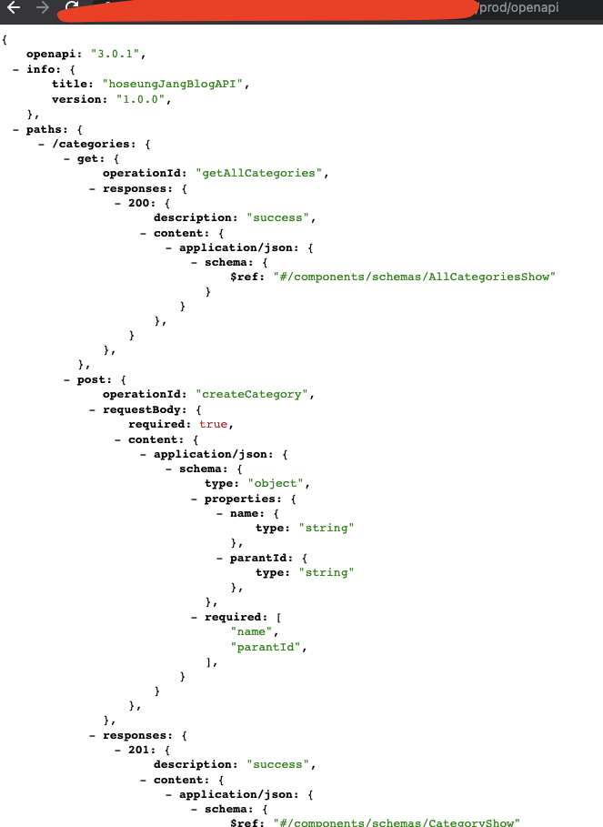

## Open API Specification?

> The OpenAPI Specification (OAS) defines a standard, programming language-agnostic interface description for HTTP APIs, which allows both humans and computers to discover and understand the capabilities of a service without requiring access to source code, additional documentation, or inspection of network traffic. - [출처](https://github.com/OAI/OpenAPI-Specification#the-openapi-specification)

Open API Specification(이하 OAS)은 프로그래밍 언어에 종속되지 않는 HTTP API를 위한 표준 인터페이스를 정의합니다. 그리고 이는 개발자와 기계 모두가 소스코드 확인, 추가적인 문서, 네트워크 트래픽 검사 등을 하지 않고도 서비스의 기능을 찾고 이해할 수 있도록 합니다.

요약하자면, 백엔드 API 문서를 명세하는 형식의 표준을 제공하는 것이 OAS라고 생각하면 될 것 같습니다.

## OAS를 꼭 써야할까?

예를 들어, API 문서를 명세할 때 아래와 같이 개발자가 스스로 임의의 포맷을 만들 수 있을 것입니다.

```json
{
  "path": "/",
  "method": "GET",
  "params": null,
  "response": {
    "statusCode": 200,
    "body": null
  }
}
```

위처럼 했을 때의 단점은:

- OAS처럼 매우 광범위하게 통용되는 표준이 아니므로 호환성 면에서 극과 극의 차이를 보인다는 점

- 개발자가 형식을 정의하기 위해 많은 것을 고려하고 시간을 투자해야 한다는 점

  - 어떤 포맷을 기반으로 정의할건지 (JSON? Yaml?)

  - DELETE Method에는 Request Body를 허용할 것인가?

  - Path Parameters나 Query Parameters 같은 것들은 어떻게 정의할 것인지

  - 필드들의 타입은 어떻게 정의할 것인지

  - 등등등 ...

하지만 OAS는 매우 널리 사용되는 표준이고, [JSON Schema](https://json-schema.org/)라는 표준에 기반하고 있습니다.

```json
{
  "paths": {
    "/": {
      "get": {
        "responses": {
          200: {
            "description": "success",
            "content": {
              "application/json": {
                "schema": {
                  {
                    "type": "object",
                    "properties": {
                      "success": {
                        "type": "boolean"
                      }
                    },
                    "required": ["success"]
                  }
                }
              }
            }
          }
        }
      }
    }
  }
}
```

우선 OAS로 API를 명세하면, 시각화, Client SDK 생성 등을 Swagger같은 도구로 편하게 할 수 있고, 이 외에도 여러가지 편리한 점을 얻을 수 있습니다.

또한 JSON Schema도 매우 광범위하게 통용되는 표준 중 하나이기 때문에, OAS로 명세된 API 문서를 읽어서 [json-schema-to-typescript](https://www.npmjs.com/package/json-schema-to-typescript)나 [react-json-schema-form](https://www.npmjs.com/package/react-jsonschema-form)같은 도구를 적극 활용할 수 있습니다.

이것이 위에서 OAS를 쓰지 않을 때의 단점으로 호환성 문제를 이야기 했던 이유입니다.

## 어떻게 명세할까?

제가 생각한 방법은 두 가지가 있었습니다.

1. express 라우터를 순회하면서 (router.stack을 통해 등록된 라우터들을 순회할 수 있습니다) 그 데이터를 기반으로 OAS기반 명세 자동 생성하기

2. 직접 하드코딩해서 명세하기

저는 2번 방법을 선택(~~할 수 밖에 없었..~~)했는데, express의 라우터에서는 당연히 request parameters나 status code, response body 등이 무엇인지 알 수 없어서 OAS기반의 명세를 자동으로 생성하는게 불가능했습니다.

제가 직접 웹 프레임워크를 커스텀해서 만들었다면 그런 부분을 신경썼겠지만.. 조금 불편하더라도 손수 명시하는 방식을 택했습니다.

살짝 이야기를 덧붙이자면, 실제로 제가 다니는 회사에서 직접 개발한 프레임워크에서는 OpenAPI Specification을 router를 순회하며 자동으로 생성해주기 때문에 개발자가 직접 명시해줄 필요가 없답니다.

## 명세

[openapi3-ts](https://www.npmjs.com/package/openapi3-ts)라는 OAS에 관련된 type definitions를 제공해주는 패키지를 활용하여 명세하도록 하겠습니다.

[OAS 3.0.1 Documentation](https://github.com/OAI/OpenAPI-Specification/blob/master/versions/3.0.1.md)을 참고했습니다.

```typescript
// src/api/routers/openAPI.ts

import { Router } from "express";
import { OpenAPIObject } from "openapi3-ts";

export const openAPISpec: OpenAPIObject = {
  openapi: "3.0.1",
  info: {
    title: "hoseungJangBlogAPI",
    version: "1.0.0",
  },
  paths: {
    /* ... */
  },
  components: {
    shemas: {
      /* ... */
    },
  },
};

export const applyOpenAPIRouter = (rootRouter: Router) => {
  const router = Router();

  router.get("/", (req, res) => {
    return res.status(200).json(openAPISpec);
  });

  rootRouter.use("/openapi", router);
};
```

## 확인

/openapi로 요청을 보내면 잘 오네요.



## 마무리

최근에 회사일도 바빠지고, 주짓수라는 것도 배우러 다니다보니 토이프로젝트 진도가 많이 느려졌네요. 그래도 이젠 프론트엔드 작업 시작까지 머지 않았습니다!

다음 글에서는 오늘 만든 API(GET /openapi)를 사용해서 Client SDK를 자동 생성하는 내용으로 찾아오겠습니다.
