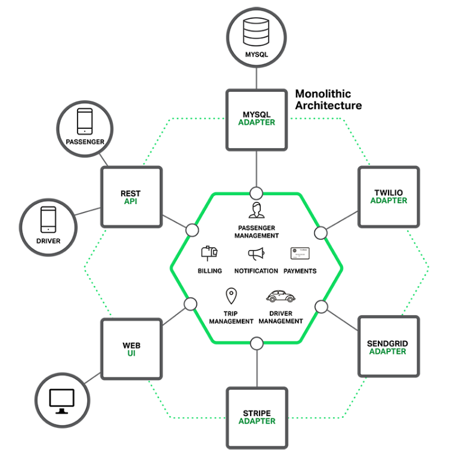
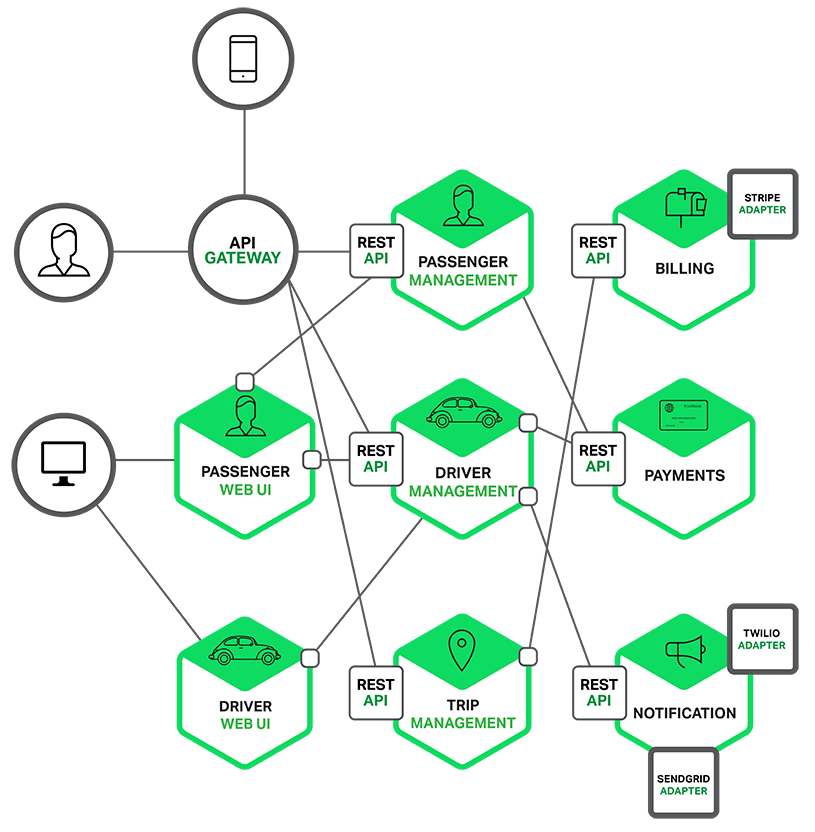
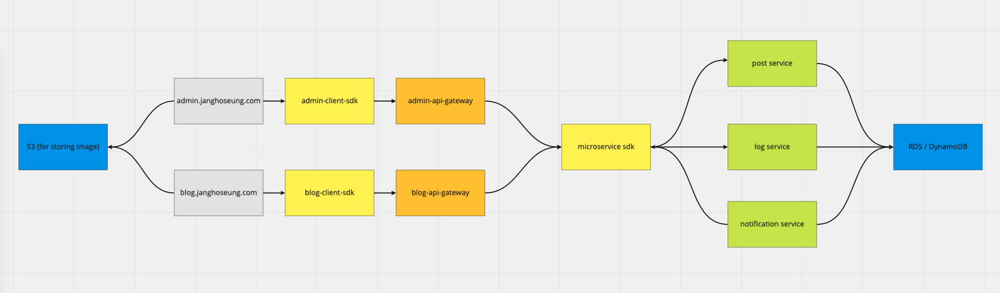

## MSA 아키텍쳐란

MSA는 MicroService Architecture의 약자로, 독립적으로 자신의 기능을 수행하는 여러 서비스들을 조합하여 하나의 애플리케이션을 이루는 개념입니다.

MSA는 모놀리식 아키텍처와 반대되는 개념이라고 볼 수 있습니다. 아래 두 사진을 보시면 이해가 빠르실 것 같습니다.

1. 모놀리식 아키텍처
   

2. MSA
   

1번 사진(모놀리식)을 보시면 하나의 애플리케이션(육각형) 내부에 billing, payments 등 모든 비즈니스 로직이 포함되어 있습니다.즉, 모놀리식 아키텍처는 하나의 애플리케이션이 거대한 아키텍처를 포함하고 있는 형태라고 할 수 있습니다.

반면 2번 사진(MSA)을 보시면, 애플리케이션이 billing, passenger, driver 등 독립적인 서비스로 나누어져 있고, 필요한 경우 서로를 호출하는 구조로 이루어진 것을 알 수 있습니다. 각각의 서비스간 통신하는 방법은 HTTP 요청도 있을 것이고, (잘은 모르지만)RPC 같은 방법도 있을 것입니다. AWS Lambda의 경우 직접 호출할 수도 있을 것 같네요.

## 설계

우선 이런 설계도를 그릴 때 아주 편리한 [miro](https://miro.com)라는 도구를 사용했습니다.

전체 설계도의 초안은 아래와 같습니다. (사진이 잘 안보이네요..)



(언제든지 설계가 변경될 수 있습니다. ~~돈이 부족할 것 같네요~~)

1. AWS S3
   우선 이미지를 저장할 용도로 AWS의 S3이라는 스토리지를 하나 두었습니다. S3에는 웹에서 직접 aws-sdk를 통해서 접근하게 만들 생각입니다.

2. client-sdk
   뭐라고 부르는지 몰라서 우선 client-sdk라고 해놓았는데, 백엔드 API를 사용할 수 있게하는 sdk입니다. 즉, 프론트엔드에서 아래와 같이 사용할 수 있습니다.

```typescript
// 이런 식으로 API를 사용하는게 아니라
axios.get("https://example.com", { id: "asdf" });

// 이런 식으로 사용하면 됩니다. (타이핑이 되어있다는 엄청난 장점이 있어요!)
BlogAPI.getPostById({ id: "asdf" });
```

3. api gateway
   MSA에는 api gateway라는 구성요소가 꼭 포함되어 있었습니다.(필수 구성요소인지는 잘 모르겠습니다) 클라이언트 단에서 사용할 API들은 모두 이곳에 위치해있습니다. 인증 / 메디에이션(응답 가공?) 용도로 사용할 생각입니다.

4. microservice-sdk
   제 블로그의 모든 마이크로 서비스들의 API 호출 함수들이 모여있는 라이브러리입니다. 대략 아래와 같은 인터페이스로 만들 생각입니다.

```typescript
client.post.getPostById.call({ id: "asfd" });
client.post.getPostList.call();
```

5. 마이크로 서비스들

   - post service: 블로그의 게시글(혹은 댓글)과 관련된 것들이 관리될 서비스
   - log service: 방문자수, 게시글 조회수 등을 찍어낼 서비스
   - notification service: 인기글 알림, 댓글 알림 등 이메일(혹은 SMS) 알림을 담당할 서비스

6. RDS / DynamoDB
   아마 post, category 같은 경우에는 RDS를 사용할 것 같고, DynamoDB는 log찍는데 사용할 것 같은데.. 조금 더 세부적인 설계가 끝나면 봐야겠습니다. 우선 DB는 저 두가지를 사용할 생각입니다.

아직은 초안이니까, 개발하면서 추가/개선해나가면 될 것 같네요.

## 참조

- 설계도 보기: https://miro.com/app/board/o9J_laTyd80=/
