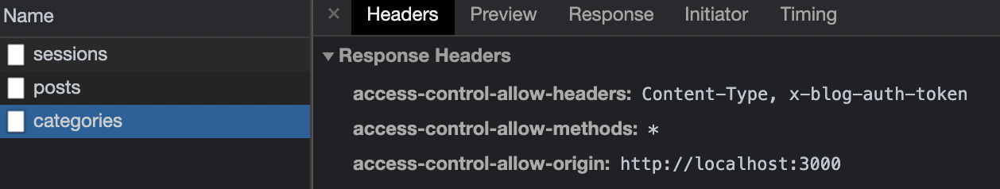

> 드디어 개인 블로그 프로젝트의 모든 백엔드 기본 작업이 끝나서, 어드민 프론트엔드 작업을 시작하게 되었습니다!!

## 개요

사실 CORS이슈는 학교다닐 때 프로젝트 하면서 아주 많이 겪어봤고, 뭔지도 알고 있습니다. 근데 지금까지는 CORS 이슈를 그냥 [cors](https://www.npmjs.com/package/cors) 라는 패키지로 대충:

```typescript
app.use(cors());
```

이런식으로 해결했었는데요, CORS같은 아주 기초적인 내용을 지금껏 이런식으로 떼우고 그냥 지나쳤다는게 스스로 어이가 없어서.. 이번엔 제대로 알아보기로 결심했습니다.

## CORS?


출처: [mdn](https://developer.mozilla.org/ko/docs/Web/HTTP/CORS)

우선 origin이란 정보를 가져오는 원천, 즉 도메인을 의미한다고 보면 됩니다.

브라우저로 domain-a.com 으로부터 응답받아 보고있는 HTML에서, domain-b.com으로 요청을 보낸다면?

자신의 origin이 아닌 다른 origin에 요청했으니, 이게 바로 Cross-Origin-Resource-Sharing입니다.

만약 domain-b.com에서 domain-a.com으로부터 오는 요청을 허용하지 않았다면, 프론트엔드 개발자 분들이 끔찍하게도 많이 겪어보셨을:


이런 모양새의 에러에 마주하며 데이터를 불러오지 못하게 됩니다.

그렇다면 domain-a.com에서 domain-b.com이 자신의 요청을 허용했는지를 어떻게 알 수 있냐? 해당 origin으로 preflight request라는 것을 사전에 보내기 때문입니다.

### CORS 허용 헤더

우선 preflight request를 알아보기 전에 CORS를 허용하는 HTTP Response 헤더를 알아봅시다.

클라이언트의 요청에 대해 서버는 "Access-Control-Allow-" 가 앞에 붙는 헤더를 응답함으로써 CORS 허용 여부를 알려주게 됩니다.

- Access-Control-Allow-Origin
  - 어떤 origin에서 온 요청만 허용할지 결정합니다.
- Access-Control-Allow-Methods
  - 어떤 HTTP Method만 허용할지 결정합니다.
- Access-Control-Allow-Headers
  - 어떤 HTTP 헤더만 허용할지 결정합니다.
- 등등...

### Preflight Request

preflight request는 브라우저가 실제 요청을 보내기 전에, CORS가 허용되었는지 OPTIONS method를 통해 미리 확인하는 요청입니다.

우선 브라우저가 prefligh request를 보내지 않는 경우가 있는데, 그러려면 아래의 조건을 모두 충족해야 합니다.

- GET, HEAD, POST 중 하나의 method로 요청을 보냈나?
- [여기](https://fetch.spec.whatwg.org/#forbidden-header-name)와 [여기](https://fetch.spec.whatwg.org/#cors-safelisted-request-header)에 있는 HTTP 헤더만 사용했나?

그리고 preflight request를 보냈는지의 여부에 따라 요청 이후 동작이 달라집니다.

- 안보낸 경우

  - 실제 요청 -> 응답 받음 -> CORS 허용 헤더 확인
  - 허용된 경우 응답을 보여줌
  - 허용되지 않은 경우 응답을 보여주지 않고 CORS 에러를 뱉음

- 보낸 경우
  - preflight request -> 응답 받음 -> CORS 허용 헤더 확인
  - 허용된 경우 실제 요청을 다시 보냄
  - 허용되지 않은 경우 실제 요청은 보내지 않고 CORS 에러를 뱉음

## blog-api-gateway에 CORS 허용 헤더 추가하기

blog-api-gateway의 최상위에서 middleware를 하나 만들어서 CORS 허용 헤더를 설정해 주었습니다.

```typescript
// src/app.ts

app.use((req, res, next) => {
  if (req.headers.origin) {
    res.setHeader("Access-Control-Allow-Origin", req.headers.origin);
  }
  res.setHeader("Access-Control-Allow-Methods", "*");
  res.setHeader("Access-Control-Allow-Headers", ["Content-Type", "x-blog-auth-token"].join(", "));
  next();
});
```

헤더를 각각 설명드리면:

- Access-Control-Allow-Methods
  - \*을 사용해서 모든 HTTP Method를 허용하도록 설정했습니다.
- Access-Control-Allow-Origin
  - 클라이언트가 보낸 Origin 헤더를 그대로 사용했습니다.
- Access-Control-Allow-Headers
  - Content-Type에 위에서 설명했던 허용 값 이외의 값(application/json 같은 것들)을 설정하게 되면, 따로 허용해줘야 하는 것 같아 추가했습니다.
  - 제가 JWT로 만든 access token을 x-blog-auth-token 헤더로 주고받도록 만들어놔서 허용해줬습니다.

## 결과

설정했던 CORS 허용 헤더들이 잘 넘어오고 있고, 문제없이 잘 동작하네요.


