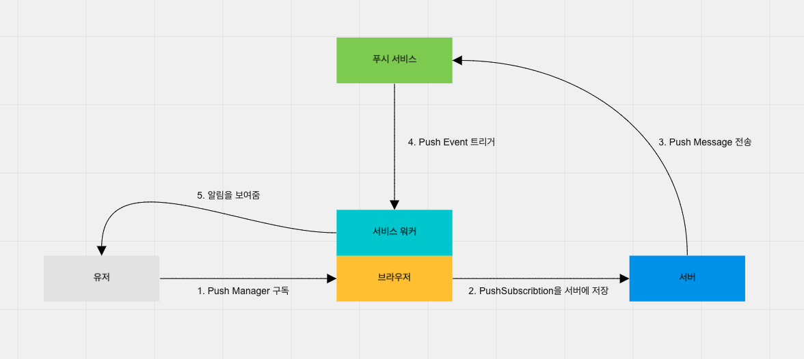
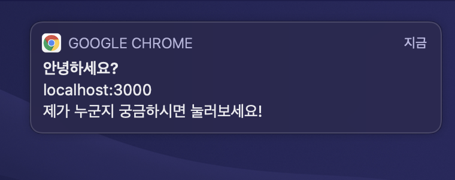

프론트엔드 개발에 관심이 있으시다면, PWA라는 개념을 많이 들어보셨을겁니다.

"Progressive Web Apps"의 줄임말로, 웹 브라우저에서도 마치 네이티브 앱을 설치해서 사용하는 것 같은 사용자 경험을 위한 기술입니다.

이 때, PWA를 뒷받침해주는 기술 중 하나가 바로 서비스 워커입니다.

서비스 워커는 웹 사이트와는 별개로 백그라운드에서 실행되는 스크립트입니다. 즉, 웹 사이트를 닫아도 계속 실행됩니다.

일반적으로 웹 사이트는 오프라인 상태에서는 사용할 수 없지만, 서비스워커를 활용하면 캐시, 백그라운드 동기화 등을 통해 오프라인 상태에서도 웹 사이트를 어색함 없이 이용할 수 있게 만들 수 있습니다.

최근에 회사에서 데스크탑 웹을 사용하는 유저들도 푸시 알림을 받을 수 있게 서비스 워커로 웹 푸시를 처리하는 작업을 했었고, 확실히 기억해두면 앞으로도 꽤 유용하게 활용할 수 있는 경험이라는 생각이 들었습니다.

따라서 이 글에서는 서비스 워커와 웹 푸시의 동작 방식과 개발 과정을 정리해보려고 합니다.

# 웹 푸시의 동작

아래는 웹 푸시가 어떻게 동작하는지를 표현한 간단한 다이어그램입니다.



우선 구성 요소들 중에 '서버'와 '푸시 서비스'가 뭔지 헷갈리실텐데, 각각을 정리하면,

- 서버

  - 서버를 말합니다. 데이터베이스에 PushSubscription이라는 웹 푸시 구독 정보를 저장하고, 필요할 때 그 정보를 활용해 푸시 알림을 보내기 위해 필요합니다.

- 푸시 서비스

  - 브라우저가 웹 푸시를 제공하기 위해 사용하는 서비스입니다. Chrome의 경우 [FCM](https://firebase.google.com/docs/cloud-messaging)을 사용하고 있습니다. 즉, 브라우저마다 사용하는 푸시 서비스가 다를 수 있습니다. 하지만 모두 같은 프로토콜을 따르기 때문에 특정 브라우저가 사용하는 푸시 서비스가 무엇인지는 신경쓰지 않아도 됩니다.

그리고 각각의 동작 과정에 대해서 정리하겠습니다.

## 1. Push Manager 구독

가장 첫 번째 단계는 유저가 푸시 매니저를 구독하게 만드는겁니다.

우선 유저가 브라우저에게 알림을 표시할 수 있는 권한을 줘야 하는데, [Notification API](https://developer.mozilla.org/en-US/docs/Web/API/Notification)의 [requestPermission](https://developer.mozilla.org/en-US/docs/Web/API/Notification/requestPermission)을 사용해 유저에게 권한을 요청할 수 있습니다.

유저에게 권한 받기에 성공하면, PushSubscription 이라는 객체를 얻어야 합니다.

PushSubscription은 [Push API](https://developer.mozilla.org/en-US/docs/Web/API/Push_API)를 사용해 [Push Manager를 구독](https://developer.mozilla.org/en-US/docs/Web/API/PushManager/subscribe)하면 얻을 수 있습니다.

이 때, Push Manager를 구독하려면 application server keys, 다른 말로 VAPID keys 라는게 필요한데, VAPID keys는 유저에게 푸시 알림을 보내는 서버가 누군지 식별하는 역할을 합니다.

PushSubscription에는 푸시 알림을 보낼 주소(endpoint)와, 암호화에 필요한 key들이 들어있습니다. endpoint는 유저 하나에 고유하고, key들은 [Web Push Protocal](https://developers.google.com/web/fundamentals/push-notifications/web-push-protocol)에 맞춰서 Push Message를 암호화하기 위해 필요합니다.

## 2. PushSubscription을 서버에 저장

1번 단계에서 PushSubscription을 얻었다면, 그걸 서버에 저장하면 됩니다. 이 때, 웹 푸시를 보내기 위해선 VAPID keys를 서버가 갖고있어야 합니다. 환경 변수를 사용하거나, 하드코딩해서 저장해두면 됩니다.

## 3. Push Message 전송

이제 서비스 특성에 따라 자유롭게 알림을 전송해주면 됩니다. 예를 들어, 이커머스 서비스라면 포인트 적립이나 상품 재입고 등을 알림으로 전송할 수 있겠죠.

## 4. Push Event 트리거

푸시 서비스로 Push Message가 전달되면, 서비스 워커에 [Push Event](https://developer.mozilla.org/en-US/docs/Web/API/PushEvent)가 트리거됩니다.

서비스 워커 스크립트에 Push Event의 핸들러를 작성하여 적절한 처리를 해줄 수 있습니다. 유저가 알림을 클릭했을 때 특정 URL이 열리도록 할 수도 있고, 푸시 알림을 보여주지 않을 수도 있습니다.

## 5. 알림을 보여줌

위의 모든 단계를 거쳐서 최종적으로는 유저에게 푸시 알림이 보여지게 됩니다.

# 개발 과정

## 푸시 메시지 형식 설계

우선 푸시 메시지를 어떤 형식으로 보낼지 정해야 합니다.

제가 필요한건 단순히 알림을 보내는 것도 있었지만, 알림을 클릭했을 때 지정된 페이지가 열리게 만들고 싶었습니다.

따라서 간단하게 아래의 형식으로 정해주었습니다.

```typescript
interface Payload {
  title: string;
  body: string;
  link: string;
}
```

title, body는 알림의 내용이고, link는 유저가 알림을 클릭했을 때 띄울 페이지의 링크입니다.

이 때, 푸시 메시지는 string으로 보내야 하는데, Javascript에서 JSON은 자유롭게 stringify/parse가 가능하므로 괜찮습니다.

## 서비스 워커 스크립트 작성

이제 서비스 워커 스크립트를 작성해봅시다.

서비스 워커는 Javascript 파일을 따로 다운로드 받는 방식입니다. 따라서 React를 쓰고계신 분들은 public 디렉토리에 파일을 생성하시거나, CRA를 사용하시는 분들은 [공식 가이드](https://create-react-app.dev/docs/making-a-progressive-web-app/)를 참고해서 파일을 생성해주시면 됩니다.

```javascript
self.addEventListener("push", (event) => {
  const payload = JSON.parse(event.data.text());
  event.waitUntil(
    registration.showNotification(payload.title, {
      body: payload.body,
      data: { link: payload.link },
    })
  );
});

self.addEventListener("notificationclick", (event) => {
  clients.openWindow(event.notification.data.link);
});

self.addEventListener("install", () => {
  self.skipWaiting();
});
```

3가지 이벤트에 대해 핸들러를 등록했는데, 각각을 설명드리면,

- `push`
  - 위에서 언급했던 푸시 서비스가 메시지를 받았을 때 트리거하는 이벤트입니다. data를 JSON으로 다시 바꾼 후, `showNotification`으로 유저에게 보내줬습니다.
- `notificationclick`
  - 유저가 푸시 알림을 클릭했을 때 발생하는 이벤트입니다. push 이벤트의 핸들러에서 `showNotification`을 실행할 때 data로 link를 넘겨주는걸 볼 수 있는데, `notificationclick` 핸들러에서 그 data를 그대로 사용할 수 있습니다.
- `install`
  - 서비스 워커가 설치됬을 때 발생하는 이벤트입니다. 이미 서비스 워커가 실행되고 있고, 수정된 서비스 워커가 새롭게 다운로드 된 경우, 새로운 서비스 워커는 웹 사이트가 닫혀야 활성화되는데, 이 때 `skipWaiting`을 실행하면 새로운 서비스 워커를 설치 직후 즉시 활성화 할 수 있습니다.

## 서비스 워커 등록

이제 브라우저에 서비스 워커를 등록해줘야 하는데, 우선 브라우저가 서비스 워커와 웹 푸시를 지원하는지 확인해야 합니다.

아래의 조건으로 확인할 수 있습니다.

```typescript
if ("serviceWorker" in navigator && "PushManager" in window) {
  /* ... */
}
```

그리고 아래와 같이 서비스 워커를 등록해주면 됩니다.

```typescript
async function registerServiceWorker(): Promise<ServiceWorkerRegistration> {
  return await navigator.serviceWorker.register("/service-worker.js");
}
```

저는 서비스 워커 스크립트를 `public/service-worker.js`에 위치시켰기 때문에 register 메소드의 인자를 저렇게 넘겨주었는데, 본인 상황에 따라 바꿔주시면 됩니다.

## Push Manager 구독

다음은 Push Manager를 구독해서 PushSubscription을 얻어올 차례입니다.

위에서 `registerServiceWorker`를 실행하고 얻은 `ServiceWorkerRegistration`을 사용해 Push Manager를 구독하면 됩니다.

```typescript
async function subscribePushManager(
  serviceWorkerRegistration: ServiceWorkerRegistration
): PushSubscription {
  return await serviceWorkerRegistration.pushManager.subscribe({
    userVisibleOnly: true,
    applicationServerKey: /* Public VAPID key */,
  });
}
```

## 서버에서 푸시 메시지 전송

이제 모든 준비가 끝났고, 푸시 메시지를 전송하기만 하면 유저에게 알림이 보여질겁니다.

위에서 Push Message를 보낼 때 Web Push Protocol에 따라 데이터를 암호화해서 전송해야 한다고 언급했었습니다.

하지만 암호화를 구현하기는 복잡하니, npm 패키지인 [web-push](https://github.com/web-push-libs/web-push)를 사용하면 편합니다.

web-push를 사용해 VAPID keys도 생성할 수 있습니다.

```typescript
webpush.generateVAPIDKeys();
```

우선 setVapidDetails를 사용해 초기 세팅을 해줍시다. 이걸 한번 해주면 나중에 sendNotifcation을 실행할 때 계속해서 VAPID keys 등을 넘겨줄 필요가 없어집니다.

```typescript
webpush.setVapidDetails(
  "mailto:hoseungjang@catchfashion.com",
  /* Public VAPID Key */,
  /* Private VAPID Key */,
);
```

1번째 인자는 이 VAPID키의 소유자의 연락처가 담긴 페이지의 URL이나, mailto 주소가 들어가야 합니다. 전 mailto 주소로 제 회사 이메일을 남겼습니다.

그리고 2, 3번째 인자는 각각 Public / Private VAPID Key를 넘겨주면 됩니다.

설정이 끝났으면, 필요할 때 sendNotification을 실행하면 됩니다.

```typescript
webpush.sendNotification(
  pushSubscription,
  JSON.stringify({
    title: "안녕하세요",
    body: "제가 누군지 궁금하시면 눌러보세요!",
    link: "https://www.catchfashion.com",
  }),
  {
    TTL: 3600 * 12,
  }
);
```

1번째 인자는 PushSubscription입니다. 알림을 보내려는 유저의 PushSubscription을 넘겨주면 됩니다.

2번째 인자는 message string입니다. 위에서 정한 JSON 형식대로 payload를 작성하고, JSON.stringify 해서 넘겨주면 됩니다.

3번째 인자는 필수는 아니고 옵션입니다. 웹 푸시는 생각보다 많은 기능을 지원하는데, 그 중 대표적인게 TTL입니다.

유저의 디바이스가 오프라인이거나, 브라우저가 꺼져있는 등의 상황에서는 알림이 전달되지 못하고 대기 큐에 들어가게 됩니다. 이 때, TTL이 설정되있으면 TTL 내에 메시지가 전달되지 못할 경우 그냥 큐에서 메시지가 삭제됩니다.

전 12시간 내에 전달되지 못할 경우 삭제하도록 설정했습니다.

# 결과

로컬에서 테스트해보니 알림이 잘 오는걸 확인할 수 있었습니다.


