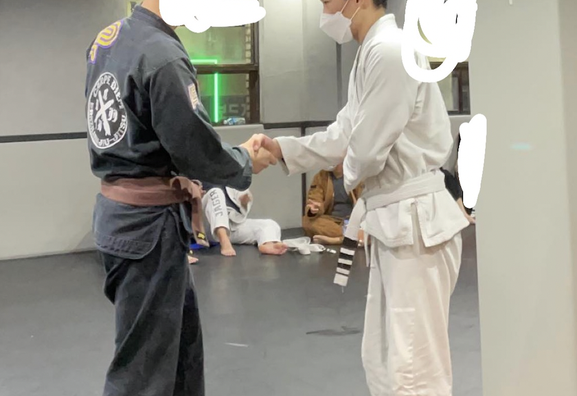

## 2021년(이었던 것)

2021년이 끝났다. 너무 정신없이 흘러가서 어떤 일이 있었나 돌아보기가 복잡하다.

원래 이런 회고글을 쓰지 않으려고 했지만.. 이런거라도 안하면 스스로를 돌아보는 때가 많이 없을 것 같아서 적어보려고 한다.

## 고등학교 졸업

2021년에는 딱히 별 이벤트가 없었다. 딱 하나 꼽자면 고등학교를 졸업하고 성인이 된 해였다는 것?

항상 10대의 마지막은 화려하게 장식하자고 생각했었는데, 그 바이러스(...) 덕분에 재택 + 온라인 졸업식 2연타를 맞고 자취방에서 허무하게 끝나버렸다.

나는 소프트웨어 마이스터고등학교를 나왔는데, 돌이켜보면 정말 운이 좋았다고 생각한다.

사실 그냥 수능볼 자신이 없어서 생각없이 들어간 곳이었지만, 막상 들어와보니..

- 웹개발 꿀잼
- 기숙사 생활 꿀잼
- 개발자라는 직업이 날이 갈수록 각광받음
- 개방적이고 자유로운 IT업계 문화
- **군대 뺄 수 있음(!!!!)**
- ...

이런 좋은 혜택(?)들을 싸그리 챙길 수 있었던 것이었다. 물론 중간에 넘어질 때도 많았지만 그럴 때마다 다시 잘 일어섰고, 결론은 나름 잘된 것 같으니 내 선택은 옳았다고 생각한다.

만남과 헤어짐이 좀 이상하긴 했지만, 고등학교를 떠나보내려니 속시원 하기도 하고.. 미련이 남기도 하고.. 마음이 싱숭생숭 했던 것 같다.

20대의 처음이 끝난 지금도 약간 고등학교 졸업할 때의 느낌이 드는 듯 하다.

## 회사 생활

지금 다니는 회사는 명품 이커머스 [캐치패션](https://www.catchfashion.com/)을 개발하는 곳이다.

(귀여운 트리도 설치하는 따스한 팀이다)

19살 때인 2020년 8월 18일에 입사해서 지금까지 다니고 있으니, 나도 벌써 1.4년차 개발자가 되었다. (병역특례도 무사히 받았다!)

학교에선 백엔드 개발만 공부했었고, 회사에도 백엔드 개발자로 입사했지만, 입사하자마자 맡게된 일은 프론트엔드였다.

회사 도메인이랑 코드베이스를 이해할 겸 프론트엔드부터 천천히 작업해보자는 의도였고, 확실히 도메인 이해와 사내 프론트엔드 / 백엔드 시스템의 전체적인 이해에 많은 도움이 되었다.

그래도 회사에서 하는 작업 만으로는 프론트엔드 개발에 빠르게 적응하기에 어려움이 있다고 느꼈고, 개인적으로 프로젝트를 진행하면서 공부를 많이 했었다.

그렇게 어쩌다보니 프론트엔드에 내가 손대지 않은 부분이 없을 정도로 기여도가 높아지게 되었다.

전체적으로 어떤 일을 했었는지 정리해보면...

### 기존 페이지 수정, 새로운 페이지 추가

처음에는 기존 페이지의 UI를 수정하거나, 완전히 뜯어고치는 프론트엔드 작업을 주로 했었다.

새로운 폰트를 적용하는 간단한 작업부터, 상품 리스트, 상품 상세페이지를 완전히 새롭게 바꾸는 비교적 큰 작업들까지 많은 것들이 내 손을 거쳤다.

그리고 회사 코드를 스스로 읽을 수 있게 됬을 때 쯤, 프론트엔드와 함께 백엔드 작업도 같이 하게 되었다.

가장 기억에 남는건 카드사 프로모션 페이지인 것 같다. 처음으로 프론트엔드와 백엔드 모두 맡았던 서비스였고, 도메인 특징을 기준으로 API와 UX를 설계했던게 가장 기억에 남는다.

카드사 프로모션은 한번에 많이 진행하지 않는 특징이 있었고, 그래서 각각의 프로모션을 따로 로딩하는게 아니라 페이지에 들어가면 한번에 로딩하도록 요청-응답-렌더링 플로우를 설계했다.

처음 로딩만 기다리면 그뒤엔 기다림 없이 서비스를 이용할 수 있으니 유저에게 괜찮은 경험이라고 생각했고, 프론트엔드 코드 내에서도 처리하기가 더 편했던 기억이 난다.

### 퍼포먼스 이슈 추적 및 해결, 코드 리팩토링

퍼포먼스 이슈를 추적하고 해결하거나, 기존 레거시를 뜯어고치는 리팩토링 작업들도 많이 했었다.

맨 처음 진행했던건 상품 페이지 리팩토링이었는데, 하나의 파일에 모든 로직이 다 들어가있어서 어떤 퍼포먼스 이슈가 생길지 모르고, 읽기도 매우 힘든 hook들과 component들이 많았다.

일단 그것들을 의존하는 모델 기준으로 분리하고, state의 범위를 잘 고려해서 다시 위치시켰다. 불필요한 리렌더링도 줄어들고, 가독성과 유지보수성도 많이 좋아졌다.

그리고 삭제할 때 깜빡한 dead code들도 많이 있었다. 그래서 연관된 것들은 물리적으로 가까이 위치시켜서 dead code의 발생을 예방했다.

react-router의 리렌더링 문제를 해결하려고 했던 작업들([RxJS로 개선하기](/2021-10-09-rxjs), [Link 컴포넌트 새로만들기](/2021-12-07-do-not-use-link))도 있었고, 이외에 많은 것들을 뜯어고쳤다.

eslint를 고치기도 했다. 대표적으로 Typescript에서 빈 객체를 표현하는 방식을 lint로 강제했었는데, 그 내용은 [이 글](/2021-09-15-typescript-empty-object)에 잘 정리해두었다.

### 인터널 프로덕트 개발

사내 팀들의 생산성 향상을 위한 인터널 프로덕트도 개발했다.

사내 모든 팀의 작업은 [Asana](https://asana.com/ko)라는 칸반으로 관리되고 있는데, Asana에서 제공하는 [Webhook API](https://developers.asana.com/docs/webhooks)를 사용해 이벤트를 받을 수 있다.

그걸 활용해서 마케팅팀의 특정 작업이 리뷰 단계로 넘어가면 마케팅팀 슬랙 채널에 알려주는 리뷰 알리미 봇을 만들었었다.

정규표현식으로 컨텐츠를 파싱해서 [Slack Block Kit](https://api.slack.com/block-kit) 형식으로 바꾸거나, [p-limit](https://www.npmjs.com/package/p-limit)로 Promise 동시성을 제한하거나.. 기존에 못해본 종류의 기술적인 시도를 해볼 수 있어서 재밌었던 것 같다.

### 조금 다른 레벨(?)의 웹개발

단순한 HTML, CSS, Javascript 작업에서 벗어난 작업들을 많이 했던 점도 좋았다.

[Visual Regression Test를 도입](/2021-02-10-visual-regression-test)하기도 했었고, Github Actions에 Lighthouse CI를 붙여서 퍼포먼스 점수를 근소하게 개선하기도 했었고, 서비스 워커를 다루기도 했었다.

서비스 워커를 다뤘던 것이 가장 최근에 하기도 했고 너무 재미있게 작업해서 기억에 많이 남는다.

웹 브라우저에서도 푸시 알림을 받을 수 있게 하는 작업이었는데, [Web Fundamentals](https://developers.google.com/web/fundamentals/push-notifications)에 관련 개념과 동작원리가 잘 정리되어 있었다.

서비스 워커와 웹 푸시 API를 다루는 것도 재미있었고, 백엔드 작업도 재미있었다. 무엇보다 테스트할 때 크롬에서 알림이 뜨는게 너무 신기했다.

그리고 웹팩 번들 용량을 줄이는 작업도 했었다. 쓸데없이 용량을 많이 차지하는 [moment.js](https://www.npmjs.com/package/moment)를 [dayjs](https://www.npmjs.com/package/dayjs)로 마이그레이션하는 작업이었다.

단순 라이브러리 교체 작업이긴 했지만, 기존 기술을 새롭게 대체할 때 무엇이 고려되어야 하는지 배울 수 있어서 좋았다.

## 회사에서 얻은 점

위에서 회사에서 대략 어떤 일을 해왔는지 돌아봤다. (자세한 이력은 [웹 이력서](https://about.hoseung.me/experience/catch-fashion)에 잘 정리해 두었다.)

그런 작업들을 해오면서 무엇을 얻었는지도 한번 정리해 보려고 한다.

### 프론트엔드, 백엔드 설계

지금까지 프론트엔드, 백엔드 두 분야를 경계없이 넘나들며 작업해왔다.

그러면서 프론트엔드, 백엔드 두 분야를 별개로 보지 않고, 함께 생각하는 능력을 갖게된 것 같다.

백엔드 데이터와 API를 어떻게 설계하는 것이 프론트엔드 개발에 더 편할지, 프론트엔드에서 렌더링을 어떻게 하는 것이 백엔드에 더 효율적일지 등을 고려하게 되었다.

### 작업의 이유 생각하기

선배 개발자 분이 항상 강조하시던 부분이 있다.

어떤 작업이 있을 때, 아무 생각없이 요구사항대로 그냥 하는게 아니라, 이 작업을 왜 하는건지, 즉 뭘 개선하려는 거고 어떤 결과를 기대하는 것인지를 생각하는게 중요하다는 것이다.

처음엔 어렵고 와닿지 않았지만, 지금 생각해보면 앞으로 개발자로 일하는 데에 있어서 정말 중요한 가르침을 받았다고 느낀다.

작업의 이유를 생각하다 보면, 자연스럽게 개발자인 나에게서 벗어나 유저의 입장에서 생각하려는 시도를 하게 된다.

그러면 어떤 작업이 얼마나 유의미하고 중요한지에 대한 점수를 스스로 매겨볼 수 있다. 의문이 드는 작업은 진행하기 전에 다시 리뷰하고, 내가 잘못 생각했던 점은 배우고..

결론적으로 어떤 작업에 대해 어느 정도의 리소스를 써야할지 스스로 판단해서 분배할 수 있는 능력을 얻었다고 생각한다.

물론 아직은 더 많은 연습이 필요한 부분이다.

### 작업 관리

나는 작업을 하다보면 자주 느끼는 것이 있다. (나와 같은 주니어 분들도 똑같은 것을 느낄 것이고, 시니어 분들은 우릴 지켜보며 더욱 크게 느끼실 것 같다)

어떠한 문제가 주어졌을 때, 그걸 복잡하게 키워서 해결하는 경향이 있다는 것이다.

작업을 하다 (지금 작업과는 별개인)문제가 보이면 그걸 고치고, 새로운 문제가 보이면 또 그걸 고치고, 그걸 반복하다가 PR을 올리면 처음 계획한 작업의 범위보다 훨씬 커져있는걸 보게 된다.

그런 의미에서 작업을 스스로 적절히 끊고 분리하는 능력을 키우려고 노력했던 것 같다.

작업을 하다 문제를 발견하면, Asana에 새로운 카드를 추가해서 다음 스프린트 때 리뷰하도록 해서 현재 작업의 범위를 지키고, 또 어떤 작업이 너무 커질 것 같으면 그 작업을 적절한 단위로 나눠서 진행하려고 노력했다.

이게 단순히 작업 이력을 추적할 때나 코드리뷰할 때 편리함을 준다는 점 외에도, 버그 발생도 줄여주고, 버그가 발생하더라도 파악과 해결을 쉽게 만들어준다는 점도 좋다고 느꼈다.

나는 항상 두 가지 기준으로 작업을 분리한다.

- 이 작업이 어느 정도로 스케일이 커질 것 같은가?
- (새로운 이슈를 발견했을 때) 이 작업과 얼마나 관련이 있는가?

### 데이터에 근거한 생각과 선택, 결과에 대한 고민

회사 생활을 하면서 가장 재미있었던게 거의 모든 것들이 데이터에 근거하여 결정되었다는 점이다.

우리 팀의 시스템에서는 API 호출, API 에러, 유저 행동 등등등 정말 많은 데이터를 수집하고 있고, [Looker](https://looker.com)라는 서비스를 사용해 시각화할 수 있게 되어있다.

신규 유저 유입, 구매전환, 특정 유저들의 행동 등 여러가지 성과 측정과 결론 도출이 가능하다.

나는 주로 기획자, 디자이너 분들과 함께 새로운 기능에 대한 AB 테스트를 많이 진행했었다. 결과가 좋으면 왜 좋은건지, 결과가 안좋으면 왜 안좋은건지를 고민하고 얘기해보는게 꽤 재밌었다.

내 작업이 기술적인 의미를 넘어서 비즈니스적으로도 어떤 결과를 일으킬지 고민해야 한다는 것을 배울 수 있었던 것 같다.

## 개인 프로젝트

2021년에는 개인 프로젝트를 많이 했었다.

프론트엔드 개발을 익히기 위한 간단한 토이 프로젝트들 몇 가지를 했었고, [웹 이력서](https://about.hoseung.me)와 개발 블로그를 만들었다.

그중 개발 블로그는 정말 애정이 많이 가는 프로젝트다. 거의 반년동안 시간이 날 때마다 개발했고, 한 번 완성한 후에도 끊임없이 개선하며 유지보수 중이다.

개발 블로그를 만들며 특히 중요시 했던건 개발자 경험과 자동화였다. 아마 [블로그 개발 일지](/tags/%EA%B0%9C%EC%9D%B8%20%EB%B8%94%EB%A1%9C%EA%B7%B8)에서 '자동', '자동 생성' 같은 단어를 가장 많이 썼을 것 같다.

특히 [Fully-typed한 백엔드 시스템 만들기](/2021-12-22-fully-typed-backend)에서 나온 기능들은 실무에서도 쓸 만한 것들이라고 생각한다.

그리고 프론트엔드와 serverless 기술의 결합에도 많이 관심을 가졌던 것 같다. AWS CloudFront와 Lambda@Edge는 정말 사기적인 조합이라고 느꼈다.

## 운동

2021년에는 개발 만큼 운동에도 빠져 살았다.

코스를 짜서 간단히 런닝하는 것부터 시작해서, 헬스를 시작했고, 특히 주짓수라는 운동에 주 5일 모두 나갈 정도로 빠져있다.

(2달 전쯤 관장님께 3그랄을 받고있는 사진이다)

2021년 초에만 해도 흔히 말하는 멸치와 같은 몸이었는데, 이젠 몸무게도 좀 오르고 몸도 예전보다 좋아진 듯 해서 기분이 좋다.

근데 운동에 너무 빠져있는 것도 문제라는 생각이 든다. 운동과 공부 두 마리 토끼를 모두 잡으려 하니 자꾸만 잠을 줄이게 됬고, 건강이 안좋아지는게 느껴지기 시작했다.

시간은 한정적이니까 앞으로는 운동과 공부를 격일로 번갈아가며 하던가 하고, 잠을 많이 챙겨야겠다.

## 영어

2021년에는 개발과 운동 만큼 영어에도 관심을 가졌다.

우선 귀부터 뚫는걸 목표로 삼았었다. 고등학교 때 선생님이 알려주신 방법으로 계속 공부했다.

일단 무작정 귀로 듣고 따라 적고, 틀리거나 못들은 부분은 나중에 자막을 보고 빨간 글씨로 적는다. 그리고 억양까지 완벽히 연속 5번 따라할 수 있을 때까지 반복해서 말한다.(~~5번 연속으로 말하는건 내가 추가한 조건이긴 하다~~)

그리고 나중에 돌아보면 빨간 글씨가 조금씩 줄어드는걸 볼 수 있다고 하셨다.

위 사진이 예전에 받아적은 페이지고, 아래 사진이 가장 최근에 받아적은 페이지다.

선생님 말씀대로 빨간 글씨가 현저히 줄어든걸 볼 수 있었다. 나는 그대로라고 생각했지만, 알게모르게 듣기 실력이 늘은 것 같다.

영어 공부할 때 가장 집중했던 건 영어 공부를 '공부'라고 인식하지 않도록 하는 것이었다. 그래서 내가 가장 흥미를 가지는 주제로 듣기를 하려고 노력했다.

그렇게 찾은게 [Fireship](https://www.youtube.com/c/Fireship/featured)이라는 유튜브 채널이다.

나는 주로 in 100 seconds 시리즈로 공부하는데, 컨텐츠 이름처럼 영상이 2분 정도로 짧다. 그래서 빠르게 듣고 새로운 영상으로 넘어갈 수 있어서 질리지 않는다.

그리고 무엇보다 말에 속도감이 있으면서도 명료하게 잘 들려서 나같은 초보자에게 좋은 채널인 것 같다.

## 2022년 계획

모든게 돌아보면 아쉬운 법이지만, 2021년은 특히 더 아쉬운 해였던 것 같다.

자꾸 뭔가를 해야한다는 압박감과 뒤쳐진다는 불안감에 시달렸던 것 같다. 그런 감정이 번아웃을 일으키고 날 막아섰을지도 모르겠다는 생각이 든다.

그래도 막상 돌아보니 나름 알찬 한 해인것 같기도 하다. 2022년에는 저런 감정들을 모두 내려놓는 것부터 시작해야겠다.

그래서 나의 2022년 목표는,

- 개발 내적인 것
  - 컴포트 존(Typescript) 벗어나기 -> Go, Java 둘 중 하나로 백엔드 개발하기
  - 묵혀뒀던 전공 서적들 읽기 (클린코드, 이펙티브 자바 등등...)
  - 이직도 준비할겸 기본기 꼼꼼히 채우기
  - 개발 블로그 SEO 강화하고, 방문자 데이터 수집해서 시각화하기
  - ...
- 개발 외적인 것
  - 주짓수 대회 금메달 따기
  - 3대 400 넘기
  - 더 다양한 사람으로 영어 듣기
  - 영어 해석에 큰 어려움이 없을 정도로 독해 공부하기
  - **훈련소 갔다오기(...)**
  - ...

대략 이 정도인 듯 하다. 쓰려고 하니 생각이 안나서 생략된 부분들까지 포함해서 약 80% 이상만 달성하고 싶다.

마지막은 지난 크리스마스에 고등학교 친구들과 스키장에 2박3일간 여행가서 찍었던 사진이다. 내년에도 남은 연차 몰빵하고, 기분 좋은 휴가를 보낼 수 있길 바라는 의미에서...

